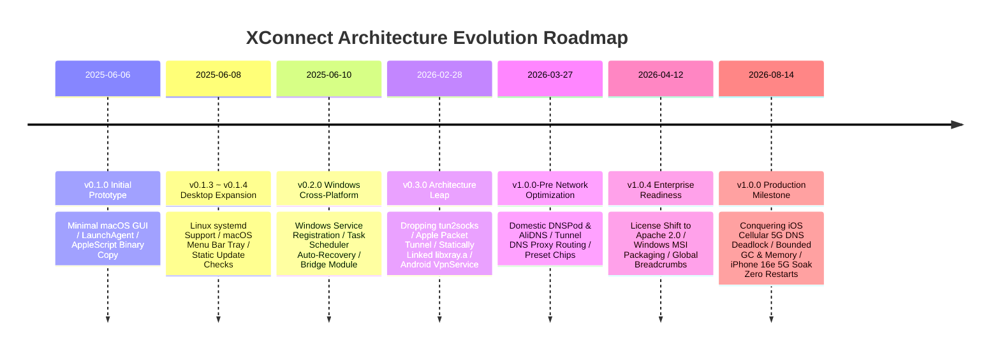
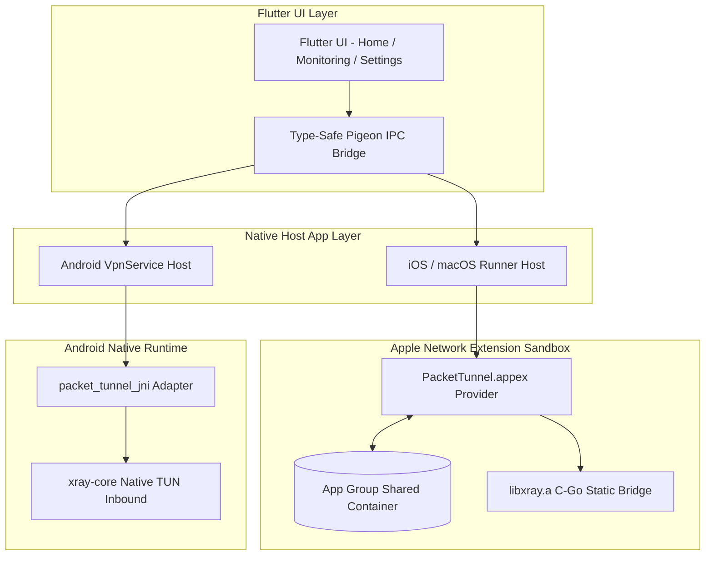
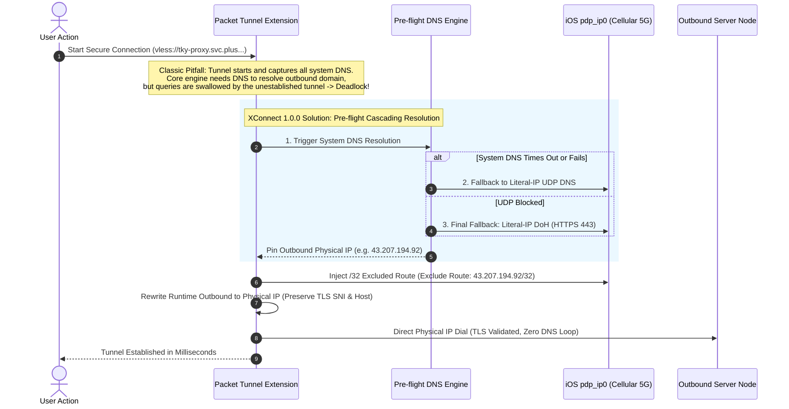

# 🚀 From a Humble Script to a Rock-Solid Multi-Platform System: The Architectural Evolution of XConnect

**—A 14-Month Journey Across 5 OS Platforms, Native Packet Tunnel, and Cellular DNS Deadlock Breakthroughs**

---

**Author Information**

- Author: Haitao Pan
- Role: Platform Engineer
- Projects: XWorkmate · XConnect · Open Platform
- Open Source Org: ai-workspace-infra (https://github.com/ai-workspace-infra)
- Tagline: Bring AI into real work, not just chat—from ideas to workflows, and into controllable production.

---

## Abstract

Every robust, complex system often originates from a crude, humble prototype.

On **June 6, 2025**, XConnect released its very first public preview, `v0.1.0`—it was merely a macOS desktop utility that used AppleScript to escalate privileges, copy binaries into `/opt/homebrew/bin`, and register a handwritten `LaunchAgent` plist daemon.

Fourteen months later, on **August 14, 2026**, XConnect officially shipped its `v1.0.0` production release. Today, it has evolved into a modern, resilient secure network acceleration system covering five major operating systems: **iOS, macOS, Windows, Android, and Linux**. It has undergone a complete architectural transformation to native **Packet Tunnel (System VPN)**, statically linking the core engine within the iOS sandbox, and breaking through deep-water engineering hurdles such as **iOS 5G Cellular DNS Startup Deadlocks** and strict memory budget constraints.

This article provides an in-depth retrospective of XConnect's journey from `v0.1.0` to `v1.0.0`, deconstructing key architectural decisions across cross-platform foundations, native Network Extensions, cascading DNS control planes, real-time telemetry, and production-grade reliability engineering.

---

## 📅 XConnect Evolution Roadmap



---

## 1. The Genesis (June 2025): A "Good Enough" Desktop Script Wrapper

### 1.1 The First Line of Code in `v0.1.0`: Minimalist and Unpolished

Looking back at the `v0.1.0` codebase from June 6, 2025, the initial design was straightforward:

- **Brute-Force Deployment**: The Flutter UI handled basic node selection. The underlying network acceleration binary (`xray`) was bundled inside the macOS app resources. On startup, the Swift native layer used AppleScript to prompt for administrator privileges, copied the binary directly to `/opt/homebrew/bin/xray`, and wrote a `.plist` file under `~/Library/LaunchAgents/` to launch a standalone daemon process.
- **Bare-Bones Functionality & Fragile State**: No menu bar tray, no traffic split-routing, no mobile platform support. Configuration was merely a static JSON file saved under `ApplicationSupport`.

```
[v0.1.0 Architecture]
Flutter UI (Dart) 
   └── AppleScript Privilege Escalation 
         └── Copy Binary to /opt/homebrew/bin/xray
               └── Write LaunchAgent plist to spawn external daemon
```

### 1.2 Rapid Desktop Expansion (v0.1.1 ~ v0.2.0)

Over the following weeks, the team iterated rapidly to establish essential desktop parity:
- **v0.1.2**: Introduced Dart template-based dynamic configuration generation and static `index.json` update checks.
- **v0.1.3 (Linux)**: Built a Go-based Linux Native Bridge to automatically generate and manage `systemd` services, bringing daemon lifecycle management to Linux.
- **v0.1.4 (macOS)**: Added a native menu bar tray icon with quick window toggle and minimize-to-tray behavior.
- **v0.2.0 (Windows)**: Designed a dedicated Windows Bridge module leveraging **Windows Services** and the **Task Scheduler** for background persistence and automatic failure recovery.

> 💡 **Phase Retrospective**:  
> In this early stage, XConnect was essentially a **"cross-platform GUI wrapper around external standalone processes"**. While functional on desktop platforms, this design faced three insurmountable blockers when targeting mobile environments (iOS / Android):
> 1. **Sandbox & Security Isolation**: iOS strictly forbids applications from spawning external binaries or detached child processes.
> 2. **Network Traffic Interception**: External processes cannot capture full-device IP traffic without native OS-level VPN / TUN interfaces.
> 3. **Lifecycle & Power Governance**: Mobile operating systems aggressively terminate unmanaged, power-hungry background processes.

---

## 2. The Core Architecture Leap (Feb 2026): Embracing OS Kernels and Mobile Networks

In early 2026, XConnect underwent its most decisive architectural overhaul—**shifting from "external process proxying" to "native system-level Packet Tunnel (System VPN)"**.



### 2.1 Abandoning tun2socks for Apple Network Extension

Early prototypes using `tun2socks` on macOS and iOS suffered from heavy memory footprint, extra buffer copying overhead, elevated TCP handshake latency, and frequent termination by iOS Jetsam due to memory limits.

In `v0.3.0`, XConnect executed a comprehensive redesign:
1. **Dedicated `PacketTunnel.appex` Extension**: Implemented as an Apple-compliant `NEPacketTunnelProvider`, running as an officially recognized System VPN entity.
2. **Static Linking & Native Go/C Bridge**: Built a customized `libxray.a` static library for iOS. The Swift extension invokes exported C bridge symbols directly (`StartXrayTunnel`, `SubmitInboundPacket`, `StopXrayTunnel`), eliminating IPC latency and sub-process overhead.
3. **Unified Android VpnService**: On Android, connected the system TUN file descriptor (`fd`) directly to the core TUN inbound layer via JNI (`packet_tunnel_jni`), harmonizing mobile architectures.

### 2.2 Type-Safe IPC and Real-Time Telemetry Bus

- **Pigeon Type-Safe Communication**: Replaced error-prone string-based `MethodChannel` calls with Pigeon-generated contracts between Dart, Swift, and Java.
- **App Group Shared Telemetry Bus**: To cross sandbox boundaries on iOS and macOS, designed a telemetry pipeline: `PacketTunnelProvider -> App Group -> DarwinHostApi -> Flutter UI`. The UI displays upload/download throughput, active round-trip latency, CPU usage (smoothed over a 10-second sliding window), and memory status.

---

## 3. Deep-Water Combat (Mar 2026 ~ Aug 2026): Deadlocks, Memory, and Edge Stability

Real-world mobile networks—especially active 5G cellular links, complex multi-region CDNs, and restricted DNS environments—uncover edge cases that never surface in local tests.

### 3.1 The Fatal "iOS Cellular DNS Startup Deadlock"

On physical iOS devices using real 5G connections (`pdp_ip0` interface), the system frequently entered a fatal deadlock upon connection:



#### 💡 The Four-Step Breakthrough:

1. **Pre-flight Cascading Endpoint Resolution**: Before initializing the Packet Tunnel, resolve the server domain via a three-tier fallback: `System DNS -> IP-Literal UDP DNS -> IP-Literal DoH`.
2. **Fail-Closed Safety Guard**: If all resolution channels fail, the connection aborts cleanly with an explicit error, preventing an unusable tunnel from spinning in a deadlock loop.
3. **Dynamic `/32` Excluded Route**: The resolved physical IP is dynamically added as a `/32` excluded route, ensuring tunnel outbound dials bypass the VPN capture interface.
4. **Runtime Config Rewrite with SNI Retention**: The transport layer dials the literal physical IP directly, while the application layer preserves the original domain for TLS SNI and XHTTP Host headers, ensuring both immediate connectivity and strict certificate validation.

---

### 3.2 Bounded Memory Footprint and GC Optimization

iOS Network Extensions operate under tight memory limits (typically 15MB to 50MB before triggering Jetsam termination):

- **Go GC Runtime Tuning**: Tuned Go runtime garbage collection pacing and explicitly released idle heap memory to the operating system during both idle and active sessions.
- **Bounded Ring-Buffer Logging**: Memory-resident logs are strictly capped. Persistent logs are rotated and written asynchronously to `Library/Caches`, preventing unbounded memory growth during long-lived sessions.
- **Suspension-Aware Connectivity Probing**: When an iOS device sleeps and enters a suspended state, active data plane probes are flagged as `Inconclusive`. Upon wakeup, exponential backoff prevents false positive disconnect alerts caused by OS sleep cycles.

---

## 4. Architectural Transformation Matrix (v0.1.0 vs. v1.0.0)

| Dimension | v0.1.0 Prototype (2025-06-06) | v1.0.0 Production (2026-08-14) |
| :--- | :--- | :--- |
| **Supported Platforms** | macOS Desktop only | **iOS, macOS, Windows, Android, Linux** |
| **System Integration** | AppleScript + LaunchAgent daemon | **Apple Packet Tunnel (System VPN)** + Android VpnService |
| **Core Engine Bridge** | Disk-copied external binary | **Statically linked `libxray.a`** + C/Go/Pigeon in-memory bridge |
| **DNS & Split-Routing** | None; relies on unmanaged system DNS | **Unified DNS Control Plane**: Pre-flight resolution, DoH fallback, anti-pollution proxy routing |
| **Cellular Robustness** | Not supported | **5G Deadlock Immunity** + `/32` route exclusion + backoff-aware probing |
| **Telemetry & Observability** | Raw console output | **Real-time throughput, latency, 10s smoothed CPU, memory bar, rotated logs** |
| **Transport Protocols** | Basic VLESS | **VLESS + XHTTP (XMUX connection multiplexing)** + dynamic runtime rewriting |
| **Stability & Validation** | Frequent crashes requiring manual restarts | **iPhone 16e real 5G soak smoke test: 0 restarts, 0 crashes** |

---

## 5. Key Engineering Takeaways & Epilogue

Looking back over these 14 months of continuous evolution, XConnect's journey highlights three core software engineering lessons:

1. **Do not fear crude beginnings—close the feedback loop first**: `v0.1.0` was unpolished, but it verified the end-to-end transport hypothesis on day one. Without that rudimentary first step, there would be no real-world feedback to guide subsequent refactors.
2. **Face operating system internals directly**: True product defensibility is rarely built on the UI layer. It is forged in low-level systems engineering: Apple Network Extension sandboxes, cross-language memory bridges, and cellular routing topologies.
3. **From a Standalone Tool to a Foundational Substrate**: Today, XConnect has grown beyond a standalone network client. It serves as the trusted, high-performance connectivity layer powering AI workspace ecosystems like **[XWorkmate](https://console.svc.plus/products/xworkmate)**, realizing a unified environment for chat, tasks, and reliable global connectivity.

From a single AppleScript in the summer of 2025 to a battle-tested architecture spanning five platforms in 2026, XConnect `v1.0.0` is both a milestone and a launchpad for next-generation network infrastructure.
