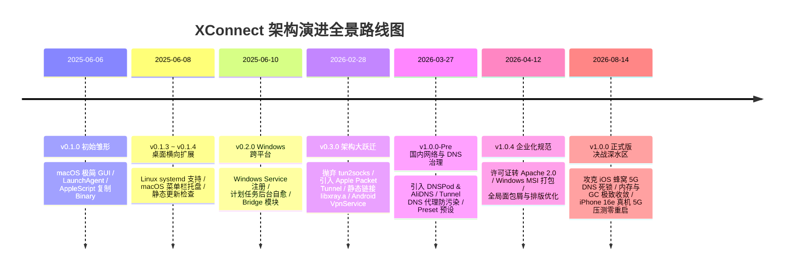
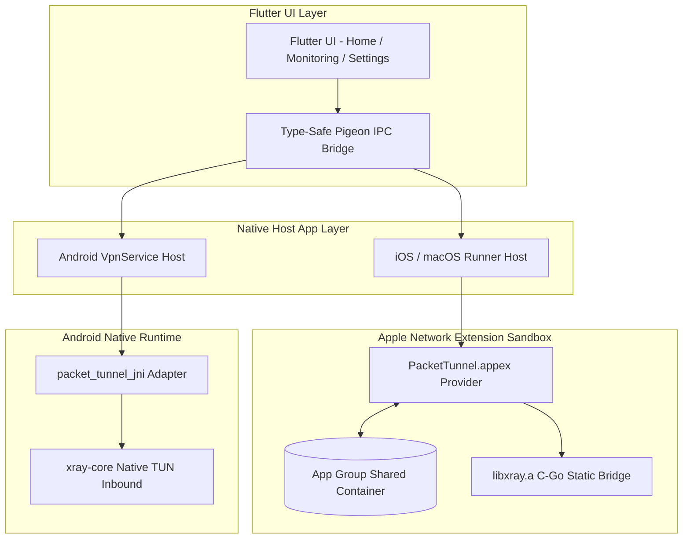
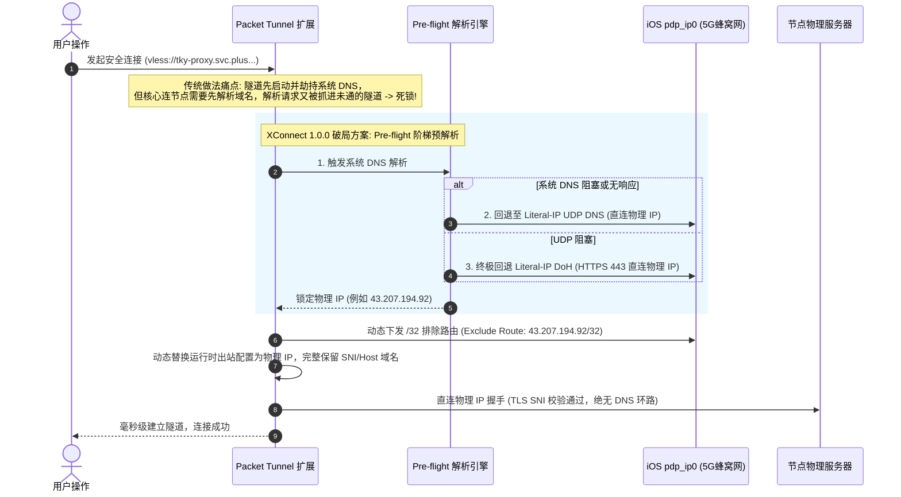

# 🚀 从简陋的脚本玩具到坚如磐石的多端系统：XConnect 架构演进与突围之路

**——跨越 14 个月、5 大操作系统、系统级 Packet Tunnel 与蜂窝网络 DNS 死锁攻坚实录**

---

**作者信息**

- 作者：Haitao Pan
- 职位：平台工程师（Platform Engineer）
- 所在项目：XWorkmate · XConnect · Open Platform
- 开源组织：ai-workspace-infra（https://github.com/ai-workspace-infra）
- 一句话自述：Bring AI into real work, not just chat——从想法到工作流，再到可控制的落地。

---

## 摘要

任何复杂而可靠的系统，最初往往都脱胎于一个粗糙甚至简陋的原型。

**2025 年 6 月 6 日**，XConnect 发布了 `v0.1.0` 第一个公开预览版——它只是一个通过 AppleScript 提权把二进制文件拷贝到 `/opt/homebrew/bin`、再手写 LaunchAgent plist 托管的 macOS 桌面小程序。

时隔 14 个月，**2026 年 8 月 14 日**，XConnect 正式发布了 `v1.0.0` 生产就绪版。此时的它，已经蜕变为覆盖 **iOS、macOS、Windows、Android、Linux** 五大平台的现代化安全网络加速系统：不仅彻底重构为原生系统级 **Packet Tunnel (System VPN)** 架构，在 iOS 沙盒内静态链接核心引擎，更在深水区攻克了极具挑战性的 **“iOS 蜂窝网络 5G DNS 启动死锁”** 与 **严苛内存配额治理**。

本文深度复盘 XConnect 从 `v0.1.0` 到 `v1.0.0` 的完整演进历程，拆解其在跨平台架构设计、原生网络扩展（Network Extension）、DNS 级联解析控制面、实时系统可观测性与生产级稳定性攻坚中的核心技术决策。

---

## 📅 XConnect 全景演进时间线



---

## 一、 初始雏形（2025.06）：能跑就行的桌面脚本包装器

### 1.1 `v0.1.0` 的第一行代码：简陋到极致

回到 2025 年 6 月 6 日的 `v0.1.0` 代码库，整个项目的设计非常“质朴”：

- **粗暴的部署机制**：Flutter 界面只负责基本的节点展示和切换。底层的加速二进制（`xray`）直接内置在 macOS App 资源包内。启动时，Swift 原生层通过 AppleScript 触发系统管理员授权弹窗，将可执行文件硬拷贝至 `/opt/homebrew/bin/xray`，然后写入 `~/Library/LaunchAgents/` 下的 plist 文件启动服务。
- **单薄的功能与脆弱的配置**：没有托盘常驻、没有分流规则、不支持移动端。配置数据仅仅是写在 `ApplicationSupport` 目录下的静态 JSON。

```
[v0.1.0 架构]
Flutter UI (Dart) 
   └── AppleScript 提权 
         └── 拷贝 Binary 到 /opt/homebrew/bin/xray
               └── 写入 LaunchAgent plist 启动独立后台进程
```

### 1.2 极速填坑与桌面三端覆盖（v0.1.1 ~ v0.2.0）

最初的几周，团队以高频迭代补齐桌面端的基础可用性：
- **v0.1.2**：实现基于 Dart 模板的动态配置生成器，引入静态 `index.json` 的版本检测机制。
- **v0.1.3 (Linux)**：实现基于 Go 的 Linux 原生 Bridge，自动生成并管理 `systemd` 服务，使 Linux 具备守护进程能力。
- **v0.1.4 (macOS)**：增加菜单栏系统托盘（System Tray），支持窗口一键最小化与快速唤醒。
- **v0.2.0 (Windows)**：针对 Windows 环境引入专用的 Bridge 模块，利用 **Windows Service** 与 **Task Scheduler（任务计划程序）** 实现了后台自动驻留与异常自愈。

> 💡 **阶段总结与反思**：  
> 这个阶段的 XConnect 本质上是**“外部独立进程的跨平台 GUI 包装器”**。这种架构在桌面端尚能勉强支撑，但一旦面向移动端（iOS / Android），便会遭遇三大不可逾越的鸿沟：
> 1. **沙盒与权限隔离**：iOS 绝对不允许 App 擅自拉起外部独立二进制进程；
> 2. **网络流量劫持**：外部进程无法接管整机网络，必须借助操作系统级 VPN / TUN 接口；
> 3. **生命周期与功耗**：移动操作系统会在后台毫不留情地清理高功耗、未受控的后台任务。

---

## 二、 架构大跃迁（2026.02）：深入操作系统内核与移动端突围

2026 年初，XConnect 迎来了立项以来最关键的一次架构重构——**从“外部进程代理”彻底转向“原生系统级 Packet Tunnel (System VPN)”**。



### 2.1 彻底抛弃 tun2socks，拥抱 Apple Network Extension

在 macOS 和 iOS 早期预研中，传统的 `tun2socks` 方案暴露出诸多问题：额外的内存拷贝开销、TCP 握手延迟增加，以及在 iOS 严苛的 App Extension 内存配额下极易被系统 Jetsam 强杀。

XConnect 在 `v0.3.0` 做出了彻底的重构：
1. **构建独立的 `PacketTunnel.appex` 扩展**：直接作为 Apple 官方规范的 `NEPacketTunnelProvider` 运行，成为操作系统原生认可的 System VPN。
2. **静态链接与 Go/C 原生桥接**：为 iOS 定制了静态链接库 `libxray.a`，在 Swift 扩展层直接通过 C 桥接符号调用 `StartXrayTunnel`、`SubmitInboundPacket`、`StopXrayTunnel`，消除了任何子进程开销。
3. **Android VpnService 统一化**：在 Android 端通过 JNI (`packet_tunnel_jni`) 将系统的 TUN 文件描述符 (`fd`) 直接移交给核心的 TUN Inbound 模块，实现双移动端架构对齐。

### 2.2 跨平台 IPC 与实时可观测性总线

- **Pigeon 类型安全通信**：废弃了易出错的字符串 MethodChannel，全面采用 Pigeon 定义 Dart 与 Swift/Java 之间的类型安全接口。
- **App Group 共享数据总线**：在 iOS/macOS 的沙盒隔离下，设计了 `PacketTunnelProvider -> App Group -> DarwinHostApi -> Flutter UI` 的监控流水线，以 10 秒滑动平均算法向主界面平滑输出实时上/下行速率、连接延迟、CPU 与内存健康度。

---

## 三、 决战深水区（2026.03 ~ 2026.08）：死锁、内存与网络极限治理

在移动端网络（尤其是真实 5G 蜂窝网、复杂 CDN 节点与国内弱网环境）面前，实验室中跑通的代码往往会遇到极端暗礁。

### 3.1 致命的“iOS 蜂窝网络 DNS 启动死锁” (Cellular DNS Deadlock)

在 iOS 真实 5G 网络（`pdp_ip0` 接口）下，团队曾遇到一个极其隐蔽且致命的问题：**隧道启动瞬间陷入永久 DNS 死锁**。



#### 💡 破局关键四步：

1. **Pre-flight 阶梯式预解析**：在启动 Packet Tunnel 之前，按 `系统 DNS -> IP-Literal UDP DNS -> IP-Literal DoH` 三级阶梯顺序预先锁定服务器的物理 IP。
2. **Fail-Closed 闭环保护**：如果所有解析渠道均无法获取节点 IP，立即安全阻断并明确报错，坚决不启动会陷入死锁的空转隧道。
3. **动态 `/32` 排除路由 (Exclude Route)**：将解析出的节点物理 IP 作为 `/32` 静态路由排除在 VPN 抓包范围之外，彻底物理隔绝流量自环。
4. **运行时动态重写**：传输层底层直接拨号物理 IP，应用层 TLS SNI 和 XHTTP Host 严格保留原始域名，既绕过了 DNS 依赖，又保障了 TLS 证书的严格安全校验。

---

### 3.2 内存配额与 GC 极限收敛

iOS Network Extension 的内存上限极其苛刻（通常在 15MB 到 50MB 之间，稍有瞬间抖动即被系统 Jetsam 强杀）：

- **Go GC 运行时微调**：通过定制环境变量与垃圾回收节流策略，在网络空闲期与活跃期主动将未使用的堆内存归还给操作系统。
- **环形内存日志缓冲区 (Bounded Ring Buffer)**：限制日志在内存中的驻留窗口，持久化日志以滚动分卷形式异步写入 `Library/Caches`，杜绝内存持续增长。
- **挂起感知探活 (Suspension-Aware Probe)**：当 iOS 设备锁屏休眠进入挂起状态时，将网络探测标记为 `Inconclusive`（非确定状态），并在唤醒后采用指数退避重试，彻底消除因系统休眠导致的“假性网络断开”误报。

---

## 四、 成果对比：从 v0.1.0 到 v1.0.0 的质变

| 维度 | v0.1.0 雏形版 (2025-06-06) | v1.0.0 正式版 (2026-08-14) |
| :--- | :--- | :--- |
| **平台支持** | 仅 macOS 桌面端 | **iOS、macOS、Windows、Android、Linux** 全平台 |
| **系统级集成** | AppleScript 提权 + LaunchAgent 进程 | **Apple Packet Tunnel (System VPN)** + Android VpnService |
| **底层核心集成** | 外部二进制文件磁盘拷贝与调用 | **静态链接 `libxray.a`** + 原生 C/Go/Pigeon 内存级桥接 |
| **DNS 与分流** | 无分流策略，依赖系统原生解析 | **DNS 控制中枢**：Pre-flight 阶梯解析、DoH 回退、防污染分流 |
| **蜂窝网络治理** | 不支持移动端 | **抗 5G 死锁** + `/32` 排除路由 + 弱网指数退避探活 |
| **系统可观测性** | 仅控制台零散输出 | **实时速率、延迟、10s 平滑 CPU、内存健康条、滚动日志** |
| **传输协议支持** | 基础 VLESS | **VLESS + XHTTP (XMUX 多路复用)** + 运行时动态重写 |
| **稳定性与测试** | 偶发崩溃，需手动重启进程 | **iPhone 16e 真实 5G 环境长时间 Soak 压测 0 崩溃 0 重启** |

---

## 五、 工程启示与结语

回顾 XConnect 这 14 个月的演进历程，它印证了软件工程中极其宝贵的三条经验：

1. **不要害怕最初的简陋，先跑通最小闭环**：`v0.1.0` 的 AppleScript 拷贝虽然粗糙，但它在第一天就验证了核心链路并交付给真实用户。没有最初那个简陋的原型，就没有后续持续重构的方向。
2. **直面操作系统的深水区**：真正的工程壁垒从不在 UI 表面，而在于对底层机制的敬畏与钻研——深入 Apple Network Extension 沙盒、跨语言内存级 IPC、5G 蜂窝网络路由拓扑。正是这些硬仗，让 XConnect 具备了企业级的健壮性。
3. **从独立工具到基础设施底座**：今天的 XConnect 已经超越了单纯的连接客户端，它作为可靠的底层连接底座，与 **[XWorkmate](https://console.svc.plus/products/xworkmate)** 等 AI 生产力工作空间深度协同，共同构筑下一代“对话、任务与可靠连接”一体化的工作系统。

从 2025 年夏天的那一行脚本，到 2026 年覆盖五大平台的坚固架构，XConnect `v1.0.0` 是一个里程碑，更是面向未来更广阔网络与 AI 基础设施的新起点。
