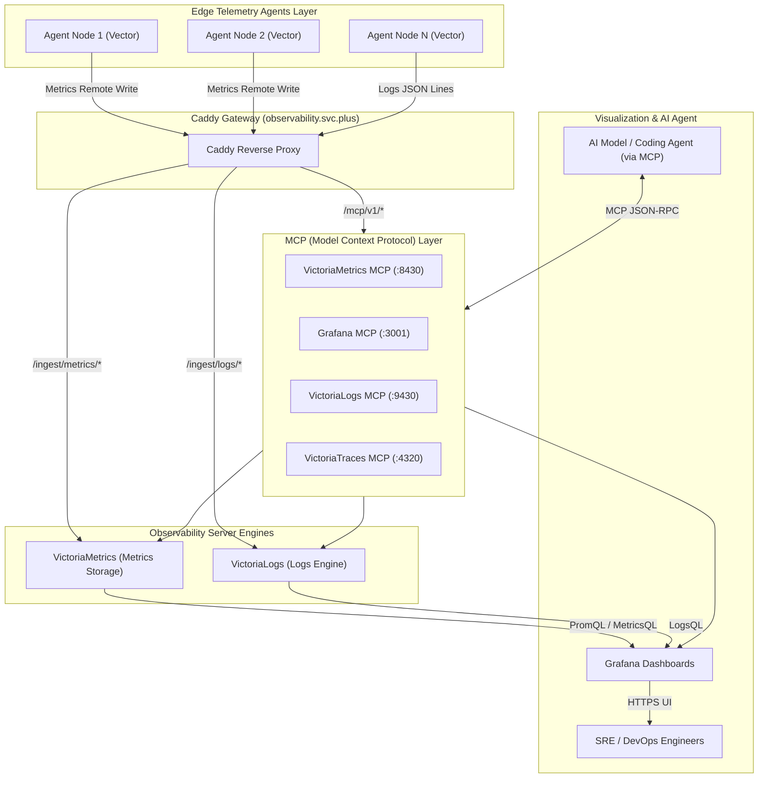

# Demystifying the Centralized Observability Server Architecture: VictoriaMetrics, VictoriaLogs, Grafana Suite, and Integrated MCP Server

> **Author**: shenlan
> **Date**: August 7, 2026
> **Tags**: observability / victoriametrics / victorialogs / grafana / mcp / caddy / ansible
> **Editor's Choice**: In cloud-native and multi-cloud infrastructure, ingesting high-concurrency metric and log telemetry from hundreds of nodes, containers, and edge agents while providing compressed storage and real-time querying is the central challenge of monitoring backends. This article fully demystifies the architectural design of observability.svc.plus—from component roles and Caddy unified routing to Ansible automated orchestration—with a special focus on the newly integrated Model Context Protocol (MCP) Server, enabling AI Agents to natively perform system troubleshooting and contextual telemetry queries.

---

## Executive Summary

In cloud-native and multi-cloud infrastructure, receiving high-concurrency metrics and logs reported by hundreds or thousands of nodes, containers, and edge agents, storing them with high compression, and querying them in real-time represent core challenges for the monitoring backend. Simultaneously, as AI Agents (such as LLMs and Vibe Coding Assistants) become deeply embedded into operational workflows, providing safe, standardized context query interfaces for AI models has become a groundbreaking advancement in modern Observability architecture.

This article details the comprehensive architectural design of the **`observability.svc.plus`** centralized observability server, covering:

- **Component Division**: Responsibility boundaries and performance advantages of VictoriaMetrics, VictoriaLogs, and Grafana;
- **Unified Gateway**: Multi-path routing distribution and security controls using Caddy reverse proxy;
- **AI-Native Capabilities**: The newly integrated Model Context Protocol (MCP) Server intelligence extensions in the Ansible Role (`playbooks/roles/docker/observability-server`).

---

## 1. Core Observability Server Component List

The server side adopts a containerized, modular microservice architecture where all components expose services through a unified Caddy reverse proxy entry point:

| Component Name | Service / Container | Entry URL / Interface | Core Responsibilities & Performance Advantages |
| :--- | :--- | :--- | :--- |
| **Caddy Gateway** | `caddy` | `https://observability.svc.plus` | **Unified Gateway & TLS Termination**. Manages multi-path routing, automated ACME certificate management, and IP/Token access control. |
| **VictoriaMetrics** | `victoriametrics` | `/ingest/metrics/api/v1/write`<br>`/select/0/prometheus/` | **Time-Series Metrics Storage & Query Engine**. Ultra-low CPU/memory overhead, high storage compression, fully compatible with Prometheus protocol and MetricsQL syntax. |
| **VictoriaLogs** | `victorialogs` | `/ingest/logs/insert/jsonline`<br>`/select/logsql/` | **High-Volume Log Full-Text Search & Analysis Engine**. Reduces memory consumption by 80% compared to Elasticsearch while efficiently handling high-cardinality logs. |
| **VictoriaTraces** | `victoriatraces` | `/ingest/traces/*`<br>`/opentelemetry/v1/traces` | **Distributed Tracing Engine**. Efficiently ingests and stores OpenTelemetry / OTLP trace telemetry, enabling cross-microservice call-graph analysis and latency bottleneck identification. |
| **Grafana** | `grafana` | `https://observability.svc.plus/grafana/` | **Unified Visualization & Alerting Dashboards**. Aggregates VictoriaMetrics metrics and VictoriaLogs telemetry to provide multi-dimensional dashboards. |
| **MCP Servers (New)** | `observability-mcp-*` | `/mcp/v1/*` | **AI Model Context Protocol Server Array**. Enables AI Coding Agents (such as Cursor, Claude, or Antigravity) to query Metrics, Logs, Traces, and Dashboard contexts. |

---

## 2. Model Context Protocol (MCP) Server Capability Integration

To empower AI Agents with proactive infrastructure diagnostic capabilities, automated orchestration and parameter configuration for MCP Servers have been fully integrated into the `playbooks/roles/docker/observability-server` Ansible Role.

### 2.1 Ansible Role Configuration Highlights (`defaults/main.yml`)

In the role default variables (`defaults/main.yml`), global MCP toggles and MCP adapter parameters for four core components were added:

```yaml
# Ansible Role: playbooks/roles/docker/observability-server/defaults/main.yml

# 1. Global MCP Base Parameters
observability_mcp_enabled: true
observability_mcp_bind_address: "127.0.0.1"
observability_mcp_auth_enabled: true

# 2. Specialized MCP Server Default Parameters
# 2.1 VictoriaMetrics MCP (Provides MetricsQL intelligent querying)
observability_victoriametrics_mcp_enabled: "{{ observability_mcp_enabled }}"
observability_victoriametrics_mcp_port: 8430

# 2.2 Grafana MCP (Provides Dashboard config and Alert status extraction)
observability_grafana_mcp_enabled: "{{ observability_mcp_enabled }}"
observability_grafana_mcp_port: 3001

# 2.3 VictoriaLogs MCP (Provides LogsQL automated log context querying)
observability_victorialogs_mcp_enabled: "{{ observability_mcp_enabled }}"
observability_victorialogs_mcp_port: 9430

# 2.4 VictoriaTraces / OTLP MCP (Provides end-to-end Traces intelligent tracking)
observability_victoriatraces_mcp_enabled: "{{ observability_mcp_enabled }}"
observability_victoriatraces_mcp_port: 4320
```

### 2.2 MCP Agent Interaction Design

Leveraging the MCP protocol, AI Agents (LLMs) can safely issue function calls (Tool Calls) to the Observability Server:

- **Metric Tool Call**: AI requests: *"Check memory and bandwidth usage trends for the agent-proxy host over the past 1 hour"* → VictoriaMetrics MCP parses and generates MetricsQL → Returns structured time-series data.
- **Log Tool Call**: AI requests: *"Retrieve Caddy 5xx error logs around 13:45"* → VictoriaLogs MCP executes LogsQL → Extracts matching log context.


---

## 3. Server Topology & Data Flow


<details>
<summary>Click to expand Mermaid Source Code</summary>



</details>

**Key Data Flow Points**:

1. Edge nodes collect metrics (Metrics Remote Write) and logs (Logs JSON Lines) via Vector, forwarding them to the Caddy gateway;
2. Caddy routes requests based on Path prefixes: `/ingest/metrics/*` → VictoriaMetrics, `/ingest/logs/*` → VictoriaLogs;
3. Grafana aggregates data from both sources for visualization and alerting, while AI Agents communicate bi-directionally with the MCP Server array via `/mcp/v1/*` using MCP JSON-RPC.

---

## 4. Caddy Routing & Security Control Configuration

The Caddyfile centrally manages subpath routing for all observability services and MCP endpoints, achieving zero-intrusive extension:

```caddyfile
# Caddyfile snippet: observability.svc.plus
observability.svc.plus {
    # 1. Prometheus Metrics Ingest / Query
    handle_path /ingest/metrics/* {
        reverse_proxy victoriametrics:8428
    }

    # 2. VictoriaLogs Ingest / Query
    handle_path /ingest/logs/* {
        reverse_proxy victorialogs:9428
    }

    # 3. Grafana Dashboard UI
    handle /grafana/* {
        reverse_proxy grafana:3000
    }

    # 4. MCP (Model Context Protocol) Gateway Routes
    handle_path /mcp/v1/metrics/* {
        reverse_proxy 127.0.0.1:8430
    }
    handle_path /mcp/v1/logs/* {
        reverse_proxy 127.0.0.1:9430
    }
    handle_path /mcp/v1/grafana/* {
        reverse_proxy 127.0.0.1:3001
    }
}
```

**Key Security Control Points**:

- MCP Servers bind to `127.0.0.1` by default and are not directly exposed to external ports, requiring Caddy gateway authentication to access;
- `observability_mcp_auth_enabled: true` enables MCP-layer authentication, forming a dual-layer defense with Caddy's IP/Token access control;
- A single domain with ACME automated certificates allows edge agents and AI toolchains to operate without needing to adapt to backend microservice cluster topology changes.

---

## 5. Key Architectural Advantages

1. **Extreme High Concurrency & Storage Compression Ratio**: VictoriaMetrics provides up to 10x storage compression compared to traditional Prometheus, effectively reducing long-term monitoring storage costs;
2. **Native AI Agent Support (MCP Integrated)**: Fully integrates VictoriaMetrics MCP, Grafana MCP, VictoriaLogs MCP, and VictoriaTraces MCP inside the Ansible Role, providing AI LLMs with native system troubleshooting and context-awareness capabilities;
3. **Ultra-Simple Single Domain Routing**: Exposes a unified HTTPS interface via `observability.svc.plus`, shielding edge agents and AI toolchains from backend microservice cluster complexity;
4. **Closed-Loop Observability**: Enables seamless one-click correlation from metric anomalies to timestamped logs in VictoriaLogs within Grafana or AI interfaces, drastically reducing MTTR (Mean Time to Resolution).

---

## About the Author

Long-term practitioner focused on cloud-native infrastructure, observability, and AI Agent engineering implementations. This article is based on real-world deployment experience from the production `observability.svc.plus` environment, with all component configurations automated via Ansible Role (`playbooks/roles/docker/observability-server`).
