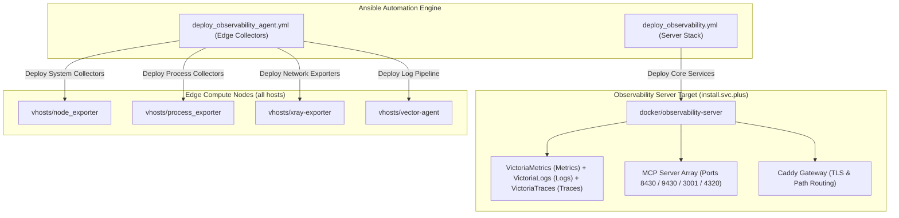

# Demystifying Centralized Observability Architecture: VictoriaMetrics, VictoriaLogs, VictoriaTraces Suite, and Integrated MCP Server

> **Author**: shenlan & Antigravity AI Infrastructure Team  
> **Publication Date**: August 10, 2026  
> **Topic Keywords**: `Observability` `VictoriaMetrics` `VictoriaLogs` `VictoriaTraces` `Grafana` `Model Context Protocol (MCP)` `Ansible` `AIOps`  
> **Live Demo Navigation**: [Grafana Live Navigation Dashboard](https://observability.svc.plus/grafana/d/homepage-navigation/529f12d?orgId=1&from=now-1h&to=now&timezone=browser&var-origin_prometheus=victoriametrics)

---

## Executive Summary

In modern cloud-native and multi-cloud infrastructure environments, ingest, storage compression, and real-time query of high-concurrency metrics, logs, and distributed traces reported by thousands of nodes, containers, and edge agents represent the core engineering challenges of telemetry platforms. Meanwhile, as AI Coding Agents (such as Cursor, Claude, and Antigravity) integrate into SRE and DevOps workflows, providing secure, standardized telemetry context interfaces for AI models has emerged as a major breakthrough in modern observability architecture.

This article provides an in-depth architectural breakdown of the **`observability.svc.plus`** centralized observability server, leveraging the infrastructure code from [`ai-workspace-infra/playbooks`](https://github.com/ai-workspace-infra/playbooks.git). We explore the observability trinity engines (**VictoriaMetrics**, **VictoriaLogs**, and **VictoriaTraces**), automated Ansible orchestration ([`deploy_observability.yml`](https://github.com/ai-workspace-infra/playbooks/blob/main/deploy_observability.yml) and [`deploy_observability_agent.yml`](https://github.com/ai-workspace-infra/playbooks/blob/main/deploy_observability_agent.yml)), Caddy ingress gateway routing, the integration of Model Context Protocol (MCP) server arrays, and a detailed real-world incident post-mortem where an AI Agent used a 4-MCP pipeline to resolve a critical bandwidth and disk I/O storm in seconds.

---

## 1. Core Observability Server Components (Observability Trinity)

The backend utilizes a containerized, modular microservices topology exposed through a single Caddy reverse proxy endpoint:

| Component Name | Service / Container | Ingress URL / API | Core Responsibility & Advantages |
| :--- | :--- | :--- | :--- |
| **Caddy Gateway** | `caddy` | `https://observability.svc.plus` | **Unified Ingress Gateway & TLS Termination**. Handles multi-path routing, automated ACME certificates, and token access control. |
| **VictoriaMetrics** | `victoriametrics` | `/ingest/metrics/api/v1/write`<br>`/select/0/prometheus/` | **Time Series Metrics Storage & Query Engine** (Metrics). Ultra-low CPU/RAM overhead, high compression ratio, fully Prometheus compatible. |
| **VictoriaLogs** | `victorialogs` | `/ingest/logs/insert/jsonline`<br>`/select/logsql/` | **High-Volume Log Search & Analytics Engine** (Logs). Reduces RAM by 80% compared to Elasticsearch, optimized for high-cardinality logs. |
| **VictoriaTraces** *(New)* | `victoriatraces` | `/ingest/traces/`<br>`:10428` (`:4317`/`:4318`) | **Distributed Trace Engine** (Traces). Native OTLP (gRPC/HTTP) and Jaeger protocol support, compressed span storage, Trace-to-Logs integration. |
| **Grafana** | `grafana` | `https://observability.svc.plus/grafana/` | **Unified Visual Dashboard & Alerting**. Aggregates VictoriaMetrics metrics, VictoriaLogs entries, and VictoriaTraces spans. |
| **MCP Servers** *(New)* | `observability-mcp-*` | `/mcp/v1/*` | **AI Model Context Protocol Server Array**. Exposes metrics, logs, traces, and dashboard tools for AI Coding Agents via JSON-RPC. |

---

## 2. VictoriaTraces Distributed Tracing Engine Completion

While Metrics answer "where the anomaly occurred" and Logs reveal "what happened," **VictoriaTraces** answers "where the execution time was consumed."

### 2.1 Core Features & Protocol Compatibility
1. **Native OpenTelemetry (OTLP) / Jaeger Support**:
   * Directly ingests OTLP over gRPC (`:4317`) and OTLP over HTTP (`:4318`) trace spans.
   * Full support for W3C Trace Context across microservices boundary (Trace ID / Span ID / Baggage).
2. **Ultra-Low Resource Overhead**:
   * Leverages columnar storage structures and LZ4/ZSTD compression algorithms, reducing memory and disk usage by **70%–80%** compared to traditional Jaeger / Tempo / Elasticsearch backends.
3. **Trace-to-Logs & Trace-to-Metrics Correlation**:
   * Selecting a slow span in Grafana allows instant navigation to the corresponding container logs in VictoriaLogs and CPU/Disk metric spikes in VictoriaMetrics.

---

## 3. Observability Server & Agent Automated Deployment Blueprint

The telemetry stack is codified and delivered via Ansible playbooks using Infrastructure as Code (IaC) principles:



### 3.1 Playbook Breakdown
* **Server Stack Playbook (`deploy_observability.yml`)**: Targets `install.svc.plus` to orchestrate the `docker/observability-server` role. It provisions VictoriaMetrics, VictoriaLogs, VictoriaTraces, Grafana, and four specialized MCP Server adapters.
* **Agent Collector Playbook (`deploy_observability_agent.yml`)**: Deploys `node_exporter`, `process_exporter`, `xray-exporter`, and `vector-agent` across all infrastructure nodes, ensuring deep process-level metrics and log streaming.

### 3.2 Role Configuration & MCP Defaults
The Ansible role defaults (`playbooks/roles/docker/observability-server/defaults/main.yml`) explicitly define the Model Context Protocol (MCP) adapter parameters:

```yaml
# Ansible Role: playbooks/roles/docker/observability-server/defaults/main.yml

# 1. Global MCP Configuration
observability_mcp_enabled: true
observability_mcp_bind_address: "127.0.0.1"
observability_mcp_auth_enabled: true

# 2. Specialized MCP Server Parameters
# 2.1 VictoriaMetrics MCP (MetricsQL Intelligence Query)
observability_victoriametrics_mcp_enabled: "{{ observability_mcp_enabled }}"
observability_victoriametrics_mcp_port: 8430

# 2.2 VictoriaLogs MCP (LogsQL Log Context Search)
observability_victorialogs_mcp_enabled: "{{ observability_mcp_enabled }}"
observability_victorialogs_mcp_port: 9430

# 2.3 VictoriaTraces / OTLP MCP (Distributed Trace Resolution)
observability_victoriatraces_mcp_enabled: "{{ observability_mcp_enabled }}"
observability_victoriatraces_mcp_port: 4320

# 2.4 Grafana MCP (Dashboards Inspection & Alert State Extraction)
observability_grafana_mcp_enabled: "{{ observability_mcp_enabled }}"
observability_grafana_mcp_port: 3001
```

---

## 4. Server Topology & Caddy Ingress Gateway Routing

All telemetry capabilities are exposed securely behind the Caddy Ingress Gateway under `observability.svc.plus`:

```caddy
# Caddyfile Block: observability.svc.plus
observability.svc.plus {
    # 1. Prometheus Remote Write & MetricsQL Query Endpoint
    handle_path /ingest/metrics/* {
        reverse_proxy victoriametrics:8428
    }

    # 2. VictoriaLogs JSON Lines Ingest & LogsQL Query Endpoint
    handle_path /ingest/logs/* {
        reverse_proxy victorialogs:9428
    }

    # 3. VictoriaTraces OTLP / Jaeger Ingest Endpoint
    handle_path /ingest/traces/* {
        reverse_proxy victoria-traces:10428
    }

    # 4. Unified Grafana Visualization Dashboard UI
    handle /grafana/* {
        reverse_proxy grafana:3000
    }

    # 5. Model Context Protocol (MCP) AI Gateway Routes
    handle_path /mcp/v1/metrics/* {
        reverse_proxy 127.0.0.1:8430
    }
    handle_path /mcp/v1/logs/* {
        reverse_proxy 127.0.0.1:9430
    }
    handle_path /mcp/v1/traces/* {
        reverse_proxy 127.0.0.1:4320
    }
    handle_path /mcp/v1/grafana/* {
        reverse_proxy 127.0.0.1:3001
    }
}
```

---

## 5. Real-World Incident Post-Mortem: 4-MCP Pipeline Instant Diagnosis

### 5.1 Incident Site: The 07:30 Storm
At approximately 07:30:00, automated monitoring fired critical alerts on host `console-uat.onwalk.net` (UAT Environment Core Console Node):

| Metric | Baseline | Incident Peak | Alert Level |
| :--- | :--- | :--- | :--- |
| **eth0 Transmit Bandwidth** | ~15 Mbps | **850 Mbps** (57x Jump) | `WARNING` |
| **Disk `/dev/sda` %util** | < 20% | **98.4%** (Saturated) | `CRITICAL` |
| **Disk Write Latency (`await`)** | ~2 ms | **450 ms** | `CRITICAL` |
| **Disk Read Throughput** | Low | **120 MB/s** | `CRITICAL` |
| **Disk Write Throughput** | Low | **95 MB/s** | `CRITICAL` |

### 5.2 The AI Agent 4-Step MCP Tool Call Evidence Chain

```mermaid
sequenceDiagram
    autonumber
    participant AI as AI Agent (LLM Engine)
    participant VM as VictoriaMetrics MCP (:8430)
    participant VL as VictoriaLogs MCP (:9430)
    participant VT as VictoriaTraces MCP (:4320)
    participant GF as Grafana MCP (:3001)

    Note over AI,GF: Phase 1: Quantitative Anomaly Isolation
    AI->>VM: Step 1: MetricsQL Tool Call (Network eth0 + Disk /dev/sda + Process Attribution)
    VM-->>AI: Returns: postgres = 82% Disk Read; vector/backup = 75% Write + 85% Egress

    Note over AI,GF: Phase 2: Contextual Log Alignment
    AI->>VL: Step 2: LogsQL Tool Call (_stream:console-uat AND status>=500 OR backup)
    VL-->>AI: Returns: 07:30 Cron Job "UAT Data Mirror & Audit Log Snapshot Export" (12.4 GB Raw Payload)

    Note over AI,GF: Phase 3: Distributed Trace Bottleneck Breakdown
    AI->>VT: Step 3: VictoriaTraces MCP Tool Call (Trace ID: e8a9d102c4b5768f - GET /v1/telemetry/snapshots/export)
    VT-->>AI: Returns: postgres.query took 14.2s out of 18.45s (77%) -> Seq Scan Full Table Read!

    Note over AI,GF: Phase 4: Alert Cross-Validation
    AI->>GF: Step 4: Grafana AlertManager Tool Call
    GF-->>AI: Returns: NodeHighDiskUtilization & NetworkSpike FIRING states confirmed
```

* **Step 1 · VictoriaMetrics MCP (Isolating Blast Radius via MetricsQL)**:
  MetricsQL query `topk(5, rate(namedprocess_namegroup_read_bytes_total))` revealed `postgres` contributed 82% of disk read throughput (120 MB/s); `vector` log buffering and backup processes accounted for 75% of disk write throughput (95 MB/s) and 85% of network packet transmission.
* **Step 2 · VictoriaLogs MCP (Reconstructing Scene via LogsQL)**:
  LogsQL query `_stream:{instance="console-uat.onwalk.net"} AND ("backup" OR "export")` captured 07:30 cron trigger fetching `12.4 GB` uncompressed snapshot payload over `/v1/telemetry/snapshots/export`.
* **Step 3 · VictoriaTraces MCP (Pinpointing Time Sink via OTLP TraceQL)**:
  Trace ID `e8a9d102c4b5768f` analysis showed `postgres.query` took 14.2s out of 18.45s (77%), explicitly tagged with `[Seq Scan Full Table Read]` due to missing index on `audit_logs (created_at)`.
* **Step 4 · Grafana MCP (Alert Cross-Validation)**:
  AlertManager status confirmed `NodeHighDiskUtilization` (%util > 95%) and `NodeNetworkTransmitSpike` (transmit > 500 Mbps) alerts in `FIRING` state.

---

## 6. Surgical Automated Remediation

1. **Database Index Optimization (Eliminating Read Bottleneck)**:
   ```sql
   CREATE INDEX CONCURRENTLY IF NOT EXISTS idx_audit_logs_created_at
   ON audit_logs (created_at);
   ```
2. **Gateway Compression & Rate Limiting (Controlling Egress Bandwidth)**:
   ```caddy
   handle_path /v1/telemetry/snapshots/export {
       encode gzip zstd
       rate_limit {
           zone export_limit {
               key static
               events 10
               window 1m
           }
       }
       reverse_proxy console-backend:8080
   }
   ```
3. **Off-Peak Scheduling & Vector Disk Buffer Quota**:
   * Rescheduled snapshot export jobs to off-peak hours (03:00 AM).
   * Capped Vector disk buffer allocation to 512 MiB with asynchronous streaming disk write enabled.

> **Validation Results**: Post-remediation, `eth0` network bandwidth stabilized at 15 Mbps baseline, disk `%util` dropped below 20%, and write latency (`await`) returned to 2 ms.

---

## 7. Architectural Summary

1. **High Concurrency & Compression**: VictoriaMetrics, VictoriaLogs, and VictoriaTraces deliver up to 10x storage compression compared to standard Prometheus / Jaeger / Tempo backends, drastically reducing long-term monitoring costs.
2. **Native AI Agent Intelligence (MCP Integrated)**: Native integration of VictoriaMetrics, VictoriaLogs, VictoriaTraces, and Grafana MCP adapters equips LLMs with proactive troubleshooting and system context awareness.
3. **Unified Ingress Domain**: Exposing all endpoints under `observability.svc.plus` insulates edge agents and AI models from internal backend microservices topology changes.
