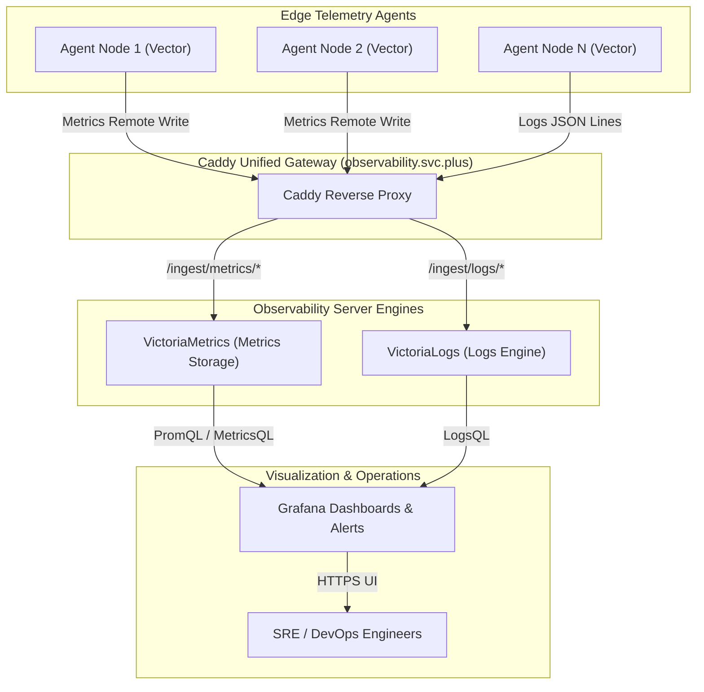

# Demystifying the Centralized Observability Server Architecture: VictoriaMetrics, VictoriaLogs, and Grafana Unified Suite

In cloud-native and multi-cloud infrastructure, handling high-concurrency ingestion, compressed storage, and real-time querying for metrics and logs shipped by hundreds of nodes, containers, and edge agents represents the ultimate challenge for monitoring backends. This article breaks down the architectural design of the **`observability.svc.plus`** centralized observability server, illustrating how Caddy gateway routing, VictoriaMetrics time-series storage, VictoriaLogs search engine, and Grafana form a unified, cloud-neutral platform.

---

## 1. Core Observability Server Components

The backend utilizes a containerized, modular microservices topology exposed through a single Caddy reverse proxy endpoint:

| Component | Container / Unit | Ingress URL / Path | Core Role & Key Advantages |
| :--- | :--- | :--- | :--- |
| **Caddy Gateway** | `caddy` | `https://observability.svc.plus` | **Unified Entry Gateway & TLS Termination**. Handles multi-path routing, ACME SSL certificates, and access control. |
| **VictoriaMetrics** | `victoriametrics` | `/ingest/metrics/api/v1/write`<br>`/select/0/prometheus/` | **Time-Series Metrics Storage & Query Engine**. Ultra-low CPU/RAM footprint, high compression ratio, fully compatible with Prometheus Remote Write and MetricsQL. |
| **VictoriaLogs** | `victorialogs` | `/ingest/logs/insert/jsonline`<br>`/select/logsql/` | **High-Throughput Log Search Engine**. Uses 80% less memory than Elasticsearch while efficiently indexing high-cardinality logs. |
| **Grafana** | `grafana` | `https://observability.svc.plus/grafana/` | **Unified Visualization & Alerting Platform**. Combines VictoriaMetrics metrics and VictoriaLogs telemetry into rich operational dashboards. |

---

## 2. Server Topology & Data Flow



---

## 3. Caddy Routing Configuration

The Caddyfile centrally manages subpath routing for all observability services:

```caddy
# Caddyfile snippet: observability.svc.plus
observability.svc.plus {
    # 1. Prometheus Metrics Ingestion & Querying
    handle_path /ingest/metrics/* {
        reverse_proxy victoriametrics:8428
    }

    # 2. VictoriaLogs Ingestion & Querying
    handle_path /ingest/logs/* {
        reverse_proxy victorialogs:9428
    }

    # 3. Grafana Dashboard UI
    handle /grafana/* {
        reverse_proxy grafana:3000
    }
}
```

---

## 4. Key Architectural Advantages

1. **Extreme High Concurrency & Storage Compression**: VictoriaMetrics provides up to 10x storage compression compared to standard Prometheus, significantly reducing long-term retention costs.
2. **Simplified Unified Endpoint**: Exposes a single HTTPS domain `observability.svc.plus`, shielding edge agents from underlying backend topology changes.
3. **Closed-Loop Observability**: Enables seamless drill-down in Grafana from a metric spike directly to timestamp-correlated logs in VictoriaLogs, drastically reducing MTTR (Mean Time to Resolution).
