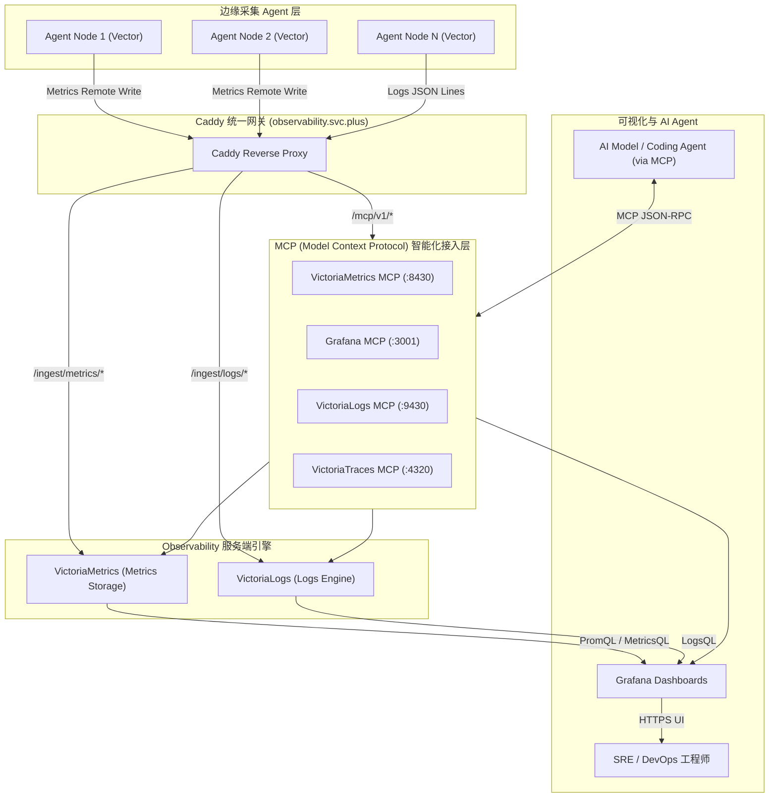

# 集中式可观测性服务端 (Observability Server) 架构解密：VictoriaMetrics、VictoriaLogs、Grafana 阵列与 MCP 智能 Server 集成

在云原生与多云基础设施中，将成百上千个节点、容器与边缘 Agent 上报的指标与日志进行高并发接收、压缩存储与实时查询，是监控服务端的核心挑战。同时，随着 AI Agent (如 LLM / Vibe Coding Assistants) 深入运维流程，如何为 AI 模型提供安全、标准化的上下文查询接口也是现代 Observability 架构的新突破。

本文详细解密 **`observability.svc.plus`** 集中式可观测性服务端的整体架构设计，涵盖组件分工、Caddy 统一网关分流，以及最新在 Ansible Role (`playbooks/roles/docker/observability-server`) 中全量集成的 **Model Context Protocol (MCP) Server** 智能服务拓展。

---

## 1. Observability Server 核心组件清单

服务端采用容器化 + 模块化微服务组合，各组件通过统一的 Caddy 反向代理入口暴露服务：

| 组件名称 | 服务/容器 | 入口 URL / 接口 | 核心职责与性能优势 |
| :--- | :--- | :--- | :--- |
| **Caddy Gateway** | `caddy` | `https://observability.svc.plus` | **统一入口网关与 TLS 终结**。负责多 Path 路由分发、自动 ACME 证书管理与 IP/Token 接入控制。 |
| **VictoriaMetrics** | `victoriametrics` | `/ingest/metrics/api/v1/write`<br>`/select/0/prometheus/` | **时序指标存储与查询引擎**。极低 CPU/内存开销，高度压缩存储，完全兼容 Prometheus 协议与 MetricsQL 语法。 |
| **VictoriaLogs** | `victorialogs` | `/ingest/logs/insert/jsonline`<br>`/select/logsql/` | **海量日志全文检索与分析引擎**。对比 Elasticsearch 内存占用减少 80%，高效处理高基数（High-Cardinality）日志。 |
| **Grafana** | `grafana` | `https://observability.svc.plus/grafana/` | **统一可视化与告警大盘**。聚合 VictoriaMetrics 指标与 VictoriaLogs 日志，提供多维度 Dashboards。 |
| **MCP Servers** *(New)* | `observability-mcp-*` | `/mcp/v1/*` | **AI 模型上下文协议 Server 阵列**。允许 AI Coding Agent (如 Cursor / Claude / Antigravity) 调取 Metrics、Logs、Traces 及 Dashboards 上下文。 |

---

## 2. Model Context Protocol (MCP) Server 能力集成

为了让 AI Agent 具备主动诊断基础设施健康状况的能力，在 Ansible 角色 `playbooks/roles/docker/observability-server` 中全新集成了 MCP Server 的自动化编排与参数配置。

### 2.1 Ansible Role 修改亮点 (`defaults/main.yml`)
在角色默认变量 `defaults/main.yml` 中，新增了全局 MCP 开关及四个核心组件的 MCP 适配器参数：

```yaml
# Ansible Role: playbooks/roles/docker/observability-server/defaults/main.yml

# 1. 全局 MCP 基础参数
observability_mcp_enabled: true
observability_mcp_bind_address: "127.0.0.1"
observability_mcp_auth_enabled: true

# 2. 专项 MCP 服务端默认参数
# 2.1 VictoriaMetrics MCP (提供 MetricsQL 智能查询)
observability_victoriametrics_mcp_enabled: "{{ observability_mcp_enabled }}"
observability_victoriametrics_mcp_port: 8430

# 2.2 Grafana MCP (提供 Dashboards 配置与 Alert 告警状态提取)
observability_grafana_mcp_enabled: "{{ observability_mcp_enabled }}"
observability_grafana_mcp_port: 3001

# 2.3 VictoriaLogs MCP (提供 LogsQL 自动化日志上下文查询)
observability_victorialogs_mcp_enabled: "{{ observability_mcp_enabled }}"
observability_victorialogs_mcp_port: 9430

# 2.4 VictoriaTraces / OTLP MCP (提供全链路 Traces 智能追踪)
observability_victoriatraces_mcp_enabled: "{{ observability_mcp_enabled }}"
observability_victoriatraces_mcp_port: 4320
```

### 2.2 MCP Agent 交互设计
借助 MCP 协议，AI Agent (LLM) 可以安全地向 Observability Server 发起函数调用 (Tool Calls)：
* **Metric Tool Call**: AI 提出 `"查一下 agent-proxy 主机过去 1 小时的内存与带宽使用趋势"` $\rightarrow$ VictoriaMetrics MCP 解析生成 MetricsQL $\rightarrow$ 返回结构化时序数据。
* **Log Tool Call**: AI 提出 `"检索 13:45 左右 Caddy 的 5xx 错误日志"` $\rightarrow$ VictoriaLogs MCP 执行 LogsQL $\rightarrow$ 提取匹配日志上下文。

---

## 3. 服务端整体架构与数据流 (Server Topology)



---

## 4. Caddy 路由分发与安全控制配置

Caddyfile 集中管理所有可观测性子路径及 MCP 路由，实现零侵入扩展：

```caddy
# Caddyfile 片段：observability.svc.plus
observability.svc.plus {
    # 1. Prometheus Metrics Ingest / Query
    handle_path /ingest/metrics/* {
        reverse_proxy victoriametrics:8428
    }

    # 2. VictoriaLogs Ingest / Query
    handle_path /ingest/logs/* {
        reverse_proxy victorialogs:9428
    }

    # 3. Grafana 可视化大盘 UI
    handle /grafana/* {
        reverse_proxy grafana:3000
    }

    # 4. MCP (Model Context Protocol) 智能化 Gateway 路由
    handle_path /mcp/v1/metrics/* {
        reverse_proxy 127.0.0.1:8430
    }
    handle_path /mcp/v1/logs/* {
        reverse_proxy 127.0.0.1:9430
    }
    handle_path /mcp/v1/grafana/* {
        reverse_proxy 127.0.0.1:3001
    }
}
```

---

## 5. 架构优势总结

1. **极致的高并发与存储压缩比**：VictoriaMetrics 相比传统 Prometheus 提供多达 10x 的存储压缩率，有效降低长周期监控存储成本。
2. **原生 AI Agent 支持 (MCP Integrated)**：在 Ansible Role 中全量整合 VictoriaMetrics MCP、Grafana MCP、VictoriaLogs MCP 与 VictoriaTraces MCP，让 AI 大模型原生具备系统排障与上下文感知能力。
3. **极简单一域名路由**：通过 `observability.svc.plus` 统一暴露 HTTPS 接口，边缘 Agent 与 AI 工具链无需感知后端复杂的微服务集群变化。
4. **闭环可观测性**：在 Grafana 或 AI 交互界面中实现从 Metric 指标异常一键关联至 VictoriaLogs 对应时间戳的日志上下文，大幅缩短 MTTR（平均故障恢复时间）。
