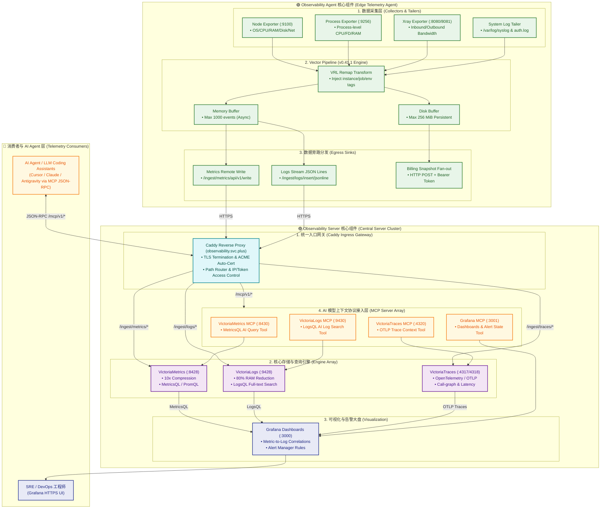

# 集中式可观测性服务端架构解密：VictoriaMetrics、VictoriaLogs、Grafana 阵列与 MCP 智能 Server 集成

> **作者**：shenlan
> **日期**：2026 年 8 月 7 日
> **标签**：observability / victoriametrics / victorialogs / victoriatraces / grafana / mcp / caddy / ansible / vector
> **编辑推荐**：在云原生与多云基础设施中，将成百上千个节点、容器与边缘 Agent 上报的指标与日志进行高并发接收、压缩存储与实时查询，是监控服务端的核心挑战。本文从 Observability Agent 采集、Caddy 统一网关分流到 Ansible 自动化编排，完整解密 observability.svc.plus 的全景架构设计，并重点介绍最新集成的 Model Context Protocol（MCP）Server 智能服务——让 AI Agent（LLM / Vibe Coding Assistants）原生具备系统排障与上下文感知能力。

---

## 摘要

在云原生与多云基础设施中，将成百上千个节点、容器与边缘 Agent 上报的指标与日志进行高并发接收、压缩存储与实时查询，是监控服务端的核心挑战。同时，随着 AI Agent（如 LLM / Vibe Coding Assistants）深入运维流程，如何为 AI 模型提供安全、标准化的上下文查询接口，也是现代 Observability 架构的新突破。

本文详细解密 **`observability.svc.plus`** 集中式可观测性服务端的整体架构设计，涵盖：

- **生态全景图**：参照 2026 架构速查表（Cheatsheet）设计的组件全景与数据链路；
- **组件分工**：Observability Server（VictoriaMetrics、VictoriaLogs、VictoriaTraces、Grafana）与 Observability Agent（Vector、Exporters）的职责边界与性能优势；
- **统一网关**：Caddy 反向代理的多 Path 路由分发与安全控制；
- **AI 原生能力**：最新在 Ansible Role（`playbooks/roles/docker/observability-server`）中全量集成的 MCP Server 智能服务拓展，赋能 AI Coding Agent 实现智能化排障。

---

## 1. Observability & MCP 生态全景 (Ecosystem Cheatsheet)


整体架构遵循四大核心阶段流水线：

```
  [COLLECT]  ──>  [INGEST]  ──>  [STORE]  ──>  [AI DIAGNOSE]
Exporters & Tail      Caddy Gateway     Victoria Cluster      MCP + AI Agent
 (Node/Proc/Xray)   (TLS/Path Route)   (Metrics/Logs/Tracing) (Context Aware)
```

---

## 2. 核心组件清单与矩阵

### 2.1 Observability Server 核心组件清单

服务端采用容器化 + 模块化微服务组合，各组件通过统一的 Caddy 反向代理入口暴露服务：

| 组件名称 | 服务/容器 | 入口 URL / 接口 | 核心职责与性能优势 |
| :--- | :--- | :--- | :--- |
| **Caddy Gateway** | `caddy` | `https://observability.svc.plus` | **统一入口网关与 TLS 终结**。负责多 Path 路由分发、自动 ACME 证书管理与 IP/Token 接入控制。 |
| **VictoriaMetrics** | `victoriametrics` | `/ingest/metrics/api/v1/write`<br>`/select/0/prometheus/` | **时序指标存储与查询引擎**。极低 CPU/内存开销，高度压缩存储（10x 压缩率），完全兼容 Prometheus 协议与 MetricsQL 语法。 |
| **VictoriaLogs** | `victorialogs` | `/ingest/logs/insert/jsonline`<br>`/select/logsql/` | **海量日志全文检索与分析引擎**。对比 Elasticsearch 内存占用减少 80%，高效处理高基数（High-Cardinality）日志。 |
| **VictoriaTraces** | `victoriatraces` | `/ingest/traces/*`<br>`/opentelemetry/v1/traces` | **分布式全链路追踪引擎**。高效接收与存储 OpenTelemetry / OTLP 追踪数据，提供跨微服务的全链路瓶颈排查与上下文关联。 |
| **Grafana** | `grafana` | `https://observability.svc.plus/grafana/` | **统一可视化与告警大盘**。聚合 VictoriaMetrics 指标与 VictoriaLogs 日志，提供多维度 Dashboards 及 Metric-to-Log 一键时间戳钻取。 |
| **MCP Servers（新增）** | `observability-mcp-*` | `/mcp/v1/*` | **AI 模型上下文协议 Server 阵列**。允许 AI Coding Agent（如 Cursor / Claude / Antigravity）调取 Metrics、Logs、Traces 及 Dashboards 上下文。 |

### 2.2 Observability Agent 边缘采集组件清单

目标节点通过轻量级 Agent 管道实现零丢失数据上报：

| 模块层级 | 组件 / 进程 | 端口/协议 | 核心职责与采集指标 |
| :--- | :--- | :--- | :--- |
| **Collectors** | `node-exporter` | `:9100/metrics` | 采集 OS 硬件与系统基础指标（CPU 利用率、内存页、磁盘 I/O、网络网卡吞吐等）。 |
| **Collectors** | `process-exporter` | `:9256/metrics` | 采集单进程级的细粒度指标（进程 CPU 占比、物理/虚拟内存、FD 文件描述符数量、线程状态）。 |
| **Collectors** | `xray-exporter` | `:8080`, `:8081` | 采集隧道代理连通性、实时双向流量（Inbound/Outbound Bytes）及按租户计费的流量 Snapshot。 |
| **Log Tailer** | `vector` file source | `/var/log/*` | 追踪 `/var/log/syslog` 与 `/var/log/auth.log`，将无结构文本转为结构化 JSON 事件流。 |
| **Pipeline Engine** | `vector` (`v0.41.1`) | VRL Engine | 使用 VRL 脚本自动注入全局 `instance`、`job` 与 `environment` 租户标签。 |
| **Buffers** | Memory & Disk Buffer | 256 MiB Disk | 内存缓冲处理毫秒级突发，256MB 磁盘持久化缓冲确保网络中断时数据零丢失。 |
| **Egress Sinks** | Billing Fan-out | HTTP `:8686` | 独立旁路 Sink，通过 HTTP POST + Bearer Token 投递计费快照至结算中心。 |

---

## 3. Model Context Protocol（MCP）Server 能力集成与 AI Agent 运维支持

为了让 **AI Agent（LLM / Vibe Coding Assistants，如 Cursor / Claude / Antigravity）** 深入 SRE/DevOps 运维流程，在 Ansible 角色 `playbooks/roles/docker/observability-server` 中全新集成了 MCP Server 的自动化编排与参数配置。

### 3.1 Ansible Role 修改亮点 (`defaults/main.yml`)

在角色默认变量 `defaults/main.yml` 中，新增了全局 MCP 开关及四个核心组件的 MCP 适配器参数：

```yaml
# Ansible Role: playbooks/roles/docker/observability-server/defaults/main.yml

# 1. 全局 MCP 基础参数
observability_mcp_enabled: true
observability_mcp_bind_address: "127.0.0.1"
observability_mcp_auth_enabled: true

# 2. 专项 MCP 服务端默认参数
# 2.1 VictoriaMetrics MCP (提供 MetricsQL 智能查询)
observability_victoriametrics_mcp_enabled: "{{ observability_mcp_enabled }}"
observability_victoriametrics_mcp_port: 8430

# 2.2 Grafana MCP (提供 Dashboards 配置与 Alert 告警状态提取)
observability_grafana_mcp_enabled: "{{ observability_mcp_enabled }}"
observability_grafana_mcp_port: 3001

# 2.3 VictoriaLogs MCP (提供 LogsQL 自动化日志上下文查询)
observability_victorialogs_mcp_enabled: "{{ observability_mcp_enabled }}"
observability_victorialogs_mcp_port: 9430

# 2.4 VictoriaTraces / OTLP MCP (提供全链路 Traces 智能追踪)
observability_victoriatraces_mcp_enabled: "{{ observability_mcp_enabled }}"
observability_victoriatraces_mcp_port: 4320
```

### 3.2 AI Agent (LLM / Vibe Assistants) 智能交互与排障流程

借助 MCP 协议，AI Agent 可以安全地向 Observability Server 发起函数调用（Tool Calls）：

- **Metric Tool Call (VictoriaMetrics MCP :8430)**：
  - *AI 交互*：AI 提出「查一下 agent-proxy 主机过去 1 小时的内存与带宽使用趋势」 $\rightarrow$ VictoriaMetrics MCP 解析生成 MetricsQL $\rightarrow$ 返回结构化时序数据。
- **Log Tool Call (VictoriaLogs MCP :9430)**：
  - *AI 交互*：AI 提出「检索 13:45 左右 Caddy 的 5xx 错误日志」 $\rightarrow$ VictoriaLogs MCP 执行 LogsQL $\rightarrow$ 提取匹配日志上下文。
- **Trace Tool Call (VictoriaTraces MCP :4320)**：
  - *AI 交互*：AI 提出「针对超时请求 `trace_id=9f8a3b`, 提取其依赖微服务的 span 延迟消耗」 $\rightarrow$ VictoriaTraces MCP 解析 OTLP Trace 上下文，定位慢 SQL 或高延迟 HTTP 调用点。
- **Grafana Tool Call (Grafana MCP :3001)**：
  - *AI 交互*：AI 提出「提取当前 Grafana 处于 Alerting 状态的规则及涉及的服务清单」 $\rightarrow$ Grafana MCP 调取 AlertManager 状态并返回面板配置。


---

## 4. 服务端整体架构与数据流（Server Topology）


<details>
<summary>点击展开 Mermaid 架构源码 (Mermaid Source Code)</summary>



</details>

**数据流要点**：

1. 边缘节点通过 Vector 采集指标（Metrics Remote Write）、日志（Logs JSON Lines）与分布式链路数据（OTLP Traces），统一上报至 Caddy 网关；
2. Caddy 按 Path 前缀分发：`/ingest/metrics/*` → VictoriaMetrics，`/ingest/logs/*` → VictoriaLogs，`/ingest/traces/*` → VictoriaTraces；
3. 可视化与告警由 Grafana 聚合三端数据源；AI Agent 则通过 `/mcp/v1/*` 与 MCP Server 阵列进行 JSON-RPC 双向交互。

---

## 5. Caddy 路由分发与安全控制配置

Caddyfile 集中管理所有可观测性子路径及 MCP 路由，实现零侵入扩展：

```caddyfile
# Caddyfile 片段：observability.svc.plus
observability.svc.plus {
    # 1. Prometheus Metrics Ingest / Query
    handle_path /ingest/metrics/* {
        reverse_proxy victoriametrics:8428
    }

    # 2. VictoriaLogs Ingest / Query
    handle_path /ingest/logs/* {
        reverse_proxy victorialogs:9428
    }

    # 3. VictoriaTraces OTLP Ingest / Query
    handle_path /ingest/traces/* {
        reverse_proxy victoriatraces:4318
    }

    # 4. Grafana 可视化大盘 UI
    handle /grafana/* {
        reverse_proxy grafana:3000
    }

    # 5. MCP (Model Context Protocol) 智能化 Gateway 路由
    handle_path /mcp/v1/metrics/* {
        reverse_proxy 127.0.0.1:8430
    }
    handle_path /mcp/v1/logs/* {
        reverse_proxy 127.0.0.1:9430
    }
    handle_path /mcp/v1/traces/* {
        reverse_proxy 127.0.0.1:4320
    }
    handle_path /mcp/v1/grafana/* {
        reverse_proxy 127.0.0.1:3001
    }
}
```

**安全控制要点**：

- MCP Server 默认仅绑定 `127.0.0.1`，不直接对外暴露端口，必须经 Caddy 网关鉴权后才可达；
- `observability_mcp_auth_enabled: true` 开启 MCP 层认证，配合 Caddy 的 IP/Token 接入控制形成双重防护；
- 统一域名 + ACME 自动证书，边缘 Agent 与 AI 工具链无需感知后端微服务集群的变化。

---

## 6. 架构优势总结

1. **极致的高并发与存储压缩比**：VictoriaMetrics 相比传统 Prometheus 提供多达 10x 的存储压缩率，有效降低长周期监控存储成本；
2. **原生 AI Agent 支持（MCP Integrated）**：在 Ansible Role 中全量整合 VictoriaMetrics MCP、Grafana MCP、VictoriaLogs MCP 与 VictoriaTraces MCP，让 AI 大模型原生具备系统排障与上下文感知能力；
3. **极简单一域名路由**：通过 `observability.svc.plus` 统一暴露 HTTPS 接口，边缘 Agent 与 AI 工具链无需感知后端复杂的微服务集群变化；
4. **闭环可观测性**：在 Grafana 或 AI 交互界面中实现从 Metric 指标异常一键关联至 VictoriaLogs 对应时间戳的日志上下文与 VictoriaTraces 追踪，大幅缩短 MTTR（平均故障恢复时间）。

---

## 关于作者

长期关注云原生基础设施、可观测性与 AI Agent 工程化落地。本文基于生产环境 `observability.svc.plus` 的真实部署经验整理，全部组件配置均通过 Ansible Role（`playbooks/roles/docker/observability-server`）自动化编排。
