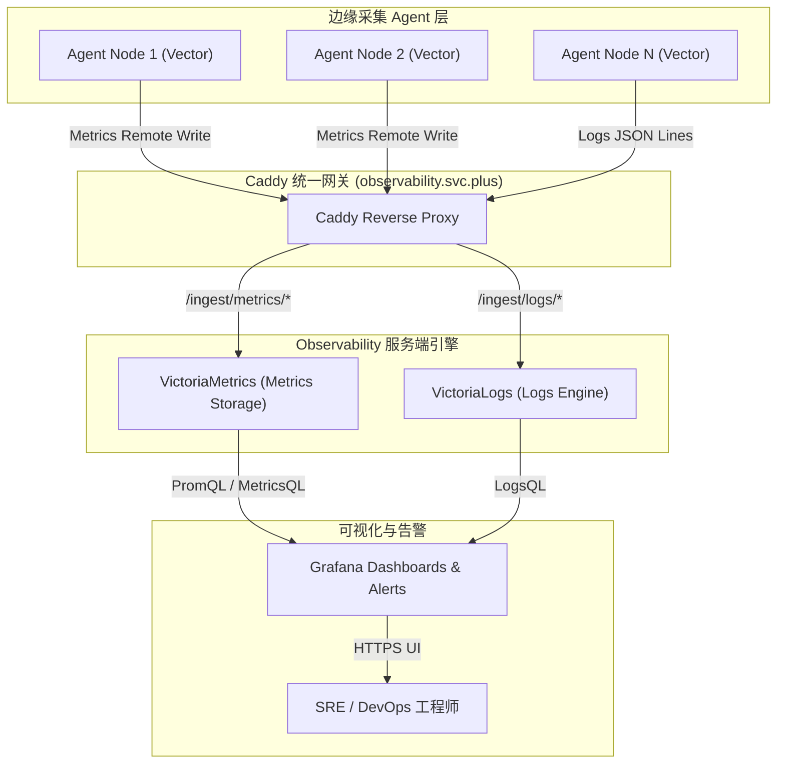

# 集中式可观测性服务端 (Observability Server) 架构解密：VictoriaMetrics、VictoriaLogs 与 Grafana 统一监控阵列

在云原生与多云基础设施中，将成百上千个节点、容器与边缘 Agent 上报的指标与日志进行高并发接收、压缩存储与实时查询，是监控服务端的的核心挑战。本文详细解密 **`observability.svc.plus`** 集中式可观测性服务端的整体架构设计，展示如何通过 Caddy 统一网关分流、VictoriaMetrics 时序引擎、VictoriaLogs 日志存储及 Grafana 打造云中立的统一观测大盘。

---

## 1. Observability Server 核心组件清单

服务端采用容器化 + 模块化微服务组合，各组件通过统一的 Caddy 反向代理入口暴露服务：

| 组件名称 | 服务/容器 | 入口 URL / 接口 | 核心职责与性能优势 |
| :--- | :--- | :--- | :--- |
| **Caddy Gateway** | `caddy` | `https://observability.svc.plus` | **统一入口网关与 TLS 终结**。负责多 Path 路由分发、自动 ACME 证书管理与 IP/Token 接入控制。 |
| **VictoriaMetrics** | `victoriametrics` | `/ingest/metrics/api/v1/write`<br>`/select/0/prometheus/` | **时序指标存储与查询引擎**。极低 CPU/内存开销，高度压缩存储，完全兼容 Prometheus 协议与 MetricsQL 语法。 |
| **VictoriaLogs** | `victorialogs` | `/ingest/logs/insert/jsonline`<br>`/select/logsql/` | **海量日志全文检索与分析引擎**。对比 Elasticsearch 内存占用减少 80%，高效处理高基数（High-Cardinality）日志。 |
| **Grafana** | `grafana` | `https://observability.svc.plus/grafana/` | **统一可视化与告警大盘**。聚合 VictoriaMetrics 指标与 VictoriaLogs 日志，提供多维度 Dashboards。 |

---

## 2. 服务端整体架构与数据流 (Server Topology)



---

## 3. Caddy 路由分发与安全控制配置

Caddyfile 集中管理所有可观测性子路径路由，实现零侵入扩展：

```caddy
# Caddyfile 片段：observability.svc.plus
observability.svc.plus {
    # 1. Prometheus Metrics Ingest / Query
    handle_path /ingest/metrics/* {
        reverse_proxy victoriametrics:8428
    }

    # 2. VictoriaLogs Ingest / Query
    handle_path /ingest/logs/* {
        reverse_proxy victorialogs:9428
    }

    # 3. Grafana 可视化大盘 UI
    handle /grafana/* {
        reverse_proxy grafana:3000
    }
}
```

---

## 4. 架构优势总结

1. **极致的高并发与存储压缩比**：VictoriaMetrics 相比传统 Prometheus 提供多达 10x 的存储压缩率，有效降低长周期监控存储成本。
2. **极简单一域名路由**：通过 `observability.svc.plus` 统一暴露 HTTPS 接口，边缘 Agent 无需感知后端复杂的微服务集群变化。
3. **闭环可观测性**：在 Grafana 中实现从 Metric 指标异常一键下钻（Drill-down）关联至 VictoriaLogs 对应时间戳的日志上下文，大幅缩短 MTTR（平均故障恢复时间）。
