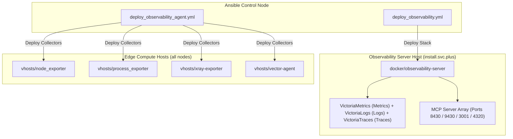
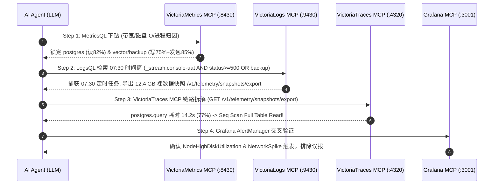

# 集中式可观测性服务端 (Observability Server) 架构解密：VictoriaMetrics、VictoriaLogs、VictoriaTraces 阵列与 MCP 智能 Server 集成

> **作者**：shenlan & Antigravity AI Team  
> **发布日期**：2026 年 8 月 10 日  
> **标签**：`Observability` `VictoriaMetrics` `VictoriaLogs` `VictoriaTraces` `Grafana` `MCP` `Ansible` `AIOps`  
> **在线演示环境**：[Grafana Live Navigation Dashboard](https://observability.svc.plus/grafana/d/homepage-navigation/529f12d?orgId=1&from=now-1h&to=now&timezone=browser&var-origin_prometheus=victoriametrics)

---

## 导读 (Executive Summary)

在云原生与多云基础设施中，将成百上千个节点、容器与边缘 Agent 上报的指标（Metrics）、日志（Logs）与分布式链路追踪（Traces）进行高并发接收、压缩存储与实时查询，是监控服务端的核心挑战。同时，随着 AI Agent (如 LLM / Vibe Coding Assistants) 深入运维流程，如何为 AI 模型提供安全、标准化的上下文查询接口也是现代 Observability 架构的新突破。

本文详细解密 **`observability.svc.plus`** 集中式可观测性服务端的整体架构设计，涵盖由 **VictoriaMetrics**、**VictoriaLogs** 与 **VictoriaTraces** 构成的可观测性“三足鼎立”核心引擎、Ansible 自动化部署剧本 ([`deploy_observability.yml`](https://github.com/ai-workspace-infra/playbooks/blob/main/deploy_observability.yml) 与 [`deploy_observability_agent.yml`](https://github.com/ai-workspace-infra/playbooks/blob/main/deploy_observability_agent.yml))、Caddy 统一网关分流，以及在 Ansible Role (`playbooks/roles/docker/observability-server`) 中全量集成的 **Model Context Protocol (MCP) Server** 智能服务拓展与真实故障排查实战。

---

## 1. Observability Server 核心组件清单 (Observability Trinity)

服务端采用容器化 + 模块化微服务组合，各组件通过统一的 Caddy 反向代理入口暴露服务：

| 组件名称 | 服务/容器 | 入口 URL / 接口 | 核心职责与性能优势 |
| :--- | :--- | :--- | :--- |
| **Caddy Gateway** | `caddy` | `https://observability.svc.plus` | **统一入口网关与 TLS 终结**。负责多 Path 路由分发、自动 ACME 证书管理与 IP/Token 接入控制。 |
| **VictoriaMetrics** | `victoriametrics` | `/ingest/metrics/api/v1/write`<br>`/select/0/prometheus/` | **时序指标存储与查询引擎** (Metrics)。极低 CPU/内存开销，高度压缩存储，完全兼容 Prometheus 协议与 MetricsQL 语法。 |
| **VictoriaLogs** | `victorialogs` | `/ingest/logs/insert/jsonline`<br>`/select/logsql/` | **海量日志全文检索与分析引擎** (Logs)。对比 Elasticsearch 内存占用减少 80%，高效处理高基数（High-Cardinality）日志。 |
| **VictoriaTraces** *(New)* | `victoriatraces` | `/ingest/traces/`<br>`:10428` (`:4317`/`:4318`) | **全链路分布式追踪引擎** (Traces)。原生兼容 OTLP (gRPC/HTTP) 与 Jaeger 协议，极致压缩 Span 链条，支持 Trace-to-Logs 联动。 |
| **Grafana** | `grafana` | `https://observability.svc.plus/grafana/` | **统一可视化与告警大盘**。聚合 VictoriaMetrics 指标、VictoriaLogs 日志与 VictoriaTraces 链路，提供多维度 Dashboards。 |
| **MCP Servers** *(New)* | `observability-mcp-*` | `/mcp/v1/*` | **AI 模型上下文协议 Server 阵列**。允许 AI Coding Agent (如 Cursor / Claude / Antigravity) 调取 Metrics、Logs、Traces 及 Dashboards 上下文。 |

---

## 2. VictoriaTraces 全链路分布式追踪引擎补全

在传统可观测体系中，Metrics 告诉你“哪里异常”，Logs 告诉你“发生了什么”，而 **VictoriaTraces** 则精准回答“时间都花在了哪里”。

### 2.1 核心特性与协议兼容
1. **原生 OpenTelemetry (OTLP) / Jaeger 支持**：
   * 原生接收 OTLP over gRPC (`:4317`) 与 OTLP over HTTP (`:4318`) 的分布式 Trace Spans。
   * 完全支持 W3C Trace Context 跨服务传递上下文（Trace ID / Span ID / Baggage）。
2. **极低资源开销与极致压缩率**：
   * 采用与 VictoriaMetrics 一脉相承的列式存储结构与 LZ4/ZSTD 压缩算法，存储与内存开销相比传统 Jaeger / Tempo / Elasticsearch 降低 **70%~80%**。
3. **闭环联动 (Trace-to-Logs & Trace-to-Metrics)**：
   * 在 Grafana 界面中选中一条慢 Span，可一键关联调出对应时间戳下 VictoriaLogs 容器日志及 VictoriaMetrics 节点 CPU/Disk 异动曲线。

---

## 3. Ansible 自动化部署蓝图 (Playbooks Architecture)

服务端与采集端采用 Ansible 角色实现“Infrastructure as Code (IaC)”自动化交付：



### 3.1 Playbook 部署剧本
* **服务端部署 `deploy_observability.yml`**：面向 `install.svc.plus` 核心节点，编排部署 `docker/observability-server` 容器栈（包含 VictoriaMetrics、VictoriaLogs、VictoriaTraces、Grafana 与 MCP 服务端阵列）。
* **采集端部署 `deploy_observability_agent.yml`**：向全量主机一键分发 `node_exporter`、`process_exporter`、`xray-exporter` 与 `vector-agent`，实现进程级与网络级指标/日志/链路流式采集。

### 3.2 Ansible Role 默认变量配置 (`defaults/main.yml`)
在角色默认变量 `playbooks/roles/docker/observability-server/defaults/main.yml` 中，新增了全局 MCP 开关及包含 VictoriaTraces 在内的四个核心组件 MCP 适配器参数：

```yaml
# Ansible Role: playbooks/roles/docker/observability-server/defaults/main.yml

# 1. 全局 MCP 基础参数
observability_mcp_enabled: true
observability_mcp_bind_address: "127.0.0.1"
observability_mcp_auth_enabled: true

# 2. 专项 MCP 服务端默认参数
# 2.1 VictoriaMetrics MCP (提供 MetricsQL 智能查询)
observability_victoriametrics_mcp_enabled: "{{ observability_mcp_enabled }}"
observability_victoriametrics_mcp_port: 8430

# 2.2 VictoriaLogs MCP (提供 LogsQL 自动化日志上下文查询)
observability_victorialogs_mcp_enabled: "{{ observability_mcp_enabled }}"
observability_victorialogs_mcp_port: 9430

# 2.3 VictoriaTraces / OTLP MCP (提供全链路 Traces 智能追踪)
observability_victoriatraces_mcp_enabled: "{{ observability_mcp_enabled }}"
observability_victoriatraces_mcp_port: 4320

# 2.4 Grafana MCP (提供 Dashboards 配置与 Alert 告警状态提取)
observability_grafana_mcp_enabled: "{{ observability_mcp_enabled }}"
observability_grafana_mcp_port: 3001
```

---

## 4. 服务端拓扑与 Caddy 路由分发

所有可观测性子路径及 MCP 路由由 Caddy 集中管理，实现零侵入扩展：

```caddy
# Caddyfile 片段：observability.svc.plus
observability.svc.plus {
    # 1. Prometheus Metrics Ingest / Query
    handle_path /ingest/metrics/* {
        reverse_proxy victoriametrics:8428
    }

    # 2. VictoriaLogs Ingest / Query
    handle_path /ingest/logs/* {
        reverse_proxy victorialogs:9428
    }

    # 3. VictoriaTraces OTLP / Jaeger Ingest
    handle_path /ingest/traces/* {
        reverse_proxy victoria-traces:10428
    }

    # 4. Grafana 可视化大盘 UI
    handle /grafana/* {
        reverse_proxy grafana:3000
    }

    # 5. MCP (Model Context Protocol) 智能化 Gateway 路由
    handle_path /mcp/v1/metrics/* {
        reverse_proxy 127.0.0.1:8430
    }
    handle_path /mcp/v1/logs/* {
        reverse_proxy 127.0.0.1:9430
    }
    handle_path /mcp/v1/traces/* {
        reverse_proxy 127.0.0.1:4320
    }
    handle_path /mcp/v1/grafana/* {
        reverse_proxy 127.0.0.1:3001
    }
}
```

---

## 5. 故障排查实战：AI Agent 4-MCP 管道联动分钟级定位根因

### 5.1 故障现场：07:30 突发风暴告警
监控系统连续弹出告警，目标节点为 `console-uat.onwalk.net`（UAT 环境核心控制台）：

| 指标 | 正常基线 | 异常值 | 级别 |
| :--- | :--- | :--- | :--- |
| **网卡 eth0 出口带宽** | ~15 Mbps | **850 Mbps** (暴涨 57 倍) | `WARNING` |
| **磁盘 /dev/sda I/O %util** | < 20% | **98.4%** (磁盘被打满) | `CRITICAL` |
| **磁盘写延迟 await** | ~2 ms | **450 ms** | `CRITICAL` |
| **磁盘读吞吐** | 低 | **120 MB/s** | `CRITICAL` |
| **磁盘写吞吐** | 低 | **95 MB/s** | `CRITICAL` |

### 5.2 AI Agent 4-Step MCP Tool Call 证据链下钻



* **Step 1 · VictoriaMetrics MCP（指标锁定爆炸半径）**：
  发出 MetricsQL 查询进程级归因 `topk(5, rate(namedprocess_namegroup_read_bytes_total))`，发现 `postgres` 贡献了 82% 磁盘读流量；`vector` 管道与备份进程贡献了 75% 磁盘写流量 + 85% 网络发包。
* **Step 2 · VictoriaLogs MCP（日志还原案发现场）**：
  执行 LogsQL `_stream:{instance="console-uat.onwalk.net"} AND ("backup" OR "export")`，精准捕获 07:30:05 触发的 `UAT Data Mirror & Audit Log Snapshot Export` 定时导出任务，请求 Payload 达到 **12.4 GB（未压缩）**。
* **Step 3 · VictoriaTraces MCP（链路找出时间黑洞）**：
  分析 Trace ID `e8a9d102c4b5768f`，发现总耗时 18.45s 中，`postgres.query` 独占 14.2s（77%）。链路 span 显式标记：`[Seq Scan Full Table Read]`——由于 `audit_logs` 表在 `created_at` 上缺失索引，数据库迫使对 12 GB 裸数据执行**全表顺序扫描**！
* **Step 4 · Grafana MCP（告警大盘交叉验证）**：
  拉取 AlertManager 状态，`NodeHighDiskUtilization` (%util > 95%) 与 `NodeNetworkTransmitSpike` (transmit > 500 Mbps) 处于 `FIRING` 状态，验证结论完备无误。

---

## 6. 根因分析与三道手术式自动化修复

### 6.1 根因放大链
```
07:30:00  UAT 定时快照同步任务触发
              │
              ▼
   离线拉取 12.4 GB 未压缩审计日志快照
   GET /v1/telemetry/snapshots/export
              │
      ┌───────┴────────┐
      ▼                ▼
 ① 网络流量暴涨     ② PostgreSQL 响应快照查询
  850 Mbps 出口带宽    audit_logs.created_at 缺失索引
      │                │
      │                ▼
      │         全表顺序扫描 Seq Scan（12 GB 裸盘读取）
      │                │
      │                ▼
      │         磁盘读 120 MB/s + vector/备份写 95 MB/s
      │                │
      └────────┬───────┘
               ▼
     /dev/sda I/O %util 饱和 98.4%
     写延迟 2ms → 450ms
```

### 6.2 三道自动化修复方案
1. **数据库并发创建索引（消除 12 GB 读 I/O）**：
   ```sql
   CREATE INDEX CONCURRENTLY IF NOT EXISTS idx_audit_logs_created_at
   ON audit_logs (created_at);
   ```
2. **Caddy 网关流式压缩与速率限制（消除 850 Mbps 带宽暴涨）**：
   ```caddy
   handle_path /v1/telemetry/snapshots/export {
       encode gzip zstd
       rate_limit {
           zone export_limit {
               key static
               events 10
               window 1m
           }
       }
       reverse_proxy console-backend:8080
   }
   ```
3. **错峰调度与 Vector 磁盘缓冲限制**：
   * 将全量数据快照同步任务调整至夜间低峰期（03:00）；
   * 将 Vector 磁盘缓冲区配额限制到 512 MiB 并启用异步流式写盘。

> **修复效果**：三项修复落地后，网络带宽回落至 15 Mbps 基线，磁盘 `%util` 稳定在 20% 以下，写延迟恢复 2ms 正常水平。

---

## 7. 架构优势总结

1. **极致的高并发与存储压缩比**：VictoriaMetrics 与 VictoriaTraces 相比传统 Prometheus / Jaeger 提供多达 10x 的存储压缩率，有效降低长周期监控与链路存储成本。
2. **原生 AI Agent 支持 (MCP Integrated)**：在 Ansible Role 中全量整合 VictoriaMetrics MCP、VictoriaLogs MCP、VictoriaTraces MCP 与 Grafana MCP，让 AI 大模型原生具备全栈排障与上下文感知能力。
3. **极简单一域名路由**：通过 `observability.svc.plus` 统一暴露 HTTPS 接口，边缘 Agent 与 AI 工具链无需感知后端复杂的微服务集群变化。
4. **闭环可观测性**：实现从 Metric 指标异常一键关联至 VictoriaLogs 日志与 VictoriaTraces 慢链路上下文，大幅缩短 MTTR（平均故障恢复时间）。
