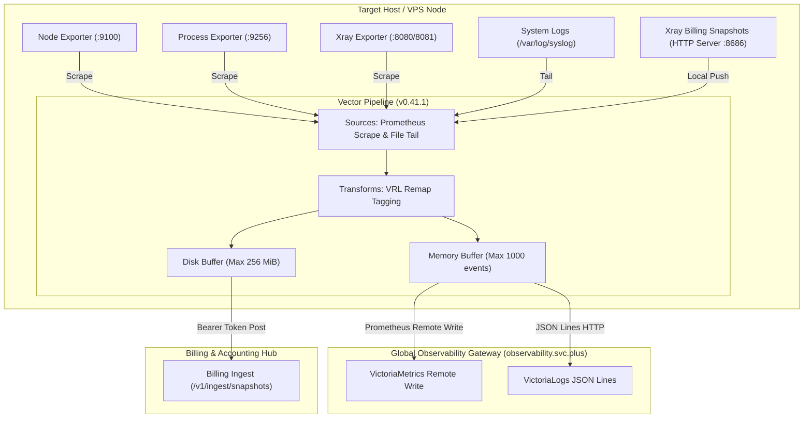

# Cloud-Native Observability Agent Architecture: High-Performance Data Pipeline and Billing Fan-out via Vector (v0.41.1) and Exporters

In multi-cloud hybrid deployments and edge proxy workloads, a high-performance, low-footprint, and fault-tolerant telemetry collection agent is the bedrock of infrastructure stability. This article provides a technical deep dive into the centralized agent architecture powered by **Vector (v0.41.1) by Datadog / Timber**, demonstrating how modular exporters, memory/disk buffering, multi-protocol ingestion, and billing data fan-out operate seamlessly together.

---

## 1. Core Agent Components & Responsibilities

On target server nodes (such as the `agent-proxy` gateway and `console` control plane), the observability suite uses a decoupled design comprising a **unified Vector telemetry pipeline + dedicated metric exporters**:

| Component | Service Unit (`systemd`) | Port / Protocol | Responsibilities & Collected Telemetry |
| :--- | :--- | :--- | :--- |
| **Vector** | `vector.service` | `v0.41.1` | **Unified Telemetry Pipeline & Forwarder**. Collects metrics and logs, applies VRL remap transformations, handles disk buffering, and securely ships data upstream. |
| **Node Exporter** | `node-exporter.service` | `:9100/metrics` | Collects OS hardware and core system metrics (CPU utilization, memory pages, disk I/O, network throughput). |
| **Process Exporter** | `process-exporter.service` | `:9256/metrics` | Collects granular process-level telemetry (CPU ratio per process, RSS/VMS memory, open file descriptors, thread status). |
| **Xray Exporter** | `xray-exporter-xhttp/tcp.service` | `:8080`, `:8081` | Collects proxy tunnel health, real-time throughput (Inbound/Outbound Bytes), and billing snapshot metrics per user. |

---

## 2. End-to-End Data Pipeline Architecture

Vector serves as an edge relay node, normalizing multi-source telemetry before delivering it to `observability.svc.plus` and the billing gateway:



### 2.1 Metrics Pipeline
* **Sources**: Scrapes `127.0.0.1:9100` (Node), `127.0.0.1:9256` (Process), and `127.0.0.1:8080/8081` (Xray).
* **Remap Transformation**: Uses Vector Remap Language (VRL) to attach global `instance` (FQDN), `job`, and `transport` labels.
* **Upstream Ingestion**: Ships metrics via `prometheus_remote_write` to `https://observability.svc.plus/ingest/metrics/api/v1/write`.

### 2.2 Logs Pipeline
* **Sources**: Tails `/var/log/syslog` and `/var/log/auth.log`.
* **Upstream Ingestion**: Formats records as streaming JSON Lines to VictoriaLogs at `https://observability.svc.plus/ingest/logs/insert/jsonline`.

---

## 3. Billing Snapshot Fan-out Mechanism

To guarantee exact accounting for network bandwidth with high availability, the architecture includes a dedicated **Billing Fan-out** channel:

1. **Local High-Speed Ingestion**: Vector exposes a local HTTP Server listening on `127.0.0.1:8686`. The Xray exporter pushes traffic snapshots directly to local Vector.
2. **Persistent Disk Buffering**: Configured with a **256 MiB disk buffer**. Even if the billing service experiences transient outages or network partitions, snapshots remain safe on local storage and replay automatically upon recovery.
3. **Secure Auth Delivery**: Transmits snapshots using `Authorization: Bearer <INTERNAL_SERVICE_TOKEN>` to `https://billing-uat.onwalk.net/v1/ingest/snapshots`.

---

## 4. Vector Configuration Reference

```toml
# Core Vector configuration: /etc/vector/vector.toml
[api]
enabled = false # Disable local API to optimize memory footprint

# 1. Prometheus Scrape Source
[sources.node_metrics]
type = "prometheus_scrape"
endpoints = ["http://127.0.0.1:9100/metrics"]
scrape_interval_secs = 15

# 2. Add Global Host Labels
[transforms.add_labels]
type = "remap"
inputs = ["node_metrics"]
source = '''.tags.instance = "agent-proxy.onwalk.net"'''

# 3. Remote Write Sink for Metrics
[sinks.prometheus_remote]
type = "prometheus_remote_write"
inputs = ["add_labels"]
endpoint = "https://observability.svc.plus/ingest/metrics/api/v1/write"
[sinks.prometheus_remote.auth]
strategy = "basic"
user = "${VECTOR_AUTH_USER}"
password = "${VECTOR_AUTH_PASSWORD}"

# 4. Billing Snapshot Fan-out Sink (Disk Buffer Enabled)
[sinks.billing_snapshot_ingest]
type = "http"
inputs = ["xray_snapshot_input"]
uri = "https://billing-uat.onwalk.net/v1/ingest/snapshots"
method = "post"
encoding.codec = "json"
[sinks.billing_snapshot_ingest.buffer]
type = "disk"
max_size = 268435488 # 256 MiB Disk Buffer
```

---

## 5. Summary & Best Practices

The Vector (v0.41.1) agent architecture cleanly decouples collection, transformation, and forwarding:
* **Minimal Footprint**: Operates within a lean 25MB–40MB RAM footprint.
* **Zero Data Loss Guarantee**: Disk buffering safeguards billing snapshots against downstream network disruptions.
* **Centralized Credentials**: Integrates with Vault to manage `VECTOR_AUTH_USER` and `VECTOR_AUTH_PASSWORD` for end-to-end security.
