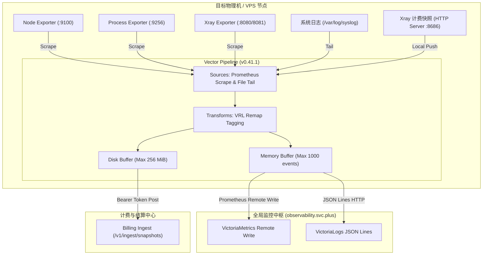

# 云原生可观测性 Agent 架构：基于 Vector (v0.41.1) 与 Exporters 的高性能数据管线与计费分流实战

在多云混合部署与边缘代理计算场景下，高性能、低资源消耗且具备强容错能力的可观测性采集 Agent 是整个基础设施稳定运行的基石。本文深度剖析基于 **Datadog / Timber 出品的 Vector (v0.41.1)** 构建的集中式 Agent 架构，展示如何通过模块化 Exporters 采集、内存/磁盘双重缓冲、多协议上报以及计费流量分流（Billing Fan-out）实现无缝数据协同。

---

## 1. 核心 Agent 及配套组件清单

在目标服务器节点（如代理网关 `agent-proxy` 与控制节点 `console`）上，监控套件采用了 **Vector 统一管道 + 专项 Exporters 采集** 的解耦设计：

| 组件名称 | 服务进程 (`systemd`) | 端口/协议 | 核心职责与采集指标 |
| :--- | :--- | :--- | :--- |
| **Vector** | `vector.service` | `v0.41.1` | **统一数据管道/传输 Agent**。负责多源指标与日志的收集、Remap 标签清洗、磁盘缓冲及远端加密上报。 |
| **Node Exporter** | `node-exporter.service` | `:9100/metrics` | 采集 OS 硬件与系统基础指标（CPU 利用率、内存页、磁盘 I/O、网络网卡吞吐等）。 |
| **Process Exporter** | `process-exporter.service` | `:9256/metrics` | 采集单进程级的细粒度指标（进程 CPU 占比、物理/虚拟内存、FD 文件描述符数量、线程状态）。 |
| **Xray Exporter** | `xray-exporter-xhttp/tcp.service` | `:8080`, `:8081` | 采集隧道代理连通性、实时双向流量（Inbound/Outbound Bytes）及按用户计费的流量快照数据。 |

---

## 2. 端到端数据流向与上报链路 (Data Pipeline)

Vector 作为边缘中继 Node，将多源数据标准化处理后分发至远端监控平台 `observability.svc.plus` 与本地计费网关：



### 2.1 指流 (Metrics Pipeline)
* **采集源**：Prometheus 抓取 `127.0.0.1:9100` (Node)、`127.0.0.1:9256` (Process)、`127.0.0.1:8080/8081` (Xray)。
* **Remap 转换**：通过 Vector Remap Language (VRL) 自动注入 `instance` (主机 FQDN)、`job` 与 `transport` 标签。
* **远端写入**：以 `prometheus_remote_write` 格式加密发送至 `https://observability.svc.plus/ingest/metrics/api/v1/write`。

### 2.2 日志流 (Logs Pipeline)
* **采集源**：追踪 `/var/log/syslog` 与 `/var/log/auth.log` 文件。
* **远端写入**：转换为流式 JSON Lines，推送至 VictoriaLogs 接口 `https://observability.svc.plus/ingest/logs/insert/jsonline`。

---

## 3. 计费快照分流机制 (Billing Fan-out)

为了保证网络流量计费的绝对精确与高可靠性，系统设计了独立的 **Billing Fan-out（计费快照旁路分流）** 通道：

1. **本地极速接收**：Vector 在本地开放 HTTP Server 监听 `127.0.0.1:8686`，Xray 计费模块将秒级流量 Snapshot 直接推送到本地 Vector。
2. **持久化落盘 Buffer (Disk Buffer)**：配有 **256 MiB 磁盘持久化缓冲区**。即使目标计费服务临时断网或高负载，快照数据依然安全缓存在本地磁盘，断网恢复后自动顺序补发。
3. **安全身份校验**：使用独立鉴权头 `Authorization: Bearer <INTERNAL_SERVICE_TOKEN>` 投递至 `https://billing-uat.onwalk.net/v1/ingest/snapshots`。

---

## 4. Vector 核心配置片段参照

```toml
# Vector 核心配置文件：/etc/vector/vector.toml
[api]
enabled = false # 关闭本地 API 以节约内存开销

# 1. 抓取 Node Exporter
[sources.node_metrics]
type = "prometheus_scrape"
endpoints = ["http://127.0.0.1:9100/metrics"]
scrape_interval_secs = 15

# 2. 注入全局主机标签
[transforms.add_labels]
type = "remap"
inputs = ["node_metrics"]
source = '''.tags.instance = "agent-proxy.onwalk.net"'''

# 3. 指标推送至全局监控 Server
[sinks.prometheus_remote]
type = "prometheus_remote_write"
inputs = ["add_labels"]
endpoint = "https://observability.svc.plus/ingest/metrics/api/v1/write"
[sinks.prometheus_remote.auth]
strategy = "basic"
user = "${VECTOR_AUTH_USER}"
password = "${VECTOR_AUTH_PASSWORD}"

# 4. 计费快照旁路 Sink (持久化磁盘 Buffer)
[sinks.billing_snapshot_ingest]
type = "http"
inputs = ["xray_snapshot_input"]
uri = "https://billing-uat.onwalk.net/v1/ingest/snapshots"
method = "post"
encoding.codec = "json"
[sinks.billing_snapshot_ingest.buffer]
type = "disk"
max_size = 268435488 # 256 MiB 磁盘缓冲
```

---

## 5. 总结与最佳实践

基于 Vector (v0.41.1) 的 Agent 架构成功将采集、处理与转发解耦：
* **超低资源占用**：整体内存消耗控制在 25MB~40MB 以内。
* **数据零丢失**：使用磁盘 Buffer 兜底计费快照，保障财务审计准确性。
* **统一身份认证**：通过 Vault 集中管理 `VECTOR_AUTH_USER` 与 `VECTOR_AUTH_PASSWORD`，实现安全闭环。
