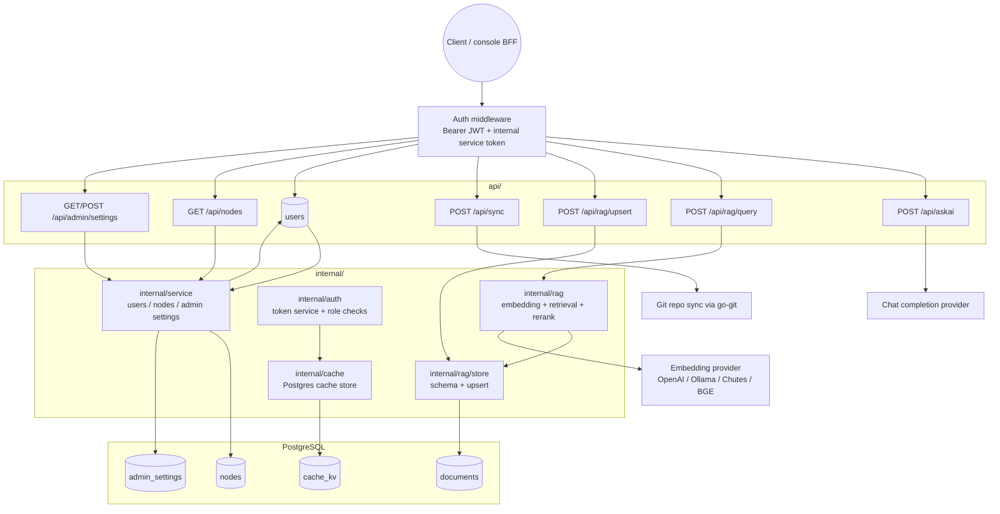

# rag-server.svc.plus Architecture

## Scope

`rag-server.svc.plus` is the RAG backend. It owns hybrid search, document ingestion, AskAI generation, repo sync, metadata reads, and admin settings for the retrieval stack.

## Architecture

## API Matrix

| Name | Path | Purpose | Database / table | Auth mode |
| --- | --- | --- | --- | --- |
| AskAI | `POST /api/askai` | Generate answer and optionally attach retrieved chunks | `documents` via RAG | internal service token + `Authorization: Bearer` JWT when enabled |
| RAG query | `POST /api/rag/query` | Hybrid retrieval only | `documents` | internal service token + `Authorization: Bearer` JWT when enabled |
| RAG upsert | `POST /api/rag/upsert` | Insert or update pre-embedded chunks | `documents` | internal service token + `Authorization: Bearer` JWT when enabled |
| Repo sync | `POST /api/sync` | Sync a git repo into local path | no direct table write | internal service token + `Authorization: Bearer` JWT when enabled |
| Users | `GET /api/users` | Read user metadata from the service DB | `users` | internal service token + `Authorization: Bearer` JWT when enabled |
| Nodes | `GET /api/nodes` | Read node metadata from the service DB | `nodes` | internal service token + `Authorization: Bearer` JWT when enabled |
| Admin settings | `GET /api/admin/settings`, `POST /api/admin/settings` | Read and update permission matrix | `admin_settings` | internal service token + `Authorization: Bearer` JWT when enabled, plus `X-User-Role: admin|operator` |

## Data Model

| Table | Role |
| --- | --- |
| `documents` | Vector + full-text store for knowledge chunks |
| `cache_kv` | Token and response cache used by auth / query paths |
| `users` | Service-side user metadata |
| `nodes` | Service-side node metadata |
| `admin_settings` | Versioned permission matrix |

## Auth Notes

- The auth module validates `Authorization: Bearer <token>` and expects the JWT claim `service = "rag-server"`.
- `cache_kv` is used to cache validated access tokens.
- `/api/admin/settings` also requires `X-User-Role` or `X-Role` to be `admin` or `operator`.
- Health checks remain outside `/api`.

## Notes

- `api/register.go` wires all routes under `/api`.
- The RAG service is lazy-initialized; if the backing config is missing, RAG endpoints degrade gracefully instead of crashing.
