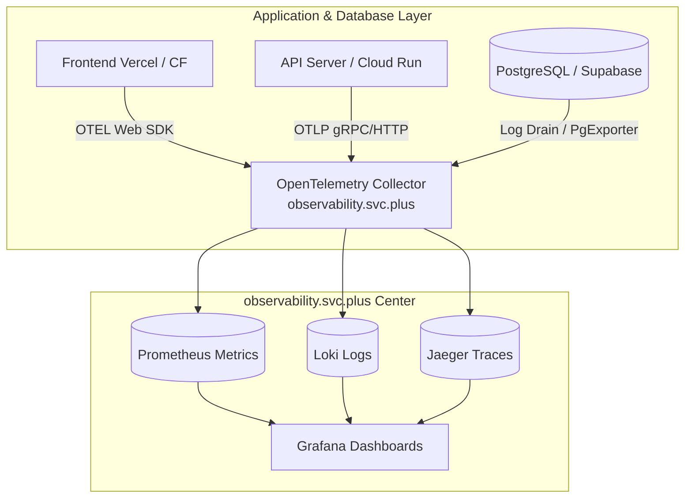

# PostgreSQL Architecture Selection & Observability Integration Guide

> **Project**: `ai-workspace-service` & `postgresql.svc.plus`  
> **Category**: Architecture Design / Deployment Selection / Observability  
> **Goal**: Evaluate three deployment architecture options and provide a comprehensive integration guide for the self-hosted observability platform `observability.svc.plus`.

---

## 1. Deployment Architecture Options Comparison

To accommodate different project stages and cost control requirements for `ai-workspace-service`, three deployment architectures are evaluated:

### Architecture Comparison Matrix

| Dimension | **Option 1: Ultra-Low-Cost Hybrid (MVP)** | **Option 2: All-in-One Self-Hosted** | **Option 3: Full Serverless Cloud-Native** |
| :--- | :--- | :--- | :--- |
| **Frontend** | Vercel (Free) / Cloudflare Pages | VPS Container (Nginx) | Vercel (Pro) / Cloudflare Pages |
| **API Server** | $5 Low-cost VPS (e.g. Hetzner/DigitalOcean) | Single VPS Instance | **GCP Cloud Run** (Scales to 0) |
| **Database & Auth** | **Supabase Cloud (Free Tier)** | `postgresql.svc.plus` or Self-hosted Supabase | **Supabase Cloud (Pro Tier $25/mo)** |
| **Estimated Monthly Cost** | **$0 ~ $5 / month** | **$5 ~ $20 / month** | **$25 ~ $50 / month** |
| **Scale Capacity** | 50,000 MAU / 200 Realtime Conn | Depends on VPS specs (100~500 QPS) | **Unlimited Elastic Scaling** |
| **Ops Overhead** | 🟢 Extremely Low | 🔴 High (Self-manage DB, TLS, Backups) | 🟢 Zero-Ops (Fully Managed) |
| **Best Fit Stage** | Proof of Concept (PoC) & MVP Launch | Data Privacy Strict / Local Deployments | Commercial Production & High-Traffic Apps |

---

## 2. Integrating Self-Hosted `observability.svc.plus`

`observability.svc.plus` is a self-hosted observability platform built on **OpenTelemetry (OTEL) Collector, Prometheus, Loki, Jaeger, and Grafana**. Telemetry data across all three deployment architectures can be seamlessly aggregated via a unified pipeline.

---

### Implementation Details for `observability.svc.plus` Integration

#### 1. Option 1 (Vercel + $5 VPS + Supabase Free)
- **API Server ($5 VPS)**:
  - Runs a lightweight `otel-col-contrib` or `vector` sidecar container.
  - Pushes API QPS, latency, HTTP status codes, and application logs via OTLP/gRPC (port `4317`) to `observability.svc.plus`.
- **Supabase Cloud (Free)**:
  - Enables `pg_stat_statements` for query analysis.
  - Runs a lightweight `postgres_exporter` to pull key database metrics.
- **Frontend (Vercel)**:
  - Integrates `@opentelemetry/sdk-trace-web` to achieve end-to-end client-to-DB trace propagation (`Frontend Request -> API -> DB Query`).

#### 2. Option 2 (All-in-One VPS / `postgresql.svc.plus`)
- **Database Metrics**:
  - Deploys `postgres_exporter` alongside `postgresql.svc.plus` (port `9187`), tracking connection usage, cache hit ratios, vector index search latency (`pgvector`), and CPU/Memory footprint.
- **Log Collection**:
  - Uses Promtail or Vector to parse PostgreSQL logs, filter slow queries, and stream log events directly to Loki in `observability.svc.plus`.

#### 3. Option 3 (Serverless / GCP Cloud Run + Supabase Pro)
- **GCP Cloud Run API**:
  - Integrates OpenTelemetry Auto-Instrumentation in the API server code with `OTEL_EXPORTER_OTLP_ENDPOINT=https://otel.observability.svc.plus:4317`.
  - Telemetry scales dynamically along with Cloud Run container auto-scaling.
- **Supabase Cloud (Pro)**:
  - Leverages Supabase Pro **Log Draining** to stream DB audit logs and Supavisor connection pool logs in real-time to `observability.svc.plus`.

---

## 3. Recommended Grafana Dashboards

Upon connecting to `observability.svc.plus`, the following Grafana dashboards are recommended:

1. **Database Core Health**: Connection saturation, buffer cache hit ratio, transactions/sec, lock wait duration.
2. **AI & Vector Search Metrics**: `pgvector` distance calculation latency, HNSW index memory footprint, embedding insertion QPS.
3. **End-to-End Tracing**: P95/P99 latency distribution, Trace ID propagation across Frontend, API, and Database.
4. **Log Alerts & Errors**: PG ERROR/FATAL logs, Supavisor connection rejection alerts, API 5xx error distribution.
