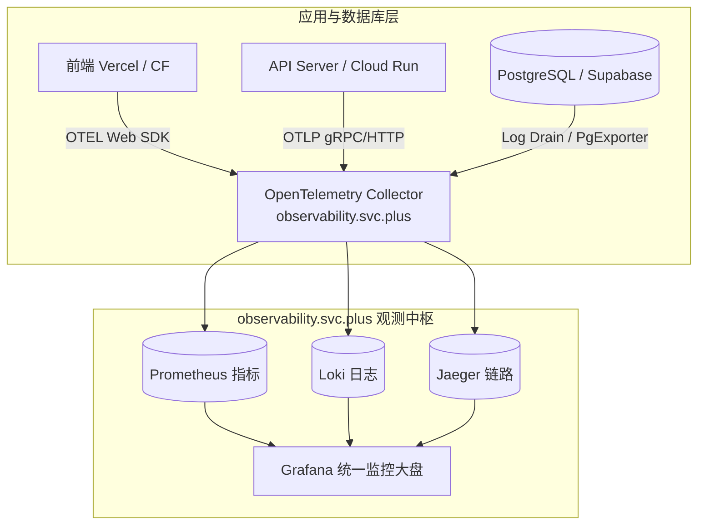

# PostgreSQL 架构选型与 Observability (可观测性) 接入指南

> **项目**：`ai-workspace-service` & `postgresql.svc.plus`  
> **文档分类**：架构设计 / 部署选型 / 可观测性 (Observability)  
> **目标**：评估三种部署架构方案，并提供集成自建可观测性平台 `observability.svc.plus` 的完整技术落地指南。

---

## 一、 部署架构方案对比

针对 `ai-workspace-service` 的发展阶段与成本控制要求，提供以下 3 种部署架构方案：

### 架构方案对比矩阵

| 评估维度 | **方案 1：极致低成本混合架构 (MVP)** | **方案 2：All-in-One 单机/全自建** | **方案 3：全 Serverless 生产云原生** |
| :--- | :--- | :--- | :--- |
| **前端 (Frontend)** | Vercel (Free) / Cloudflare Pages | VPS 容器 (Nginx) | Vercel (Pro) / Cloudflare Pages |
| **API 服务端** | $5 便宜 VPS (如 Hetzner/DigitalOcean) | 统一部署于单机 VPS | **GCP Cloud Run** (自动缩容至 0) |
| **数据库 & Auth** | **Supabase Cloud (Free 免费版)** | `postgresql.svc.plus` 或 自建 Supabase | **Supabase Cloud (Pro 生产版 $25/月)** |
| **预估月度成本** | **$0 ~ $5 / 月** | **$5 ~ $20 / 月** | **$25 ~ $50 / 月** |
| **扩展容量** | 50,000 MAU / 200 实时并发 | 依赖单机 VPS 算力 (100~500 QPS) | **无上限弹性扩容** (支持千万级 QPS) |
| **运维复杂度** | 🟢 极低 (仅维护 API 容器) | 🔴 高 (需自行维护 DB、TLS、备份) | 🟢 零运维 (全托管云原生) |
| **适合阶段** | 概念验证 (PoC)、MVP 启动期 | 数据高度私有化、局域网/局点部署 | 正式商业化上线、大规模高并发业务 |

---

## 二、 集成自建 `observability.svc.plus` 方案

`observability.svc.plus` 为集成了 **OpenTelemetry (OTEL) Collector、Prometheus、Loki、Jaeger 和 Grafana** 的自建可观测性平台。在三种架构下，均可通过统一的 Telemetry Pipeline 接入指标、日志与链路追踪。

---

### 各架构下接入 `observability.svc.plus` 的具体实施方式

#### 1. 方案 1 (Vercel + $5 VPS + Supabase Free) 接入方式
- **API 服务端 ($5 VPS)**：
  - 运行轻量级 `otel-col-contrib` 或 `vector` sidecar 容器。
  - 通过 OTLP/gRPC (端口 `4317`) 将 API 调用的 QPS、延迟、HTTP 错误率及应用日志推送到 `observability.svc.plus`。
- **Supabase Cloud (Free)**：
  - 启用 `pg_stat_statements` 扩展，定期监控慢查询。
  - 使用标准的 `postgres_exporter` 定期拉取数据库指标。
- **前端 (Vercel)**：
  - 接入 `@opentelemetry/sdk-trace-web`，实现 `前端 Request -> 后端 API -> DB Query` 客户端全链路 Trace 追踪。

#### 2. 方案 2 (All-in-One VPS / `postgresql.svc.plus`) 接入方式
- **数据库指标 (Metrics)**：
  - 在 `postgresql.svc.plus` 容器旁挂载 `postgres_exporter`，暴露端口 `9187`，收集 PG 内存、连接池、向量索引 (`pgvector`) 命中率及 CPU 消耗。
- **日志采集 (Logs)**：
  - 使用 Promtail 或 Vector 智能解析 PG 日志格式，过滤慢查询 SQL，实时远端发送至 `observability.svc.plus` Loki 实例。

#### 3. 方案 3 (Serverless / GCP Cloud Run + Supabase Pro) 接入方式
- **GCP Cloud Run API**：
  - 在 API 代码中集成 OpenTelemetry Auto-Instrumentation，配置 `OTEL_EXPORTER_OTLP_ENDPOINT=https://otel.observability.svc.plus:4317`。
  - Cloud Run 实例在秒级弹性扩缩容时，遥测数据均能无缝汇聚。
- **Supabase Cloud (Pro)**：
  - 使用 Supabase Pro 专属的 **Log Draining (日志流导出)** 功能，将数据库审计日志、Supavisor 连接池日志实时 Stream 至 `observability.svc.plus`。

---

## 三、 可观测性监控关键大盘 (Grafana Dashboard) 建议

接入 `observability.svc.plus` 后，建议在 Grafana 中配置以下 4 个核心监控板：

1. **数据库核心性能大盘**：连接数使用率、Cache 缓存命中率、Transactions/sec、Lock 锁等待。
2. **AI & Vector 向量检索专项大盘**：`pgvector` 距离计算延迟、HNSW 索引内存占用率、Embedding 写入 QPS。
3. **API 链路追踪大盘 (Tracing)**：全链路 P95/P99 响应延迟、跨服务 Trace ID 关联匹配。
4. **异常日志告警大盘**：PG Error/Fatal 日志告警、Supavisor 拒绝连接告警、API 5xx 错误分布。
