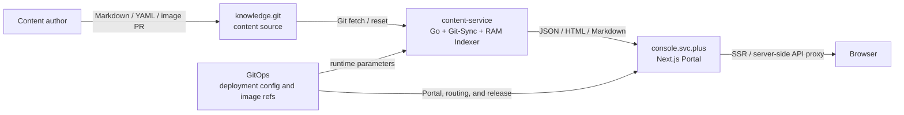
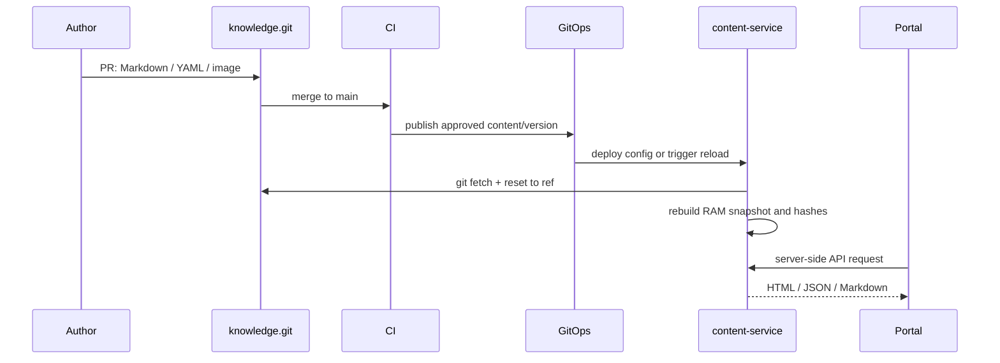

# Console and content-service Content Architecture

> This document is the content-delivery contract for the Portal. The `content-service` and `portal` repositories are the implementation references; GitOps environment configuration is the deployment reference.

## 1. Goals and non-negotiable boundaries

### 1.1 Complete separation of code and content

The `console.svc.plus` Portal and `content-service` backend must not hard-code article bodies, titles, excerpts, navigation entries, or blog images. Articles and images live only in `knowledge.git`. Publishing or updating content requires a Markdown, YAML navigation, or image change in that repository followed by its Git PR/CI release flow.

Portal owns page structure, interaction, and the content API client. content-service owns content synchronization, parsing, rendering, and querying. knowledge owns source content. A content change must not require a Portal or Go service code change.

### 1.2 No database, in-memory index

content-service has no business database dependency. At startup or reload it scans Markdown and navigation YAML in the knowledge working tree and parses YAML frontmatter, including `title`, `description`, `date`, `author`, `lang`, `category`, and `tags`. It builds an immutable RAM snapshot containing:

- hash maps for collections, pages, blogs, categories, and navigation;
- rendered HTML, original Markdown, plaintext, TOC data, and source paths;
- a SHA-256 for every source file and a stable snapshot hash for the indexed content.

API reads use the current snapshot rather than a database or per-request disk scan. `<2 ms` is a response-time target to be validated with benchmarks and runtime metrics in a controlled environment, not an unmeasured absolute SLA.

### 1.3 Git-Sync Engine and hot reload

`content-service/internal/git/sync.go` uses Git CLI only and does not call the GitHub API. It supports:

1. creating a missing working tree and running `git init`, configuring `origin`, `git fetch`, and `git reset --hard FETCH_HEAD`;
2. fetching an existing working tree and resetting it to the configured ref;
3. synchronizing before the first index build at service startup;
4. background polling controlled by `DOCS_RELOAD_INTERVAL`, defaulting to five minutes;
5. administrator-triggered `POST /api/v1/admin/reload` for an on-demand sync and snapshot rebuild;
6. retaining the last known-good snapshot when Git or indexing fails.

## 2. System boundary and topology



| Component | Owner | Responsibilities | Not responsible for |
| --- | --- | --- | --- |
| `portal` | `ai-workspace-services/portal` | Next.js pages, components, interaction, server-side API proxy | Article bodies, blog source files, content database |
| `content-service` | `ai-workspace-services/content-service` | Git sync, frontmatter parsing, Markdown rendering, RAM index, content API | Business data, user authentication, online editor |
| `knowledge.git` | `haitaopanhq/knowledge` | Product docs, blogs, homepage copy, navigation, images, version history | Runtime secrets, deployment config, database data |
| GitOps | `ai-workspace-infra/gitops` and release tooling | Images, domains, environment variables, routing, and deployment versions | Article source files |

### 2.1 Naming convention

| Concept | Current value/convention | Meaning |
| --- | --- | --- |
| Content source repository | `https://github.com/haitaopanhq/knowledge.git` | Replaceable with any Git service URL |
| Go module / legacy service identity | `docs.svc.plus` | Code package and historical deployment identity; not the Git repository name |
| Git repository | `content-service` | Backend service repository name |
| Docker image | `docs` | Existing deployment contract; changing the repository name does not rename it automatically |
| Production entry points | `console.svc.plus` / `docs.svc.plus` | Environment-provided addresses, not business logic |

## 3. Configuration contract

All runtime addresses and paths are injected through environment variables or GitOps. Code must not depend on a developer workstation path.

| Variable | Required | Purpose | Production example | UAT example | Local example |
| --- | --- | --- | --- | --- | --- |
| `KNOWLEDGE_REPO_PATH` | Yes | knowledge working-tree path | `/knowledge` | `/knowledge` | `/Users/<user>/workspaces/knowledge` |
| `KNOWLEDGE_REPO_URL` | Required for first init | Git upstream URL | `https://git.example/knowledge.git` | same | `https://github.com/haitaopanhq/knowledge.git` |
| `KNOWLEDGE_REPO_REF` | No | branch, tag, or commit to sync | `main` or release tag | `main` | `main` |
| `DOCS_SERVICE_PORT` | No | HTTP listen port | `8084` | `8084` | `8084` |
| `DOCS_RELOAD_INTERVAL` | No | background sync interval | `5m` | `5m` | `5m` |
| `INTERNAL_SERVICE_TOKEN` | Yes in prod/UAT | Portal-to-service API authentication | injected by Vault | injected by Vault | injected by local `.env` |
| `DOCS_SERVICE_URL` | Portal-side | server-side content-service URL | `https://docs.svc.plus` | `https://docs-uat.onwalk.net` | `http://127.0.0.1:8084` |
| `DOCS_SERVICE_INTERNAL_URL` | Optional | container-network URL | GitOps injected | GitOps injected | same as `DOCS_SERVICE_URL` |

`console.svc.plus`, `docs.svc.plus`, and `docs-uat.onwalk.net` are environment examples, not content-service business content. A deployment may replace them with any resolvable addresses.

## 4. Content layout and frontmatter

```text
knowledge/
├── docs/                         # product and technical documentation
│   ├── <collection>/             # documentation collections
│   ├── navigation*.yaml          # optional navigation
│   └── index.md                  # optional default home
├── content/                      # technical blogs and long-form content
│   └── <category>/**/*.md
├── content/website/              # Portal build-time homepage/marketing copy
├── assets/                       # images and other static assets
└── docs/design/                  # architecture and design documents
```

Documents and blog posts use Markdown. Optional frontmatter follows this shape:

```yaml
---
title: "Page title"
description: "Page summary"
date: 2026-08-13T00:00:00Z
author: shenlan
lang: en
category: architecture
tags:
  - content-service
---
```

Frontmatter must not contain secrets, tokens, database connection strings, or environment-specific hostnames. Images and internal links should use relative paths or content-service-resolvable paths.

## 5. API and request path

The browser does not call content-service directly. The Next.js server-side proxy injects `X-Service-Token`. Public HTML routes are available from content-service; internal JSON APIs require the service token.

| Method | Path | Purpose |
| --- | --- | --- |
| `GET` | `/healthz` | Service health and current snapshot time |
| `GET` | `/docs`, `/docs/{collection}/{slug}` | Server-rendered documentation HTML |
| `GET` | `/api/v1/docs/home` | Documentation home |
| `GET` | `/api/v1/docs/collections` | Collections and versions |
| `GET` | `/api/v1/docs/pages/{collection}/{slug}` | Page HTML, Markdown, TOC, and source metadata |
| `GET` | `/api/v1/docs/search?query=...` | In-memory full-text search |
| `GET` | `/api/v1/blogs`, `/api/v1/blogs/{slug}` | Blog list and detail |
| `GET` | `/api/v1/home/latest-blogs` | Latest blogs for the homepage |
| `POST` | `/api/v1/admin/reload` | Pull Git and rebuild; `pull=false` rebuilds only |
| `POST` | `/api/v1/agent/invoke` | Protected content-agent operations |

Reload follows `sync → scan/parse/render → build maps/hashes → atomic snapshot swap`. Any failure returns an error and leaves the previous snapshot serving.

## 6. Release, update, and rollback



- Content review, merge, and rollback are Git commit operations.
- Service image versions and content versions are independent; upgrading content-service does not itself publish content.
- Roll back by pointing `KNOWLEDGE_REPO_REF` at a verified commit/tag or reverting the knowledge commit, then reloading.
- Git outage, invalid frontmatter, or Markdown rendering failure keeps the last successful snapshot and must raise an alert.
- `git reset --hard` discards manual changes in the knowledge working tree. The runtime directory is not an editing surface; operators change content through Git PRs.

## 7. Security and operations

- knowledge.git contains no Vault token, GHCR token, database password, SSH private key, or other credential.
- content-service needs only read access to knowledge content and the minimum runtime credentials required by its deployment.
- `INTERNAL_SERVICE_TOKEN` is injected by Vault/GitOps and never written to Markdown, logs, or Git history.
- Git URLs may point to any Git provider. For private repositories, authentication comes from runtime Git credentials/SSH configuration, not from source code or documents.
- The admin reload endpoint must stay behind an internal network or service-auth boundary and must not be exposed to anonymous browsers.
- Monitor at least sync success/failure, last successful commit/ref, snapshot time, snapshot hash, indexed file count, reload duration, and API latency.

## 8. Acceptance criteria

1. Portal and content-service source contain no article bodies or blog image inventories.
2. Adding or changing a knowledge Markdown file is visible without a business-code change.
3. With an empty working tree and a configured URL, startup performs `git init + fetch + reset` before the first index build.
4. After an administrator reload, successful content becomes visible after one snapshot swap; failed content never replaces the old snapshot.
5. The snapshot contains source-file hashes, and an unchanged reload keeps the same hash.
6. Chinese and English pages resolve by `lang`, with default-language fallback when a localized page is absent.
7. `/api/v1/*` returns `401` without the correct `X-Service-Token`.
8. Under representative content volume and controlled network conditions, query API p95 latency reaches the `<2 ms` target; if it does not, record benchmark data rather than sacrificing correctness.
9. Local, UAT, and production use separate configuration and do not depend on a developer absolute path.
