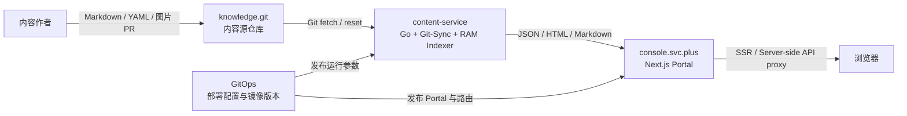
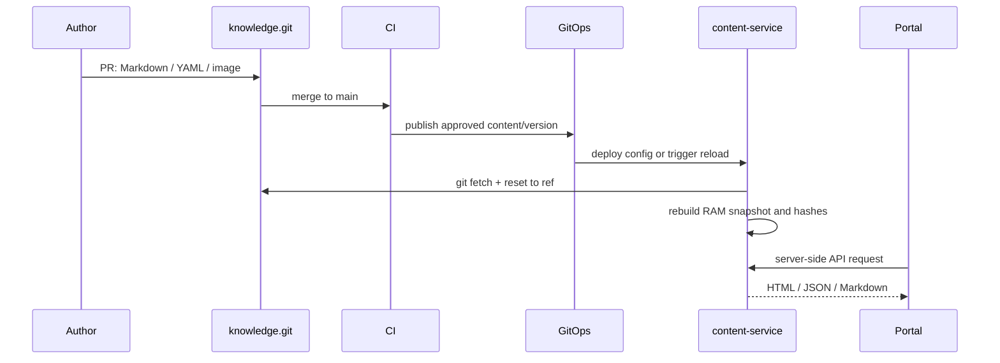

# Console 与 content-service 内容架构规范

> 本文是 Portal 内容交付的架构契约。实现以 `content-service` 和 `portal` 仓库为准，部署参数以 GitOps 环境配置为准。

## 1. 目标与不可违反的边界

### 1.1 代码与内容彻底解耦

`console.svc.plus` 门户与 `content-service` 后端均不硬编码文章正文、标题、摘要、导航条目或博客图片。文章和图片只存储在 `knowledge.git`，发布或更新内容只需要向该仓库提交 Markdown、YAML 导航文件或图片，并通过 Git PR/CI 发布。

Portal 负责页面结构、交互和内容 API 客户端；content-service 负责读取、解析、渲染和查询内容；knowledge 负责内容源文件。任何内容变更不应要求修改 Portal 或 Go 服务代码。

### 1.2 零数据库、内存极速索引

content-service 不依赖业务数据库。服务启动或 reload 时扫描 knowledge 工作树中的 Markdown 和导航 YAML，解析 YAML Frontmatter（至少支持 `title`、`description`、`date`、`author`、`lang`、`category`、`tags`），在 RAM 中构建不可变快照：

- 文档集合、页面、博客、分类和导航的哈希映射；
- HTML、原始 Markdown、纯文本、TOC 和来源路径；
- 每个来源文件的 SHA-256，以及用于判断整份内容版本的快照哈希。

API 直接读取当前快照，查询路径不访问数据库或逐请求扫描磁盘。`<2 ms` 是受控环境下的响应目标，必须通过基准测试和运行监控持续验证，不把它表述为未经测量的绝对 SLA。

### 1.3 Git-Sync Engine 与热更新

`content-service/internal/git/sync.go` 只使用 Git CLI，不调用 GitHub API。它支持：

1. 工作树不存在时自动创建目录，执行 `git init`、配置 `origin`、`git fetch`、`git reset --hard FETCH_HEAD`；
2. 工作树已存在时执行 fetch，并将工作树 reset 到配置的 ref；
3. 服务启动时在首次构建索引前完成初始化同步；
4. 后台按 `DOCS_RELOAD_INTERVAL` 轮询同步，默认 5 分钟；
5. 管理员调用 `POST /api/v1/admin/reload` 触发同步并在成功后重建快照；
6. Git 拉取或索引失败时保留上一份可用快照，不用半成品替换线上内容。

## 2. 系统边界与拓扑



| 组件 | 所有者 | 负责 | 不负责 |
| --- | --- | --- | --- |
| `portal` | `ai-workspace-services/portal` | Next.js 页面、组件、交互、服务端 API 代理 | 文章正文、博客源文件、内容数据库 |
| `content-service` | `ai-workspace-services/content-service` | Git 同步、Frontmatter 解析、Markdown 渲染、内存索引、内容 API | 业务数据、用户认证、内容编辑器 |
| `knowledge.git` | `haitaopanhq/knowledge` | 文档、博客、主页内容、导航、图片及其版本历史 | 运行时密钥、部署配置、数据库数据 |
| GitOps | `ai-workspace-infra/gitops` 与发布工具 | 镜像、域名、环境变量、路由和部署版本 | 文章内容源文件 |

### 2.1 命名约定

| 概念 | 当前值/约定 | 说明 |
| --- | --- | --- |
| 内容源仓库 | `https://github.com/haitaopanhq/knowledge.git` | 可替换为任意 Git 服务 URL |
| Go 服务 module / 旧产品域名 | `docs.svc.plus` | 代码包名和历史部署身份，暂不等同于 Git 仓库名 |
| Git 仓库 | `content-service` | 后端服务代码仓库名称 |
| Docker 镜像名 | `docs` | 现有部署合同，除非单独迁移镜像与 GitOps，不随仓库改名自动改变 |
| 生产入口 | `console.svc.plus` / `docs.svc.plus` | 由部署环境注入，不写入业务逻辑 |

## 3. 配置契约

所有运行时地址和路径通过环境变量或 GitOps 注入。代码不得依赖开发者本机路径。

| 环境变量 | 必填 | 用途 | 生产示例 | UAT 示例 | 本地示例 |
| --- | --- | --- | --- | --- | --- |
| `KNOWLEDGE_REPO_PATH` | 是 | knowledge 工作树路径 | `/knowledge` | `/knowledge` | `/Users/<user>/workspaces/knowledge` |
| `KNOWLEDGE_REPO_URL` | 首次初始化时是 | Git upstream URL | `https://git.example/knowledge.git` | 同上 | `https://github.com/haitaopanhq/knowledge.git` |
| `KNOWLEDGE_REPO_REF` | 否 | 要同步的 branch/tag/commit | `main` 或发布 tag | `main` | `main` |
| `DOCS_SERVICE_PORT` | 否 | HTTP 监听端口 | `8084` | `8084` | `8084` |
| `DOCS_RELOAD_INTERVAL` | 否 | 后台同步间隔 | `5m` | `5m` | `5m` |
| `INTERNAL_SERVICE_TOKEN` | 生产/UAT 是 | Portal 到 content-service 的 API 鉴权 | Vault 注入 | Vault 注入 | 本地 `.env` 注入 |
| `DOCS_SERVICE_URL` | Portal 侧 | Portal 服务端访问 content-service | `https://docs.svc.plus` | `https://docs-uat.onwalk.net` | `http://127.0.0.1:8084` |
| `DOCS_SERVICE_INTERNAL_URL` | 可选 | 容器网络内访问地址 | GitOps 注入 | GitOps 注入 | 同 `DOCS_SERVICE_URL` |

`console.svc.plus`、`docs.svc.plus` 和 `docs-uat.onwalk.net` 是环境示例，不是 content-service 的业务内容。测试环境可以替换为任意可解析地址。

## 4. 内容目录与 Frontmatter

```text
knowledge/
├── docs/                         # 产品技术文档
│   ├── <collection>/             # 文档集合
│   ├── navigation*.yaml          # 可选导航
│   └── index.md                  # 可选默认首页
├── content/                      # 技术博客与长期内容
│   └── <category>/**/*.md
├── content/website/              # Portal 构建期主页/营销文案
├── assets/                       # 图片等静态资产
└── docs/design/                  # 架构与设计文档
```

文档和博客正文使用 Markdown；可选 Frontmatter 示例：

```yaml
---
title: "页面标题"
description: "页面摘要"
date: 2026-08-13T00:00:00Z
author: shenlan
lang: zh
category: architecture
tags:
  - content-service
---
```

Frontmatter 不允许存储密钥、Token、数据库连接串或环境专属域名。图片、内部页面链接优先使用相对路径或内容服务可解析的路径。

## 5. API 与请求链路

Portal 浏览器不直接访问 content-service；Next.js 服务端代理负责注入 `X-Service-Token`。公开 HTML 路径由 content-service 提供，内部 JSON API 受服务 Token 保护。

| 方法 | 路径 | 用途 |
| --- | --- | --- |
| `GET` | `/healthz` | 服务健康和当前快照时间 |
| `GET` | `/docs`、`/docs/{collection}/{slug}` | 服务端渲染文档 HTML |
| `GET` | `/api/v1/docs/home` | 文档首页 |
| `GET` | `/api/v1/docs/collections` | 文档集合和版本 |
| `GET` | `/api/v1/docs/pages/{collection}/{slug}` | 单页 HTML、Markdown、TOC 和来源元数据 |
| `GET` | `/api/v1/docs/search?query=...` | 内存全文搜索 |
| `GET` | `/api/v1/blogs`、`/api/v1/blogs/{slug}` | 博客列表与详情 |
| `GET` | `/api/v1/home/latest-blogs` | 主页最新博客 |
| `POST` | `/api/v1/admin/reload` | 管理员拉取 Git 并重建快照；`pull=false` 时只重建 |
| `POST` | `/api/v1/agent/invoke` | 受保护的内容 Agent 操作 |

reload 的实现顺序是：`sync → scan/parse/render → build maps/hashes → atomic snapshot swap`。任何一步失败都返回错误并保留旧快照。

## 6. 发布、更新与回滚



- 内容变更的审查、合并和回滚以 Git commit 为单位。
- 服务版本和内容版本分别管理：content-service 镜像升级不等于内容发布。
- 回滚内容时将 `KNOWLEDGE_REPO_REF` 指向已验证 commit/tag，或恢复 knowledge 的上一 commit，然后 reload。
- Git 不可用、Frontmatter 损坏或 Markdown 渲染失败时，服务继续提供上一份成功快照并报警。
- `git reset --hard` 会丢弃 knowledge 工作树中的人工修改；运行目录禁止人工编辑，运维应通过 Git PR 修改内容。

## 7. 安全与运维边界

- knowledge.git 不存储 Vault Token、GHCR Token、数据库密码、SSH 私钥或其他凭据。
- content-service 只需要读取 knowledge Git 内容和构建期/运行期所需的最小服务凭据。
- `INTERNAL_SERVICE_TOKEN` 只由 Vault/GitOps 注入，不进入 Markdown、日志和 Git 历史。
- Git URL 支持普通 Git remote；若使用私有仓库，认证由运行环境的 Git credential/SSH 配置提供，不在代码和文档中硬编码。
- 管理 reload 接口必须处于内网或服务鉴权边界内，禁止暴露给匿名浏览器。
- 监控至少记录：同步成功/失败、最后成功 commit/ref、快照时间、快照哈希、索引文件数、reload 耗时和 API 延迟。

## 8. 验收标准

1. Portal 和 content-service 源码中不存在文章正文和博客图片清单。
2. 新增或修改 knowledge Markdown 后，无需改业务代码即可被同步并查询。
3. 空工作树配置 URL 后，服务启动会先完成 `git init + fetch + reset`，再构建首个快照。
4. 管理员调用 reload 后，成功内容在一次快照交换后可读；失败内容不会覆盖旧快照。
5. 快照包含来源文件哈希，重复 reload 无内容变化时哈希保持稳定。
6. 中英文页面按 `lang` 返回，缺少语言版本时按默认版本回退。
7. `/api/v1/*` 未提供正确 `X-Service-Token` 时返回 `401`。
8. 在代表性内容量和受控网络条件下，查询 API 的 p95 延迟达到 `<2 ms` 目标；若未达到，记录基准数据而不是弱化正确性。
9. 本地、UAT、生产使用不同配置，不依赖开发者本机绝对路径。
