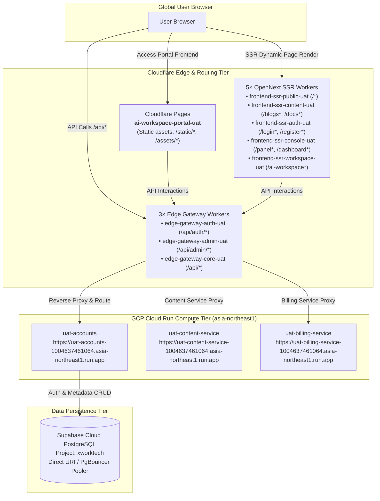
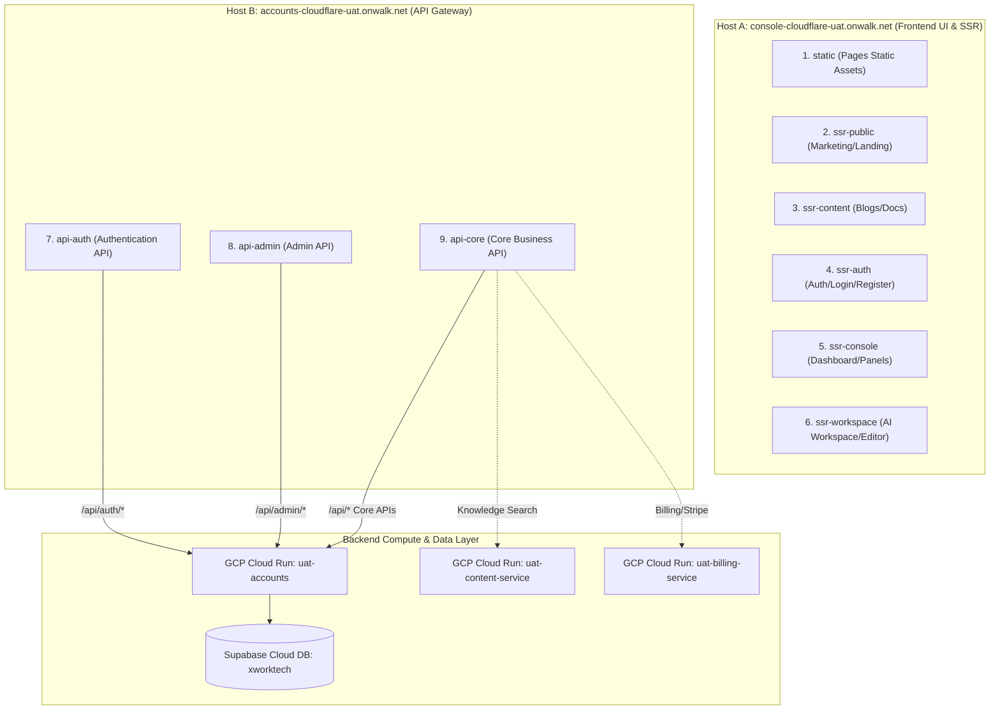
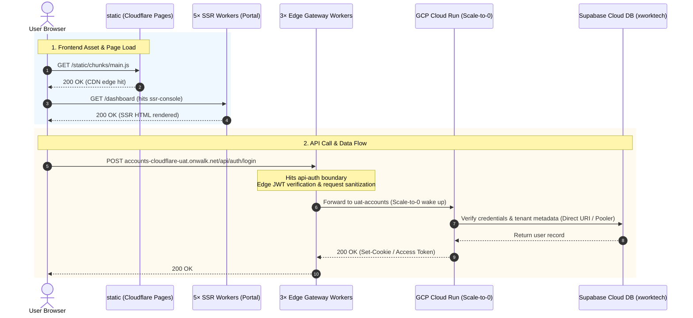

# UAT Serverless Runtime Topology, Routing Contract, and Verification Guide

> **Technology Stack**: Cloudflare Pages + Cloudflare Workers (SSR ×5 + Gateway ×3) + GCP Cloud Run (Scale-to-0) + Supabase Cloud DB (`xworktech`) + HashiCorp Vault (`vault.svc.plus`)  
> **Source Declaration**: `gitops/topology/uat/serverless/runtime-topology.yaml`  
> **Orchestrator Workflow**: `platform-ops-toolkit/.github/workflows/serverless-orchestrator.yml` ([CI Run #32017012356](https://github.com/ai-workspace-infra/platform-ops-toolkit/actions/runs/32017012356))

---

## 📌 1. Architectural Overview & Link Design

The UAT Serverless architecture is designed around **"Persistent Database + Ephemeral On-Demand Compute + Edge-Routed Boundary Splitting"** to achieve high availability with zero idle infrastructure costs.



---

## 🏛️ 2. GitOps Runtime Topology Contract (`runtime-topology.yaml`)

The topology configuration resides at `gitops/topology/uat/serverless/runtime-topology.yaml` as an immutable source of truth:

### 1. Traffic Routing & Canonical DNS (`spec.runtime.routing`)
* **Control Plane**: `cloudflare-dns` with 60-second TTL.
* **Traffic Weight**: `selfhost: 0, serverless: 100`.
* **Canonical Hostname Mapping**:
  * `console-uat.onwalk.net` $\rightarrow$ `console-cloudflare-uat.onwalk.net`
  * `accounts-uat.onwalk.net` $\rightarrow$ `accounts-cloudflare-uat.onwalk.net`

### 2. Backend Cloud Run Endpoints (`spec.serverless`)
The microservices deployed on GCP Cloud Run (region `asia-northeast1`, project `xworktech`):

* **Accounts Service**: `https://uat-accounts-1004637461064.asia-northeast1.run.app`
* **Content Service**: `https://uat-content-service-1004637461064.asia-northeast1.run.app`
* **Billing Service**: `https://uat-billing-service-1004637461064.asia-northeast1.run.app`

---

## 🌐 3. 9 Edge Split Boundaries: Routing & Link Topology

In `gitops/topology/uat/serverless/runtime-topology.yaml`, to **completely circumvent Cloudflare Workers' 3 MiB bundle limit**, **achieve sub-50ms cold starts**, and **provide dual-mode zero-cost failovers**, the frontend and API gateway are partitioned into **9 independent split boundaries** (1 Pages project + 5 SSR Workers + 3 API Gateway Workers).

### 1. Host Distribution & Boundary Mapping Topology



### 2. 9 Boundaries Routing Matrix & Responsibilities

| No. | Boundary ID | Entity Type & Worker Name | Bound Hostname | Exact Route Patterns (Routes) | Core Responsibility & Scope | Actual Backend Upstream |
| :---: | :--- | :--- | :--- | :--- | :--- | :--- |
| **1** | **`static`** | **Cloudflare Pages**<br>`ai-workspace-portal-uat` | `console-cloudflare-uat.onwalk.net` | `/static/*`<br>`/assets/*`<br>`*.ico, *.png, *.svg` | Pre-compiled static assets (Next.js HTML/JS/CSS/Media), globally distributed via Cloudflare CDN at zero bandwidth cost | Cloudflare Pages Edge Storage |
| **2** | **`ssr-public`** | **Worker (OpenNext)**<br>`frontend-ssr-public-uat` | `console-cloudflare-uat.onwalk.net` | `/*`<br>`/_edge/public/*` | SSR rendering for marketing homepage, public landing pages, and multi-platform client downloads | Cloudflare Pages static assets + Edge V8 execution |
| **3** | **`ssr-content`** | **Worker (OpenNext)**<br>`frontend-ssr-content-uat` | `console-cloudflare-uat.onwalk.net` | `/blogs*`<br>`/docs*`<br>`/download*`<br>`/_edge/content/*` | SSR rendering for blog center, knowledge base technical docs (`docs.svc.plus`), and release downloads | Cloud Run `uat-content-service` (source document fetch) |
| **4** | **`ssr-auth`** | **Worker (OpenNext)**<br>`frontend-ssr-auth-uat` | `console-cloudflare-uat.onwalk.net` | `/login*`<br>`/register*`<br>`/email-verification*`<br>`/logout*`<br>`/_edge/auth/*` | SSR rendering for user identity flows (login, registration, email activation, password reset, logout) | Edge pre-validation + Client API calls |
| **5** | **`ssr-console`** | **Worker (OpenNext)**<br>`frontend-ssr-console-uat` | `console-cloudflare-uat.onwalk.net` | `/panel*`<br>`/dashboard*`<br>`/_edge/console/*` | SSR rendering for user profile, multi-tenant control panel, subscription tier management, and organization settings | Edge aggregation + Client interactivity |
| **6** | **`ssr-workspace`** | **Worker (OpenNext)**<br>`frontend-ssr-workspace-uat` | `console-cloudflare-uat.onwalk.net` | `/ai-workspace*`<br>`/cloud_iac*`<br>`/editor*`<br>`/support*`<br>`/xworkmate*`<br>`/_edge/workspace/*` | SSR rendering for online Web IDE, AI workspace, cloud IaC orchestrator, and customer support interfaces | Direct data plane connection + Core Gateway API |
| **7** | **`api-auth`** | **Worker (Edge Gateway)**<br>`edge-gateway-auth-uat` | `accounts-cloudflare-uat.onwalk.net` | `/api/auth/*` | Intercepts auth requests, performs edge JWT verification/signing, OAuth callback handling, and login token exchange | **Cloud Run: `uat-accounts`**<br>`https://uat-accounts-1004637461064.asia-northeast1.run.app` |
| **8** | **`api-admin`** | **Worker (Edge Gateway)**<br>`edge-gateway-admin-uat` | `accounts-cloudflare-uat.onwalk.net` | `/api/admin/*` | Dedicated admin/ops gateway, enforces high-privilege endpoint isolation and RBAC access control | **Cloud Run: `uat-accounts`** (Admin module) |
| **9** | **`api-core`** | **Worker (Edge Gateway)**<br>`edge-gateway-core-uat` | `accounts-cloudflare-uat.onwalk.net` | `/api/*`<br>*(Catch-all fallback)* | Core business gateway for tenant metadata, billing, and content API calls with 2500ms timeout failover support | **Cloud Run: `uat-accounts`** / `uat-billing-service` / `uat-content-service` |

### 3. Request Flow Sequence Diagram



### 4. Engineering Rationale & Benefits

1. **Bypassing the 3 MiB Worker Limit**:
   Monolithic Next.js standalone outputs usually exceed 15~30 MiB. Splitting via OpenNext into 5 specialized SSR Workers reduces each artifact to 1.5~2.8 MiB, fitting comfortably under Cloudflare's 3 MiB cap.
2. **Sub-50ms Cold Starts**:
   Lightweight individual Workers have minimal memory footprints, enabling sub-50ms cold starts on Cloudflare's V8 Isolate engine.
3. **Privilege & Security Isolation**:
   `/api/auth/*` (high-frequency, lightweight) and `/api/admin/*` (low-frequency, high-privilege) are separated into standalone Workers, preventing vulnerability leakage across business boundaries.
4. **Zero-Cost Idle with Instant Elasticity**:
   Frontend is hosted on Cloudflare Pages/Workers for free. Backend microservices on Cloud Run scale to 0 when idle (`min-instances=0`), waking up in ~200ms when traffic arrives.

---

## ⚙️ 4. CI/CD Orchestration Workflow

The orchestration pipeline is implemented in `platform-ops-toolkit/.github/workflows/serverless-orchestrator.yml`:

### Pipeline Stages Breakdown ([Run #32017012356](https://github.com/ai-workspace-infra/platform-ops-toolkit/actions/runs/32017012356))

1. **Preflight & Contract Validation (`Validate / Dispatch inputs`)**:
   * Checks out GitOps repo and fetches `topology/uat/serverless/runtime-topology.yaml`.
   * Renders YAML into JSON format via Ruby.
   * Runs `scripts/serverless_uat/validate_cloudflare_boundaries.py` to assert all 9 boundaries, services, and data mode contracts.
2. **Database Verification & Migration (`Supabase / xworktech`)**:
   * Uses GitHub OIDC to fetch `kv/data/uat/serverless/supabase` credentials from Vault.
   * Validates Supabase PostgreSQL/REST connection and applies schema migrations if enabled.
3. **Backend Compute Deployment (`Cloud Run Matrix`)**:
   * Deploys `accounts`, `content-service`, and `billing-service` concurrently.
   * Authenticates via GCP Workload Identity Federation (WIF) and injects direct `SUPABASE_CONNECT_URI`.
4. **Edge SSR Workers Deployment (`Cloudflare / SSR Matrix`)**:
   * Concurrently builds and deploys 5 OpenNext SSR Workers.
5. **Edge Gateway Workers Deployment (`Cloudflare / edge-gateway Matrix`)**:
   * Concurrently deploys 3 Edge Gateway Workers pointing upstreams to Cloud Run.
6. **Static Pages Deployment (`Cloudflare / static-pages`)**:
   * Deploys Next.js static assets to Cloudflare Pages project `ai-workspace-portal-uat`.
7. **Summary & Verification (`Verify / Summary`)**:
   * Aggregates upstream status and publishes results to GitHub Actions Step Summary.

---

## 🔍 5. Troubleshooting & End-to-End Verification Manual

### 1. DNS Resolution & Custom Domain Binding
* **Issue**: Browser navigation to `console-cloudflare-uat.onwalk.net` returns `ERR_NAME_NOT_RESOLVED` (NXDOMAIN).
* **Root Cause**: Cloudflare DNS Zone `onwalk.net` lacks the custom domain binding or CNAME record.
* **Resolution**:
  * **Console Access**: In Cloudflare Pages `ai-workspace-portal-uat` $\rightarrow$ **Custom domains**, add `console-cloudflare-uat.onwalk.net` (or add a CNAME pointing to `ai-workspace-portal-uat.pages.dev` with Proxied enabled); if using Frontend Router, bind the custom domain directly to `frontend-router-uat` Worker.
  * **Accounts Gateway**: In Worker `edge-gateway-core-uat` $\rightarrow$ **Custom domains**, add `accounts-cloudflare-uat.onwalk.net`.
  * **Billing Gateway**: In Cloudflare DNS or Edge Gateway service routing, map `billing-cloudflare-uat.onwalk.net` to `uat-billing-service`.

### 2. 6-Step End-to-End Live Verification Commands

```bash
# 1. Verify Cloudflare DNS resolution (Canonical CNAME targets)
dig +short console-uat.onwalk.net
dig +short accounts-uat.onwalk.net
dig +short billing-uat.onwalk.net

# 2. Verify Frontend Router and Pages static asset distribution
curl -sSL -I https://console-cloudflare-uat.onwalk.net/
curl -sSL -I https://console-cloudflare-uat.onwalk.net/static/

# 3. Verify SSR dynamic split page rendering (Dashboard/Login/Blogs)
curl -sSL -I https://console-cloudflare-uat.onwalk.net/panel
curl -sSL -I https://console-cloudflare-uat.onwalk.net/login
curl -sSL -I https://console-cloudflare-uat.onwalk.net/blogs

# 4. Verify same-origin proxy from Frontend Router to Accounts Gateway & Cloud Run
curl -sSL -I https://console-cloudflare-uat.onwalk.net/api/auth/login

# 5. Verify Cloud Run Accounts container readiness & Supabase DB connectivity
curl -sSL -I https://uat-accounts-1004637461064.asia-northeast1.run.app/readyz

# 6. Verify Cloud Run Billing and Content microservice endpoints
curl -sSL -I https://uat-billing-service-1004637461064.asia-northeast1.run.app/
curl -sSL -I https://uat-content-service-1004637461064.asia-northeast1.run.app/
curl -sSL -I https://billing-cloudflare-uat.onwalk.net/
```

