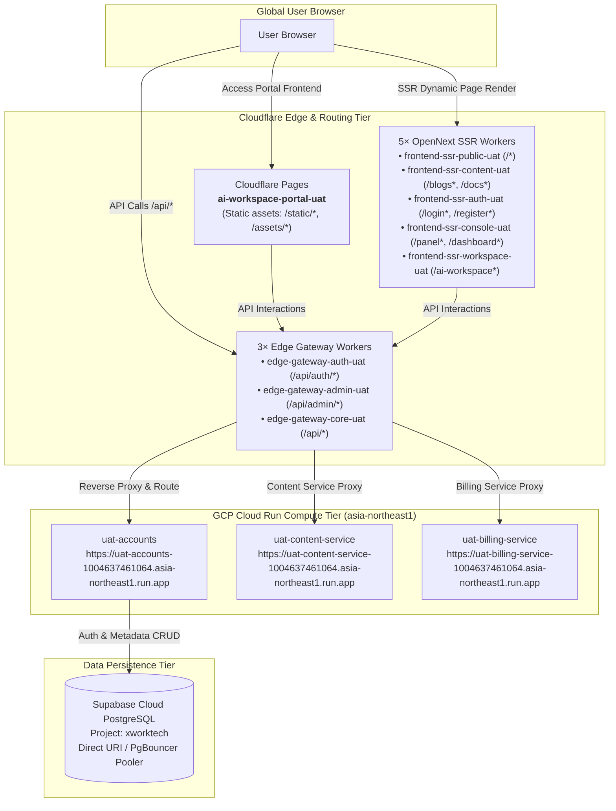

# UAT Serverless Runtime Topology, Routing Contract, and Verification Guide

> **Technology Stack**: Cloudflare Pages + Cloudflare Workers (SSR ×5 + Gateway ×3) + GCP Cloud Run (Scale-to-0) + Supabase Cloud DB (`xworktech`) + HashiCorp Vault (`vault.svc.plus`)  
> **Source Declaration**: `gitops/topology/uat/serverless/runtime-topology.yaml`  
> **Orchestrator Workflow**: `platform-ops-toolkit/.github/workflows/serverless-orchestrator.yml` ([CI Run #32017012356](https://github.com/ai-workspace-infra/platform-ops-toolkit/actions/runs/32017012356))

---

## 📌 1. Architectural Overview & Link Design

The UAT Serverless architecture is designed around **"Persistent Database + Ephemeral On-Demand Compute + Edge-Routed Boundary Splitting"** to achieve high availability with zero idle infrastructure costs.



---

## 🏛️ 2. GitOps Runtime Topology Contract (`runtime-topology.yaml`)

The topology configuration resides at `gitops/topology/uat/serverless/runtime-topology.yaml` as an immutable source of truth:

### 1. Traffic Routing & Canonical DNS (`spec.runtime.routing`)
* **Control Plane**: `cloudflare-dns` with 60-second TTL.
* **Traffic Weight**: `selfhost: 0, serverless: 100`.
* **Canonical Hostname Mapping**:
  * `console-uat.onwalk.net` $\rightarrow$ `console-cloudflare-uat.onwalk.net`
  * `accounts-uat.onwalk.net` $\rightarrow$ `accounts-cloudflare-uat.onwalk.net`

### 2. Cloudflare Boundary Split Contract (9 Boundaries)
To avoid Cloudflare Workers' 3 MiB artifact bundle limit and enable granular caching and scaling, the frontend and gateway are split into **9 independent deployment units**:

| Boundary ID | Type | Worker / Pages Entity Name | Route Patterns | Responsibility |
| :--- | :--- | :--- | :--- | :--- |
| `ssr-public` | Worker | `frontend-ssr-public-uat` | `/*`, `/_edge/public/*` | Marketing home & public landing pages |
| `ssr-content` | Worker | `frontend-ssr-content-uat` | `/blogs*`, `/docs*`, `/download*`, `/_edge/content/*` | Blog posts, documentation & download center |
| `ssr-auth` | Worker | `frontend-ssr-auth-uat` | `/login*`, `/register*`, `/email-verification*`, `/logout*`, `/_edge/auth/*` | Authentication & identity verification pages |
| `ssr-console` | Worker | `frontend-ssr-console-uat` | `/panel*`, `/dashboard*`, `/_edge/console/*` | User dashboard & console UI |
| `ssr-workspace` | Worker | `frontend-ssr-workspace-uat` | `/ai-workspace*`, `/cloud_iac*`, `/editor*`, `/support*`, `/xworkmate*`, `/_edge/workspace/*` | AI workspace & online editor interface |
| `api-auth` | Worker | `edge-gateway-auth-uat` | `accounts-cloudflare-uat.onwalk.net/api/auth/*` | Auth API gateway |
| `api-admin` | Worker | `edge-gateway-admin-uat` | `accounts-cloudflare-uat.onwalk.net/api/admin/*` | Administrative API gateway |
| `api-core` | Worker | `edge-gateway-core-uat` | `accounts-cloudflare-uat.onwalk.net/api/*` | Core API gateway fallback |
| `static` | Pages | `ai-workspace-portal-uat` | `/static/*`, `/assets/*` | Pre-compiled static assets (JS/CSS/Images) |

### 3. Backend Cloud Run Endpoints (`spec.serverless`)
The microservices deployed on GCP Cloud Run (region `asia-northeast1`, project `xworktech`):

* **Accounts Service**: `https://uat-accounts-1004637461064.asia-northeast1.run.app`
* **Content Service**: `https://uat-content-service-1004637461064.asia-northeast1.run.app`
* **Billing Service**: `https://uat-billing-service-1004637461064.asia-northeast1.run.app`

---

## ⚙️ 3. CI/CD Orchestration Workflow

The orchestration pipeline is implemented in `platform-ops-toolkit/.github/workflows/serverless-orchestrator.yml`:

### Pipeline Stages Breakdown ([Run #32017012356](https://github.com/ai-workspace-infra/platform-ops-toolkit/actions/runs/32017012356))

1. **Preflight & Contract Validation (`Validate / Dispatch inputs`)**:
   * Checks out GitOps repo and fetches `topology/uat/serverless/runtime-topology.yaml`.
   * Renders YAML into JSON format via Ruby.
   * Runs `scripts/serverless_uat/validate_cloudflare_boundaries.py` to assert all 9 boundaries, services, and data mode contracts.
2. **Database Verification & Migration (`Supabase / xworktech`)**:
   * Uses GitHub OIDC to fetch `kv/data/uat/serverless/supabase` credentials from Vault.
   * Validates Supabase PostgreSQL/REST connection and applies schema migrations if enabled.
3. **Backend Compute Deployment (`Cloud Run Matrix`)**:
   * Deploys `accounts`, `content-service`, and `billing-service` concurrently.
   * Authenticates via GCP Workload Identity Federation (WIF) and injects direct `SUPABASE_CONNECT_URI`.
4. **Edge SSR Workers Deployment (`Cloudflare / SSR Matrix`)**:
   * Concurrently builds and deploys 5 OpenNext SSR Workers.
5. **Edge Gateway Workers Deployment (`Cloudflare / edge-gateway Matrix`)**:
   * Concurrently deploys 3 Edge Gateway Workers pointing upstreams to Cloud Run.
6. **Static Pages Deployment (`Cloudflare / static-pages`)**:
   * Deploys Next.js static assets to Cloudflare Pages project `ai-workspace-portal-uat`.
7. **Summary & Verification (`Verify / Summary`)**:
   * Aggregates upstream status and publishes results to GitHub Actions Step Summary.

---

## 🔍 4. Troubleshooting & Connectivity Verification

### 1. DNS Resolution & Custom Domain Binding
* **Issue**: Browser navigation to `console-cloudflare-uat.onwalk.net` returns `ERR_NAME_NOT_RESOLVED` (NXDOMAIN).
* **Root Cause**: Cloudflare DNS Zone `onwalk.net` lacks the custom domain binding or CNAME record.
* **Resolution**:
  * **Console Access**: In Cloudflare Pages `ai-workspace-portal-uat` $\rightarrow$ **Custom domains**, add `console-cloudflare-uat.onwalk.net` (or add a CNAME pointing to `ai-workspace-portal-uat.pages.dev` with Proxied enabled).
  * **Accounts Gateway**: In Worker `edge-gateway-core-uat` $\rightarrow$ **Custom domains**, add `accounts-cloudflare-uat.onwalk.net`.

### 2. Live Verification Commands
```bash
# 1. Verify Cloudflare Pages portal
curl -sSL -I https://ai-workspace-portal-uat.pages.dev/

# 2. Verify Cloud Run Accounts container readiness
curl -sSL -I https://uat-accounts-1004637461064.asia-northeast1.run.app/readyz

# 3. Verify Cloud Run Content and Billing microservices
curl -sSL -I https://uat-content-service-1004637461064.asia-northeast1.run.app/
curl -sSL -I https://uat-billing-service-1004637461064.asia-northeast1.run.app/

# 4. Supabase Keepalive Ping
curl -sSL -H "apikey: <SUPABASE_ANON_KEY>" "https://<PROJECT_REF>.supabase.co/rest/v1/"
```
