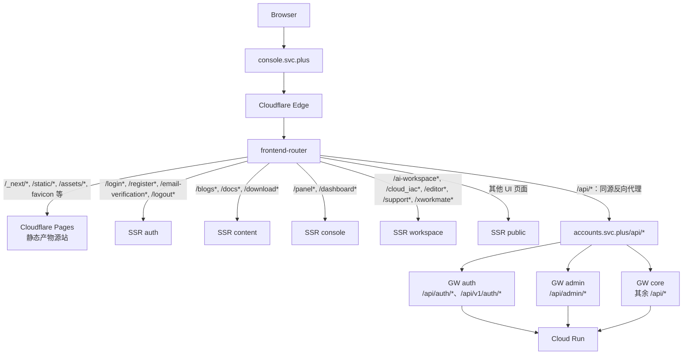

# Console Frontend Router 与 Edge Gateway 目标架构及实施计划

> 状态：**目标架构草案，待实施**
>
> 适用环境：SIT、UAT、PROD（域名、Worker 名称和上游由 GitOps 按环境渲染）
> 事实基线：[UAT Serverless 运行时拓扑、路由契约与全链路验证指南](serverless-uat-runtime-topology-and-verification.md)

## 1. 决策摘要

新增一个独立、可部署的 `frontend-router` Cloudflare Worker，作为 `console.svc.plus` 的唯一前端入口；保留 `edge-gateway` 作为 `accounts.svc.plus` 的 API 入口。

两个组件不能合并：

| 组件 | 仓库 | 入口 | 只负责 | 不负责 |
| --- | --- | --- | --- | --- |
| Frontend Router | `ai-workspace-services/frontend-router`（待创建） | `console.svc.plus/*` | 静态/动态分流、SSR 分发、同源 API 代理 | JWT 业务鉴权、Cloud Run 服务分类、数据库访问 |
| Edge Gateway | `ai-workspace-services/edge-gateway`（现有） | `accounts.svc.plus/api/*` | API 鉴权、CORS、服务分类、Cloud Run failover | Pages 静态资源、Next.js 页面、SSR 调度 |

这会把当前由 `Pages Custom Domain + 多个重叠 Worker route` 隐式完成的前端分发，收敛为一个明确、可测试的入口。`frontend-ssr-public` 当前的 `/*` 不再承担路由优先级兜底。

### 域名与绑定关系 TL;DR

| 对象 | 是否用户可见 | 公网绑定 | 绑定方式 | 说明 |
| --- | --- | --- | --- | --- |
| `frontend-router` | 是 | `console.svc.plus`（canonical） | DNS CNAME → 环境专属 Worker Custom Domain | Console 的唯一入口；按路径向 Pages、SSR 或 API Gateway 分发 |
| Cloudflare Pages | 否 | 无 Console Custom Domain | `PAGES_ORIGIN` | 仅作为静态构建产物 origin，例如 `https://ai-workspace-portal-prod.pages.dev` |
| `edge-gateway-core` | 是 | `accounts.svc.plus` | Worker Custom Domain | Accounts API host 的兜底入口 |
| `edge-gateway-auth` | 是（经 Accounts host） | `accounts.svc.plus/api/auth/*`、`/api/v1/auth/*` | Worker Route | 由更具体的 route 覆盖 core host 兜底 |
| `edge-gateway-admin` | 是（经 Accounts host） | `accounts.svc.plus/api/admin/*` | Worker Route | 管理 API 专属边界 |
| 五个 SSR Worker | 否 | 无 | `frontend-router` Service Binding | 不能暴露独立公网入口 |
| Cloud Run | 否 | 无 | Gateway upstream URL | 仅作为 Accounts、Content、Billing 的计算上游 |

DNS 只维护两个用户可见入口：

```text
console.svc.plus  -> console-cloudflare-prod.svc.plus  -> frontend-router-prod
accounts.svc.plus -> accounts-cloudflare-prod.svc.plus -> edge-gateway-core-prod
```

上例是 PROD。SIT/UAT 使用同一结构和各自的 `*-cloudflare-<env>.*` target。前两者是唯一的
canonical 用户入口；中间的 Cloudflare target 仅是 DNS 切流和 Worker Custom Domain 落点，不是第三类
业务域名。

`console-cloudflare-prod.svc.plus` 不能同时作为 Pages 和 `frontend-router` 的 Custom Domain。目标状态中 Router 拥有该 Cloudflare target，Pages 退为内部静态 origin；`/api/*` 由 Router 反向代理到 Accounts host，而不是向浏览器发送跨域重定向。

## 2. 目标流量拓扑



`frontend-router` 代理 API 时必须访问 `accounts` 的公开网关入口，而不是直接调用 `GW-core`。这样 `/api/auth/*`、`/api/admin/*` 的 Cloudflare 路由优先级仍由 `edge-gateway` 的单一契约决定，避免前端路由器复制 API 边界判断。

## 3. 前端路由契约

### 3.1 Router 决策顺序

以下顺序是严格契约；第一个匹配项获胜：

| 优先级 | 请求模式 | 处理方式 | 目标 |
| ---: | --- | --- | --- |
| 1 | `/_next/*`、`/static/*`、`/assets/*`、`/favicon.ico`、`/robots.txt`、`/sitemap.xml`、静态媒体扩展名 | 保留请求方法、缓存头和 Range；不进入 SSR | Pages artifact origin |
| 2 | `/api/*` | 保留方法、查询参数、`Set-Cookie`、追踪头；同源代理 | `https://accounts.<env-domain>/api/*` |
| 3 | `/login*`、`/register*`、`/email-verification*`、`/logout*` | Service Binding 分发 | `frontend-ssr-auth-<env>` |
| 4 | `/blogs*`、`/docs*`、`/download*` | Service Binding 分发 | `frontend-ssr-content-<env>` |
| 5 | `/panel*`、`/dashboard*` | Service Binding 分发 | `frontend-ssr-console-<env>` |
| 6 | `/ai-workspace*`、`/cloud_iac*`、`/editor*`、`/support*`、`/xworkmate*` | Service Binding 分发 | `frontend-ssr-workspace-<env>` |
| 7 | 其余 UI 页面 | Service Binding 分发 | `frontend-ssr-public-<env>` |

`/api/*` 必须在所有 SSR fallback 之前处理。Portal 目前有不少 `src/app/api/**/route.ts` BFF 处理器；目标实现前要逐项迁移、保留或废弃它们，不能让同一 API 路径同时被 Portal BFF 和 Edge Gateway 声明为最终所有者。

### 3.2 Pages 与自定义域名

目标状态中 `frontend-router` 拥有 `console.<env-domain>` 的 Cloudflare Worker Custom Domain；Pages 变为静态产物 origin，而不是该域名的 owner。Router 从环境配置读取 Pages 的 project origin，例如：

```text
PAGES_ORIGIN=https://ai-workspace-portal-uat.pages.dev
```

Router 将静态请求转发到此 origin，并保留 Cloudflare 的缓存语义。切换前必须验证 Pages origin 不返回跳转到自定义域名，否则会形成回环。

### 3.3 会话与 Cookie

Console 同源 API 代理会使浏览器把响应视为来自 `console.svc.plus`。因此必须在 Accounts 服务和 Gateway 中确认：

- Session Cookie 的 `Domain`、`Path`、`Secure`、`HttpOnly`、`SameSite` 是统一的环境契约；
- 直接访问 `accounts.svc.plus` 和经 `console.svc.plus/api/*` 代理访问不会产生两套互不识别的会话；
- `Set-Cookie` 不能被 Router 或 Gateway 合并、删除或缓存。

在完成同源代理后，浏览器常规 Console API 调用不需要跨域 CORS；`accounts.svc.plus` 的直接第三方访问仍由 Edge Gateway 的 Origin allowlist 和 credentials 策略保护，不能使用 `Access-Control-Allow-Origin: *` 配合 credentialed requests。

## 4. Edge Gateway 补全项

现有三个 Worker 是正确的分片，不新增 `GW-4` 或按 Cloud Run 服务数量拆 Gateway：

| Gateway | 路由 | 上游职责 | 必须补全的契约 |
| --- | --- | --- | --- |
| `GW-auth` | `/api/auth/*`、`/api/v1/auth/*` | Accounts Cloud Run | GitOps route 必须覆盖代码已支持的 v1 路径，或同步删除遗留 v1 支持 |
| `GW-admin` | `/api/admin/*` | Accounts Cloud Run | 明确管理员 JWT/RBAC 失败响应与审计 header |
| `GW-core` | 其余 `/api/*` | Accounts、Content、Billing Cloud Run | 用显式 service-route matrix 取代“未匹配即 Accounts”的隐式默认 |

建议的 GitOps 服务分类形态如下。具体业务 path 只能在核对各服务 OpenAPI/路由后填入，不能凭名称猜测：

```yaml
spec:
  serverless:
    edge_gateway:
      boundaries:
        - id: auth
          routes: [/api/auth/*, /api/v1/auth/*]
        - id: admin
          routes: [/api/admin/*]
        - id: core
          routes: [/api/*]
      service_routes:
        content: [/api/v1/blogs/*, /api/v1/docs/*, /api/v1/home/*, /api/v1/products/*, /api/v1/website/*]
        billing: [/api/billing/*, /api/v1/billing/*]
        accounts: [] # 最终显式清单；仅保留经过审计的 fallback
```

## 5. GitOps 与部署边界

GitOps 是名称、域名、路径、Service Binding 和上游的唯一声明源；工作流的 `operation` 仅选择部署、迁移或初始化动作，不能承担长期拓扑语义。

需要将当前 9 个边缘边界扩展为 10 个：Pages × 1、Frontend Router × 1、SSR × 5、API Gateway × 3。建议新增如下逻辑字段，由部署脚本渲染为 Worker bindings 和 routes：

```yaml
spec:
  serverless:
    console_host: console.svc.plus
    accounts_host: accounts.svc.plus
    frontend_router:
      worker_name: frontend-router-prod
      host: console.svc.plus
      pages_origin: https://ai-workspace-portal-prod.pages.dev
      api_origin: https://accounts.svc.plus
      static_prefixes: [/_next/*, /static/*, /assets/*]
      bindings:
        auth: frontend-ssr-auth-prod
        content: frontend-ssr-content-prod
        console: frontend-ssr-console-prod
        workspace: frontend-ssr-workspace-prod
        public: frontend-ssr-public-prod
```

生产、UAT 和 SIT 的 hostname、Worker suffix、Pages origin 由各自 topology 渲染，结构保持一致。现有 SSR route suffixes 将逐步从 Cloudflare 的公网 Worker routes 移到 Router 内部的匹配表；避免 `/*` 和更具体 path 同时绑定在同一个 Console host。迁移期间不可同时让 Pages 和 `frontend-router` 争夺同一 Custom Domain。

## 6. 分阶段编码计划

### 阶段 0：契约与盘点

1. 为 Portal 的 `src/app/api/**/route.ts` 建立路径所有权表：`Edge Gateway`、`Portal BFF` 或 `删除/迁移`。
2. 依据 Accounts、Content、Billing 的 OpenAPI 和实际路由建立 `service_routes` 清单。
3. 更新 GitOps schema、`validate_cloudflare_boundaries.py` 和跨环境 topology；校验从 9 个升级到 10 个边界。
4. 定义 Cookie 域、CORS allowlist、`X-Request-ID`、`X-Forwarded-*`、`X-Edge-*` 的端到端头部契约。

**完成标准**：不存在未归属的 `/api/*`；所有静态、页面和 API path 都恰有一个最终 owner。

### 阶段 1：创建 Frontend Router

1. 创建 `ai-workspace-services/frontend-router`，使用 Cloudflare Workers + TypeScript + Wrangler。
2. 实现纯 Web API router：不引入重型运行时依赖；按第 3 节顺序匹配。
3. 为 5 个 SSR Worker 配置 Service Binding；静态请求使用 `PAGES_ORIGIN` 代理；API 请求使用 `API_ORIGIN` 代理。
4. 实现 header sanitization、请求 ID 透传、`Set-Cookie` 多值保留、`OPTIONS` 行为以及静态资源 Cache-Control 保留。
5. 添加 table-driven 单元测试和 `wrangler dev` 集成测试；工作流只调用仓库内脚本，不写内联脚本。

**完成标准**：测试可证明每个路径只到达一个预期 binding/origin，`/api/auth/*` 经 Accounts host 后到 `GW-auth`。

### 阶段 2：Gateway 契约收敛

1. 在 `edge-gateway` 增加 GitOps 渲染的 service-route matrix 与测试覆盖。
2. 使 auth 的部署路由与 `/api/v1/auth/*` 支持保持一致。
3. 用精确 Origin allowlist 取代 credentialed CORS 的 wildcard 行为。
4. 为三个 Gateway 增加统一的 `X-Edge-Boundary`、`X-Upstream-Route`、请求 ID 观测字段。

**完成标准**：Content、Billing、Accounts 的路由及 failover 都可由合约测试和 UAT 探针验证。

### 阶段 3：UAT 灰度与域名切换

1. 先部署 `frontend-router-uat` 到临时 host，例如 `console-router-uat.onwalk.net`，不触碰现有 Console Custom Domain。
2. 用合成探针验证静态缓存、五个 SSR 分片、登录回调、同源 `/api/*`、Cloud Run 失败回退和 Cookie 连续性。
3. 在变更窗口中将 `console-cloudflare-uat.onwalk.net` 的 Custom Domain owner 从 Pages 切至 Router；Pages 仅保留 project origin。
4. 回滚策略：恢复 Pages Custom Domain，并保留上一个 Router Worker 版本；不回滚或重用不可变 snapshot tag。

**完成标准**：所有 UAT 公网探针通过，且无登录循环、资产 404、API CORS 错误或 Cookie 分裂。

### 阶段 4：生产推广

1. 按既定 Git 事件路由：PR → SIT，`main`/`release/*` → UAT，版本 tag → PROD。
2. 每个环境使用独立 host、Pages origin、Gateway origin、Vault role 与 Worker binding 名称。
3. 发布后执行统一 Readiness：DNS、Custom Domain、Pages、5 个 SSR、3 个 Gateway、Cloud Run、Supabase 和公网 CORS/API 探针。

## 7. 验收矩阵

| 场景 | 期望证据 |
| --- | --- |
| 静态 JS/CSS/图片 | 200；来自 Pages；不命中 SSR；缓存头保持 |
| `/login` | 200；命中 `SSR-auth` |
| `/blogs/example` | 200；命中 `SSR-content` |
| `/panel` | 有会话时命中 `SSR-console`；无会话遵循登录重定向契约 |
| `/ai-workspace` | 200；命中 `SSR-workspace` |
| `/`、`/about`、`/products/*` | 200；命中 `SSR-public` |
| `/api/auth/login` | Console Router 同源代理 → Accounts host → `GW-auth` → Accounts Cloud Run |
| `/api/admin/*` | Console Router 同源代理 → `GW-admin`；未授权为可审计的 401/403 |
| Content/Billing API | `GW-core` 带正确服务路由和 `X-Upstream-Route` 到对应 Cloud Run |
| Cookie 往返 | 登录、刷新、退出在 Console host 和 Accounts host 的预期范围内一致 |

## 8. 非目标

- 不把 Cloud Run 的业务逻辑、Supabase 凭据或数据库访问放进任一 Router。
- 不按 Accounts/Content/Billing 各自新增 Gateway Worker；服务分类属于 `GW-core`。
- 不让 GitHub Actions `operation` 输入承担 Router path 或环境拓扑定义。
- 不在切换前删除 Pages、SSR 或现有 Gateway；所有迁移均需要可验证的 UAT 灰度与回滚路径。
