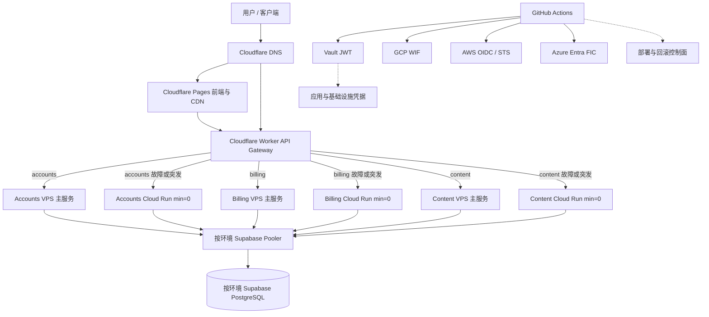

# VPS + Serverless 混合部署极简成本架构规划与工程落地指南

> **文档定位**：适用于 SIT、UAT、PROD 及后续环境的 VPS + Serverless 混合部署统一设计基线。
> **目标系统**：`portal`、`edge-gateway`、`accounts`、`billing-service`、`content-service`、`postgresql`。
> **核心目标**：VPS 承接稳定流量、Cloud Run 提供 `min=0` 弹性与故障兜底、Supabase 承载持久数据、短期云身份、最小权限、不可变发布、可验证回滚。
> **成本口径**：以“稳定流量低成本、弹性计算低闲置成本”为目标；不承诺绝对零成本，也不以删除服务替代成本治理。

---

## 一、架构目标与边界

### 1. 设计目标

所有环境采用“VPS 稳态承载 + Cloud Run 按需弹性”的混合模式：

- VPS 承接稳定、低延迟和常态流量；Cloud Run 保留服务但默认 `min-instances=0`，用于突发流量、灰度和 VPS 故障兜底；
- Supabase PostgreSQL 按环境保存业务 Schema、用户、工作区状态和持久数据；同一环境的 VPS 与 Cloud Run 必须使用同一数据源；
- Cloudflare Worker 提供统一 API 入口、鉴权、服务级路由、超时、熔断和受控故障转移；
- Portal 只有在完成静态导出兼容性验证后才使用 Cloudflare Pages；如果仍依赖 Next.js standalone 运行时，则改用 Cloud Run 或其他容器运行时；
- GitHub Actions 不保存长期云访问密钥，Vault 是应用凭据的权威来源；
- 所有环境部署均消费不可变 tag 或镜像 digest，`latest` 只允许作为非部署别名；
- 所有部署必须有健康检查、部署摘要和回滚依据。

### 2. 非目标

本方案不负责：

- 具体业务域的组件定义；组件必须以 `DELIVERY-MANIFEST.md` 和领域文档为准；
- 把一个环境直接作为另一个环境的故障转移环境；
- 通过删除 Cloud Run Service 或数据库来替代成本治理；
- 用一个跨环境高权限身份管理所有云资源。

### 3. 重要前提

“免费”依赖云厂商免费额度、区域、流量、镜像存储和服务策略。必须配置预算告警、资源标签、镜像保留策略和超额保护。Supabase Free 也不能被视为永久不暂停、永久不变更的强 SLA 数据库。

---

## 二、总体架构



### 组件职责

| 组件 | 平台 | 职责 | 状态策略 |
|---|---|---|---|
| `portal` | Cloudflare Pages 或 Cloud Run | 各环境控制台 | 构建产物可追踪 |
| `edge-gateway` | Cloudflare Worker | CORS、JWT、服务级路由、超时和上游切换 | 每个环境独立部署 |
| `accounts` | VPS 主服务 + GCP Cloud Run | 账户、认证和用户相关 API | VPS 主承载，Cloud Run `min=0` |
| `billing-service` | VPS 主服务 + GCP Cloud Run | 计量、账单和支付 API | VPS 主承载，Cloud Run `min=0` |
| `content-service` | VPS 主服务 + GCP Cloud Run | 文档/知识内容服务 | VPS 主承载，Cloud Run `min=0` |
| `postgresql` | Supabase Cloud | 按环境持久数据、Schema、种子数据 | 持久化 |
| Vault | `vault.svc.plus` | Secret SOT、策略、审计 | 不参与业务请求路径 |

---

## 三、统一身份与凭据架构

GitHub Actions 使用 GitHub OIDC 作为工作负载身份根，但不同平台分别建立信任关系：

```text
GitHub Actions Job
  │
  │ GitHub OIDC
  │
  ├─ audience=vault
  │    └─ Vault JWT Role
  │         └─ 读取目标环境 Secret
  │
  ├─ GCP Workload Identity Federation
  │    └─ 短期 GCP 部署凭据
  │
  ├─ AWS IAM OIDC → STS
  │    └─ 短期 AWS 凭据
  │
  └─ Azure Entra Federated Credential
       └─ 短期 Azure Access Token
```

这些身份关系是并行的，不应设计成“先登录 Vault，再由 Vault 代替所有云厂商登录”。不同身份系统通常要求不同的 `audience`，因此应分别请求和交换 OIDC Token。

### 1. GitHub Actions 权限

涉及联邦身份的 Job 必须显式声明：

```yaml
permissions:
  contents: read
  id-token: write
```

每个环境都应使用独立的 GitHub Environment、部署分支/Tag 限制和必要的人工审批。

### 2. Vault JWT

Vault JWT 用于读取：

- VPS API Key（当 VPS 供应商不支持 GitHub OIDC 时）；
- Cloudflare 部署 Token；
- Supabase 连接信息；
- 应用运行时 Secret；
- 迁移和初始化任务所需的短期数据凭据。

Vault Role 必须绑定：

- GitHub repository；
- `ref` 或 GitHub Environment；
- `job_workflow_ref`；
- OIDC `audience`；
- 最小 TTL 和不可续期的 batch token。

### 3. GCP Workload Identity Federation

GCP WIF 用于：

- Cloud Run 部署和更新；
- Artifact Registry 镜像读写；
- 获取部署输出和 revision 信息。

不在 Vault 中保存长期 `GCP_SA_KEY_JSON`。部署 Service Account 与 Cloud Run 运行时 Service Account 必须分离。

### 4. AWS 和 Azure 扩展

如果后续引入 AWS：

```text
GitHub OIDC → AWS IAM OIDC Provider → STS AssumeRoleWithWebIdentity
```

如果后续引入 Azure：

```text
GitHub OIDC → Microsoft Entra Federated Identity Credential
```

AWS、Azure 的 Role/Identity 只授予对应环境和资源所需权限，不回退使用长期 Access Key 或 Client Secret。

---

## 四、Vault 三层路径与最小权限

“三层架构”不仅是目录命名，还必须落实为独立 Policy 和 Role 边界。

```text
kv/data/CICD
├── GHCR_USERNAME
└── GHCR_TOKEN

kv/data/CICD/domains/<domain>
├── tls_fullchain_pem_b64
├── tls_cert_pem_b64
├── tls_key_pem_b64
├── tls_ca_pem_b64
└── tls_trust_bundle_pem_b64

kv/data/CICD/<env>
├── VPS_API_KEY
├── GCP_WIF_PROVIDER
├── GCP_DEPLOYER_SERVICE_ACCOUNT
└── 环境基础设施配置

kv/data/<env>/hybrid/control-plane
├── GCP_PROJECT_ID
├── GCP_REGION
├── ARTIFACT_REGISTRY_URL
├── CLOUDFLARE_ACCOUNT_ID
├── PAGES_PROJECT_NAME
├── WORKER_NAME
├── PORTAL_DOMAIN
└── API_DOMAIN

kv/data/<env>/hybrid/deploy/cloudflare
└── CLOUDFLARE_API_TOKEN

kv/data/<env>/hybrid/runtime/edge-gateway
└── JWT_VERIFY_SECRET

kv/data/<env>/hybrid/runtime/accounts
├── DATABASE_POOLER_URL
└── INTERNAL_SERVICE_TOKEN

kv/data/<env>/hybrid/runtime/billing
├── DATABASE_POOLER_URL
├── INTERNAL_SERVICE_TOKEN
└── STRIPE_WEBHOOK_SECRET

kv/data/<env>/hybrid/runtime/content
├── KNOWLEDGE_REPO_URL
├── KNOWLEDGE_REPO_PATH
└── INTERNAL_SERVICE_TOKEN

kv/data/<env>/hybrid/runtime/portal
├── NEXT_PUBLIC_API_URL
└── NEXT_PUBLIC_SUPABASE_ANON_KEY
```

### 域名证书存储与下发路径

公网域名、泛域名和 Caddy ACME 状态统一存储在域名级 Vault 路径：

```text
Vault canonical path:
kv/data/CICD/domains/<domain>

VPS runtime path:
/etc/xcontrol/tls/<domain>/current/
├── fullchain.pem
├── cert.pem
├── key.pem
├── ca.pem
└── trust-bundle.pem
```

当前平台约定中，`kv/data/CICD/domains/<domain>` 是跨 SIT、UAT、PROD 复用的域名证书来源；证书有效期内不因应用发布或主机重建重复申请 ACME 证书。若未来要求环境隔离证书，必须整体切换为 `kv/data/CICD/domains/<env>/<domain>`，不能在同一域名下混用两种布局。

字段约定：

- `tls_fullchain_pem_b64`：完整证书链，供 Caddy 之外的 TLS 服务使用；
- `tls_cert_pem_b64`：叶子证书；
- `tls_key_pem_b64`：域名私钥；
- `tls_ca_pem_b64`：签发 CA/中间链；
- `tls_trust_bundle_pem_b64`：客户端校验用公共根信任包，不能被证书备份任务覆盖。

证书轮换、应用镜像发布和 Cloud Run revision 发布必须相互解耦。证书恢复后，Ansible/部署脚本将 PEM 材料原子写入 `/etc/xcontrol/tls/<domain>/current/`，校验证书、私钥、SAN、签发环境和有效期后再切换 `current`。PEM、私钥和解码后的证书不得写入 Git、GitHub Artifact、Step Summary 或普通部署日志。

### 权限规则

| 身份 | 可读取范围 | 禁止读取 |
|---|---|---|
| `platform-ops-toolkit-<env>` | 当前环境 control-plane、deploy 和必要的 runtime | 其他环境路径 |
| Cloudflare deploy job | Cloudflare deploy、Gateway runtime | GCP、Supabase 主密码 |
| `accounts` runtime | `runtime/accounts` | billing、content、Cloudflare Token |
| `billing-service` runtime | `runtime/billing` | GCP 部署凭据 |
| `content-service` runtime | `runtime/content` | Supabase Service Role Key |
| migration job | 数据库迁移专用路径 | Cloudflare 生产凭据 |
| domain TLS rotation/backup job | `kv/data/CICD/domains/<domain>` 写入 | 应用运行时和普通发布 Job 的写权限 |
| VPS bootstrap/runtime | `kv/data/CICD/domains/<domain>` 只读 | 其他域名和环境的写权限 |

`ANON_KEY` 属于前端公开构建配置；`SERVICE_ROLE_KEY`、`DATABASE_DIRECT_URL` 和主数据库密码不得注入普通业务服务。

---

## 五、服务与运行时配置合同

| 服务 | 必需配置 | 运行约束 |
|---|---|---|
| Portal | `NEXT_PUBLIC_API_URL`、必要的公开 Supabase 配置 | 构建阶段注入；禁止注入私密 Key |
| Gateway | JWT 验签 Secret、当前环境 upstream map、超时配置 | Worker environment 独立部署 |
| Accounts | Pooler URL、内部服务 Token、`PORT`/配置模板 | VPS 与 Cloud Run 端口必须一致 |
| Billing | Pooler URL、内部服务 Token、当前环境支付 Secret | 必须校验数据库和内部 Token |
| Content | Knowledge repo URL/path/ref、内部服务 Token、端口 | 镜像或启动阶段必须提供知识内容来源 |

Cloud Run 服务的端口、健康检查路径和必须的环境变量必须在部署前静态校验。不能只依赖 Dockerfile 的 `EXPOSE`。

### 数据库连接

- 普通服务使用 `DATABASE_POOLER_URL`；
- migration 使用独立的 `DATABASE_DIRECT_URL`；
- 连接池必须限制最大连接数，避免 Cloud Run 水平扩展打满 Supabase；
- 数据库 URL 不得出现在日志、GitHub Step Summary 或错误信息中。

---

## 六、制品与不可变发布

所有环境都不使用 `latest`、`main` 或运行时动态推导的镜像版本作为实际部署输入。

### 允许的发布标识

```text
<env>-daily-build-YYYY.MM.DD
<env>-daily-build-YYYY.MM.DD-rN
sha-<40 位 full commit SHA>
```

每个服务构建必须提供：

- 不可变 tag；
- 完整 commit SHA tag；
- 镜像 digest；
- 构建来源仓库和 commit；
- 可选的 release manifest。

部署时必须显式传入 `deploy_tag` 或 digest。流水线不得自行把空值替换为 `latest`。

Artifact Registry 至少保留当前部署 digest、上一稳定 digest 和当前候选 digest；`latest` 只能作为指向候选版本的便利别名，不能作为回滚依据。

### 镜像来源

必须在以下两种方案中选择一种并固定：

1. 服务仓库构建并推送到统一 Artifact Registry；
2. 服务仓库构建到 GHCR，目标环境部署前进行受控复制并校验 digest。

不能出现“服务 CI 推送 GHCR，环境 CD 却直接拉取不存在的 Artifact Registry 镜像”的分裂契约。

---

## 七、混合部署流水线

```text
Prepare
  ↓
Resolve environment + deploy_tag / digest
  ↓
GitHub OIDC 登录 Vault
  ↓
GitHub OIDC 登录 GCP WIF
  ↓
读取并校验最小权限 Secret
  ↓
校验镜像存在、digest 和服务配置
  ↓
部署或更新 VPS 主服务
  ↓
部署或更新 Cloud Run 备用服务（min=0）
  ↓
获取 VPS 健康地址、Cloud Run URL 和 revision
  ↓
生成当前环境的服务级 upstream map
  ↓
部署 Worker 当前 environment
  ↓
构建并部署 Portal
  ↓
执行 migration / seed
  ↓
执行全链路 smoke test
  ↓
输出部署摘要、revision、digest 和回滚命令
```

### 失败处理

所有关键步骤必须 fail closed：

- Vault 认证失败：停止；
- 必需 Secret 缺失：停止；
- 镜像不存在或 digest 不匹配：停止；
- VPS 或任一 Cloud Run 服务部署失败：停止后续流量切换；
- Worker/Portal 部署失败：不得报告成功；
- smoke test 失败：标记发布失败并保留现场。

禁止使用以下方式隐藏失败：

```bash
|| true
failed_when: false
```

### 触发策略

| GitHub 事件 | 行为 | 凭据范围 |
|---|---|---|
| Pull Request | SIT 验证和制品检查，可选按策略部署 SIT | SIT |
| `main` / `release/*` | 按交付规则生成或消费环境快照 | 由环境规则决定 |
| `vMAJOR.MINOR.PATCH` | 生产候选/生产发布 | PROD |
| `workflow_dispatch` | 必须显式指定环境和不可变 `deploy_tag` | 用户选择环境 |
| 定时任务 | 仅执行 keepalive、观测和成本检查 | 指定环境 |
| 清理任务 | 只清理带环境标签的候选 revision/镜像 | 指定环境 |

环境路由必须遵守：PR → SIT，`main`/`release/*` → UAT，`vMAJOR.MINOR.PATCH` → PROD。快照必须使用 `<env>-daily-build-*`，生产版本必须使用 `v*`，两者不能混用。

---

## 八、Cloud Run 生命周期与成本控制

默认策略：

```text
Cloud Run service 保留
min-instances=0
max-instances=2
```

夜间不强制删除服务。保留服务可以保留 revision、服务地址和回滚能力。

如果确实需要销毁候选资源：

- 只删除具有明确 `environment=<env>` 和 `managed-by=platform-ops-toolkit` 标签的资源；
- 不删除未过保留期的镜像；
- 不删除当前 revision 或最近可回滚 revision；
- 部署与清理使用同一个 concurrency group；
- 清理前检查是否存在 active deployment lease。

Artifact Registry 清理应按照明确的仓库、tag 前缀和保留窗口执行，禁止对整个仓库进行“创建时间早于两天”的粗粒度删除。

---

## 九、数据库、迁移与种子数据

### 数据层原则

- Supabase 是每个环境的持久化数据源；
- 计算层可以销毁，数据库 Schema 和测试数据不随之销毁；
- VPS 与同环境 Cloud Run 必须使用同一个 Supabase 数据源；不能同时保留未定义主从关系的本地 PostgreSQL 双写；
- 如果要做灾备复制，必须单独定义一致性、冲突和恢复策略。

### 部署前后顺序

```text
验证 Supabase 项目
  ↓
执行 core migration
  ↓
执行可选 migration
  ↓
执行幂等 seed
  ↓
部署服务
  ↓
执行数据库连接和关键 API 验证
```

Migration job 应使用独立 Vault Role 和最小数据库权限。migration 失败必须停止发布，不得让服务在半迁移状态下对外提供目标环境流量。

---

## 十、Gateway、Portal 与域名合同

### Gateway

Gateway 必须使用明确的目标环境 Worker environment，不能在当前环境部署失败时回退到其他环境配置。

Gateway 必须按服务维护主备映射，而不是使用一个全局 primary/fallback：

```text
accounts  -> Accounts VPS  -> Accounts Cloud Run
billing   -> Billing VPS   -> Billing Cloud Run
content   -> Content VPS   -> Content Cloud Run
```

故障转移策略必须区分请求类型：GET/HEAD 等幂等请求可以在网络错误、超时或 5xx 时切换；写入类请求必须要求幂等键或由业务服务保证去重，不能对账单和支付请求进行无条件重试。

Gateway 配置至少包括：

```text
PORTAL_DOMAIN
API_DOMAIN
ACCOUNTS_UPSTREAM
BILLING_UPSTREAM
CONTENT_UPSTREAM
ACCOUNTS_FALLBACK_UPSTREAM
BILLING_FALLBACK_UPSTREAM
CONTENT_FALLBACK_UPSTREAM
TIMEOUT_MS
JWT_VERIFY_SECRET
```

Cloud Run 部署完成后，编排器读取真实 URL，再生成当前环境 upstream map。不能把可能变化的 Cloud Run URL 永久写死在 Vault 或生产 `wrangler.toml` 中。

### Portal

Portal 必须先通过以下决策：

- 如果可以稳定生成静态 `out`：使用 Cloudflare Pages；
- 如果依赖 Next.js standalone、动态 API route 或服务端渲染：使用 Cloud Run；
- 如果使用 Pages Functions/其他适配器：必须单独验证构建、运行时变量和路由合同。

Portal 的 `NEXT_PUBLIC_*` 配置在构建阶段注入，不能把私密数据库凭据打包进前端产物。

---

## 十一、健康检查、观测与验收

每个服务至少提供：

```text
/healthz
/readyz
```

部署验证包括：

1. VPS 三个主服务和三个 Cloud Run 备用服务均成功启动或处于可验证状态；
2. 数据库连接成功；
3. Gateway 能正确路由 accounts、billing、content；
4. JWT 验签成功且错误 Token 被拒绝；
5. CORS 和 OPTIONS 行为正确；
6. Portal 能访问当前环境 API；
7. 关键登录、账户、内容和账单接口通过；
8. Worker、VPS 和 Cloud Run 日志可查询；
9. 模拟 VPS 超时/5xx 时，幂等请求切换到对应 Cloud Run 服务；
10. VPS 恢复后流量可以回主，写入请求没有重复副作用。

### 观测架构约束

`observability.svc.plus` 可以继续部署在 VPS，作为平台级自建观测入口；Cloud Run、VPS 和 Worker 都必须上报统一的日志、指标和 Trace。观测写入失败不得阻断业务请求，远端 Agent 必须使用 HTTPS、认证和有界缓冲。

观测服务与业务 VPS 同机时，需要额外配置磁盘、Docker 日志、journald、Vector buffer 和恢复告警。观测平台不应成为 Vault、Worker 或业务服务的运行时强依赖。

### 统一观测字段

```text
OTEL_SERVICE_NAME
OTEL_ENVIRONMENT=<env>
OTEL_EXPORTER_OTLP_ENDPOINT
SOURCE_REPOSITORY
SOURCE_REVISION
IMAGE_TAG
IMAGE_DIGEST
DEPLOYMENT_ID
```

部署摘要不得输出 Secret、完整数据库 URL、JWT、API Token 或连接密码。

### 回滚

回滚以 Cloud Run revision 和镜像 digest 为准：

```text
记录当前 revision/digest
  ↓
发现 smoke test 或当前环境回归失败
  ↓
恢复上一个已验证 revision
  ↓
重新执行 Gateway 和关键 API 验证
```

数据库 migration 必须提供向前兼容策略。不能假设应用回滚会自动回滚数据库结构。

---

## 十二、Keepalive、备份与恢复

Supabase keepalive 只负责探测和记录状态，不替代备份。

必须分别定义：

- keepalive workflow；
- 数据库备份；
- 恢复演练；
- Schema 校验；
- 各环境 seed 重建；
- Vault KV 备份与恢复；
- Cloudflare Worker 配置恢复；
- Artifact digest 保留策略。

Keepalive 失败时应告警，不应把失败吞掉并报告成功。

---

## 十三、成本模型

| 资源 | 低闲置成本策略 | 成本风险 |
|---|---|---|
| Cloud Run | `min=0`、限制最大实例 | 请求、CPU、内存和网络超额 |
| Artifact Registry | 保留不可变发布窗口 | 镜像存储费用 |
| Cloudflare Worker | 控制请求量和日志量 | 超出免费请求额度 |
| Cloudflare Pages | 仅适合经过验证的静态产物 | 动态能力和构建限制 |
| Supabase | Pooler、容量和连接数控制 | Free 项目暂停、容量和额度限制 |
| Vault | 复用现有控制面 | 可用性、备份和运维成本 |
| GitHub Actions | 定时和并发控制 | Runner 时长、并发和缓存 |

必须设置：

- GCP Budget Alert；
- Artifact Registry retention；
- Cloud Run max instance；
- Cloudflare 用量告警；
- Supabase 容量/暂停监控；
- GitHub Actions concurrency；
- cleanup dry-run 和审批模式。

---

## 十四、推荐落地顺序

### Phase 1：身份和制品

- [ ] 为每个环境建立独立 Vault JWT Role 和 Policy；
- [ ] 建立 GCP WIF；
- [ ] 删除长期 GCP Service Account JSON；
- [ ] 固化镜像仓库和不可变 tag 合同；
- [ ] 为每个服务生成 digest 和 release manifest。

### Phase 2：VPS 主链路和数据库

- [ ] 按领域交付清单确认 VPS 主服务边界；
- [ ] 将同环境数据库统一到 Supabase；
- [ ] 校验 VPS 端口、启动命令和必需环境变量；
- [ ] 配置 Pooler 连接和连接池上限；
- [ ] 完成 migration/seed 和数据恢复演练；
- [ ] 验证 VPS `/healthz` 和 `/readyz`。

### Phase 3：Cloud Run 弹性链路

- [ ] 部署 accounts、billing、content Cloud Run 服务，默认 `min=0`；
- [ ] 校验 Cloud Run 端口、启动命令和必需环境变量；
- [ ] 配置 Cloud Run revision 与 runtime identity；
- [ ] 动态生成三个服务的 Cloud Run fallback upstream；
- [ ] 验证 `/healthz`、`/readyz` 和冷启动行为。

### Phase 4：Gateway 与 Portal

- [ ] 建立当前环境独立 Worker environment；
- [ ] 实现 VPS primary → Cloud Run fallback 的服务级路由；
- [ ] 显式注入 Worker Secret；
- [ ] 完成 Portal Pages/Cloud Run 选型；
- [ ] 验证域名、CORS、JWT 和关键 API。

### Phase 5：观测、故障转移和运营

- [ ] 建立 smoke test；
- [ ] 接入 VPS、Cloud Run、Worker 的日志、指标和 Trace；
- [ ] 完成 VPS 故障、Cloud Run 冷启动和回切演练；
- [ ] 建立 revision 回滚流程；
- [ ] 建立预算、日志、指标和追踪告警；
- [ ] 建立 keepalive、备份和恢复演练。

### Phase 6：扩展多云

- [ ] AWS IAM OIDC/STS；
- [ ] Azure Entra Federated Credential；
- [ ] 统一各云环境的 Role/Policy 命名；
- [ ] 统一部署摘要、审计和回滚合同。

---

## 十五、上线验收标准

只有满足以下条件，才允许把该方案标记为“可用”：

- [ ] GitHub Secrets 中不存储长期云凭据；不支持 OIDC 的供应商凭据必须限定在 Vault 的环境基础设施路径，并由独立 Role 读取；
- [ ] SIT、UAT、PROD 及其他环境身份和 Secret 路径完全隔离；
- [ ] 所有部署都使用不可变 tag 或 digest；
- [ ] VPS 三个主服务和 Cloud Run 三个备用服务能够独立启动和健康检查；
- [ ] Gateway 能正确执行三个服务的 primary/fallback 路由；
- [ ] 幂等写请求不会因故障转移产生重复副作用；
- [ ] Portal 构建和运行模式已验证；
- [ ] migration、seed、keepalive、备份和恢复已演练；
- [ ] smoke test 失败会使 workflow 失败；
- [ ] cleanup 不会误删生产资源或可回滚制品；
- [ ] 能根据 revision/digest 完成一次回滚；
- [ ] GitHub Actions、Vault、云厂商审计日志能够关联同一 `DEPLOYMENT_ID`。

最终原则：

> **GitHub OIDC 负责工作负载身份，Vault 负责应用密钥，云厂商 WIF 负责云控制面权限，VPS 负责稳定流量，Cloud Run 负责按需弹性和故障兜底，Supabase 负责持久数据，所有发布必须可追踪、可验证、可回滚。**
