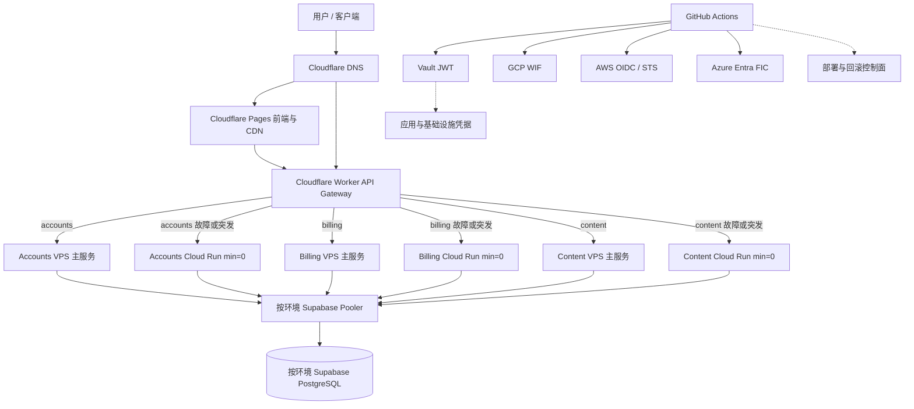

# VPS + Serverless 混合部署极简成本架构规划与工程落地指南

> **文档定位**：面向未来各类 Micro SaaS 的 VPS + Serverless 弹性架构基础规范，适用于 SIT、UAT、PROD 及后续环境。
> **参考实现**：当前以 `ai-workspace-service` 的 `portal`、`edge-gateway`、`accounts`、`billing-service`、`content-service`、`postgresql` 作为第一套落地样板；新增 Micro SaaS 只替换业务模块，不重新设计平台层。
> **核心目标**：VPS 承接稳定流量、Cloud Run 提供 `min=0` 弹性与故障兜底、Supabase 承载持久数据、短期云身份、最小权限、不可变发布、可验证回滚。
> **成本口径**：以“稳定流量低成本、弹性计算低闲置成本”为目标；不承诺绝对零成本，也不以删除服务替代成本治理。
> **当前运行基线（2026-08）**：`console-uat.onwalk.net` 为 `2C4G`，实际承载 Caddy、Portal、Accounts、Billing、Content 和自建 PostgreSQL；该状态是当前过渡态，不应被误写成已经完成的 Supabase 目标态。
> **观测基线**：`observability.svc.plus` 的 Grafana Metrics、Logs、Traces 数据源健康；四个 MCP 配置全部保留，但当前 `codex mcp list` 显示为 `Unsupported`。这表示当前 Codex 客户端对该 MCP transport/能力的识别状态，不等同于观测端点不可用；当前只保留 `observability-traces` 复数配置，不存在单数 `observability-trace`。

---

## 一、架构目标与边界

### 1. 设计目标

所有环境采用“VPS 稳态承载 + Cloud Run 按需弹性”的混合模式：

- VPS 承接稳定、低延迟和常态流量；Cloud Run 保留服务但默认 `min-instances=0`，用于突发流量、灰度和 VPS 故障兜底；
- 当前阶段允许 `console-uat` 以一台 `2C4G` VPS 承载完整控制面；在没有明确容量信号前不强制拆分 Accounts、Billing、Content，但必须预留拆分到 Cloud Run 的服务边界；
- Supabase PostgreSQL 按环境保存业务 Schema、用户、工作区状态和持久数据；同一环境的 VPS 与 Cloud Run 必须使用同一数据源；
- Cloudflare Worker 提供统一 API 入口、鉴权、服务级路由、超时、熔断和受控故障转移；
- Portal 只有在完成静态导出兼容性验证后才使用 Cloudflare Pages；如果仍依赖 Next.js standalone 运行时，则改用 Cloud Run 或其他容器运行时；
- GitHub Actions 不保存长期云访问密钥，Vault 是应用凭据的权威来源；
- 所有环境部署均消费不可变 tag 或镜像 digest，`latest` 只允许作为非部署别名；
- 所有部署必须有健康检查、部署摘要和回滚依据。

### 2. 非目标

本方案不负责：

- 具体业务域的组件定义；组件必须以 `DELIVERY-MANIFEST.md` 和领域文档为准；
- 把一个环境直接作为另一个环境的故障转移环境；
- 通过删除 Cloud Run Service 或数据库来替代成本治理；
- 用一个跨环境高权限身份管理所有云资源。

### 3. 通用化定位

这套方案由“稳定的平台层”和“可替换的业务层”组成，未来新增 Micro SaaS 必须优先复用平台层：

```text
通用平台层
  Cloudflare DNS / Pages / Worker
  Vault / GitHub OIDC / 云 WIF
  VPS 主承载 / Cloud Run 弹性副本
  Supabase 或兼容 PostgreSQL
  Observability Server / Agent / MCP
  不可变制品 / 健康检查 / 回滚 / 成本治理

可替换业务层
  Portal、Accounts、Billing、Content
  或任意 SaaS 的 Auth、Tenant、Project、Usage、Payment、Worker、API
```

每个新增 Micro SaaS 必须提交一份服务清单，至少声明：

| 维度 | 必填内容 |
|---|---|
| 服务类型 | 静态前端、无状态 API、写入/账务 API、异步 Worker、知识/内容服务 |
| 状态模型 | 无状态、数据库状态、对象存储、队列/任务状态 |
| 部署档位 | VPS 主承载、Cloud Run `min=0`、两者混合或仅 Serverless |
| 运行合同 | 端口、`/healthz`、`/readyz`、启动命令、必需环境变量 |
| 扩缩容合同 | `min/max` 实例、并发、超时、连接池、幂等和重试策略 |
| 数据合同 | Pooler/Direct URL、migration、seed、备份和恢复策略 |
| 观测合同 | `OTEL_SERVICE_NAME`、环境、版本、日志字段、指标和 Trace |
| 安全合同 | Vault 路径、OIDC Role、服务身份、允许的跨服务调用 |
| 发布合同 | 镜像仓库、不可变 tag/digest、回滚 revision 和兼容性策略 |

平台层不得因为某个业务服务使用不同语言、数据库或云厂商而失去统一的身份、观测、发布和回滚规范。

### 4. 重要前提

“免费”依赖云厂商免费额度、区域、流量、镜像存储和服务策略。必须配置预算告警、资源标签、镜像保留策略和超额保护。Supabase Free 也不能被视为永久不暂停、永久不变更的强 SLA 数据库。

---

## 二、总体架构



### 组件职责

| 组件 | 平台 | 职责 | 状态策略 |
|---|---|---|---|
| `portal` | 当前 `console-uat`；目标 Cloudflare Pages 或 Cloud Run | 各环境控制台 | 静态导出优先，构建产物可追踪 |
| `edge-gateway` | Cloudflare Worker | CORS、JWT、服务级路由、超时和上游切换 | 每个环境独立部署 |
| `accounts` | 当前 `console-uat` + GCP Cloud Run 备用 | 账户、认证和用户相关 API | VPS 主承载，Cloud Run `min=0` |
| `billing-service` | 当前 `console-uat` + GCP Cloud Run 备用 | 计量、账单和支付 API | VPS 主承载，Cloud Run `min=0` |
| `content-service` | 当前 `console-uat` + GCP Cloud Run 备用 | 文档/知识内容服务 | VPS 主承载，Cloud Run `min=0` |
| `postgresql` | 当前 `console-uat` 自建；目标 Supabase Cloud | 按环境持久数据、Schema、种子数据 | 迁移完成前禁止双写 |
| `observability-server` | 独立观测 VPS | VictoriaMetrics、VictoriaLogs、VictoriaTraces、Grafana、MCP | 不作为业务运行时依赖 |
| `observability-agent` | `console-uat`、`agent-proxy` 和代理节点 | Node/Process/Vector/Xray 指标、日志和 Trace 转发 | 有界缓冲、HTTPS、认证 |
| Vault | `vault.svc.plus` | Secret SOT、策略、审计 | 不参与业务请求路径 |

### 当前运行基线与资源分层

当前实际资源应按“两类资源池、四个监控节点”理解，而不是按四套独立业务 VPS 规划：

| 资源池 | 当前节点/组件 | 当前状态 | 最小运行 | 推荐资源与容量判断 |
|---|---|---|---|---|
| 核心控制面 | `console-uat.onwalk.net`：Caddy、Portal、Accounts、Billing、Content、自建 PostgreSQL | `2C4G` 正在运行，当前负载仍有余量 | `2C4G / 40GB SSD` | 低流量阶段约 10–30 RPS 总 API；长期保留全部组件建议 `4C8G / 80GB SSD`，约 50–150 RPS，需以压测为准 |
| Agent/代理节点 | `agent-proxy.onwalk.net`、`tky-proxy.svc.plus`、`jp-xhttp-contabo.svc.plus` | Node Exporter、Process Exporter、Vector 已覆盖 4 节点；Xray Exporter 覆盖 3 节点 | 普通节点 `1–2C / 2G / 40GB` | `tky-proxy` 当前可维持小规格；`jp-xhttp` 当前约 77% 磁盘使用，建议 `4C8G / 200GB SSD` |
| 观测平台 | `observability.svc.plus`：Metrics、Logs、Traces、Grafana、MCP | 三个 Grafana 数据源健康，当前观测服务可用 | `2C4G / 150GB SSD`，必须缩短保留期 | 推荐 `4C8G / 300GB SSD`；Metrics 30 天、Logs 7–14 天、Traces 3–7 天 |

All-in-one 只作为低流量或过渡方案，不作为长期生产隔离方案：

| All-in-one 范围 | 最小运行 | 推荐资源 | 预估承载能力与边界 |
|---|---|---|---|
| Agent-proxy + 控制面 + Observability，不包含高流量 Xray 数据面 | `4C8G / 200GB SSD` | `6C12G / 300GB SSD` | 约 4–6 个监控节点、2 万级时序、50–100 万日志/日；控制面约 10–30 RPS。必须使用 Portal 静态模式和短保留周期 |
| Agent-proxy + 控制面 + Observability，并包含低流量 Xray | `6C12G / 300GB SSD` | `8C16G / 400GB SSD` | 适合低至中等代理流量和数百级长连接；Xray、PostgreSQL 查询和观测查询会争抢 CPU/IO |
| 按当前 `jp-xhttp` 级别运行高流量 Xray | 不建议 All-in-one | `8C16G / 500GB SSD` 或拆分 | 当前 Xray 节点已出现约 2.5 核 CPU、Load1 约 3.6、磁盘约 77% 的信号；应优先独立代理资源 |

以上容量是保守工程估算，不是 SLA。任何扩容或合并决策都必须以 API 延迟、数据库连接、Xray 带宽/长连接、观测写入速率和磁盘增长曲线复核。

### Micro SaaS 通用运行档位

新业务优先选择以下标准档位，再根据实测数据升档；不得为每个 SaaS 单独发明一套资源和流水线。

| 档位 | 适用场景 | 默认部署 | 最小资源 | 推荐资源 | 典型承载能力 |
|---|---|---|---|---|---|
| S0 静态/边缘 | Landing Page、文档站、轻量控制台 | Pages + Worker | 无常驻 VPS | Pages + Worker | 主要受边缘请求、构建和 API 配额约束 |
| S1 轻量控制面 | Auth、Tenant、Project、简单 CRUD | 共享控制面 VPS + Cloud Run 备用 | 共享 `2C4G` | `1C1G`/服务或共享 `4C8G` | 低至中等流量，约 10–30 RPS 总 API |
| S2 标准 Micro SaaS | 多租户、计费、内容、管理后台 | VPS 主承载 + Cloud Run `min=0` | 共享 `2C4G` | `4C8G` 控制面 | 约 50–150 RPS 总 API，取决于数据库和外部 API |
| S3 弹性服务 | 高峰明显、任务突发、Webhook | Cloud Run 主承载或 VPS + Cloud Run | `1C512MiB`/服务 | `1C1–2GiB`/服务、`max=2–10` | 以并发、队列积压和数据库连接上限为准 |
| S4 数据/代理密集型 | AI 推理、知识库、长连接、Xray | 独立 VPS/专用节点 + Serverless 辅助 | 独立资源池 | 按带宽、IO、GPU 或队列压测 | 不与控制面、数据库、观测平台强行合并 |

S1–S3 可以共享平台控制面；S4 必须优先隔离。任何服务从 S1/S2 升到 S3/S4 时，应只替换服务运行档位，不改变域名、Vault、观测和发布接口。

---
