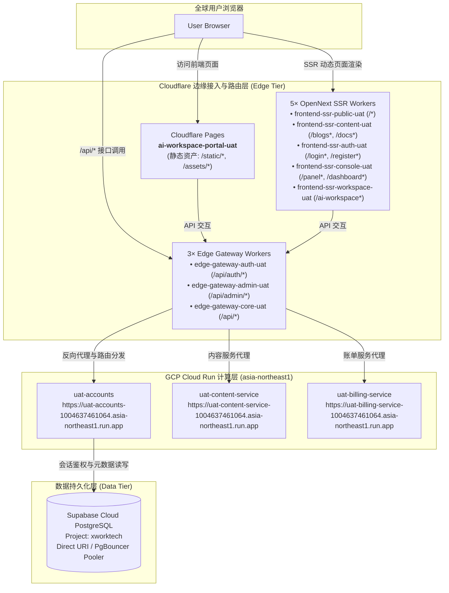

# UAT Serverless 运行时拓扑、路由契约与全链路验证指南

> **技术矩阵**：Cloudflare Pages + Cloudflare Workers (SSR ×5 + Gateway ×3) + GCP Cloud Run (Scale-to-0) + Supabase Cloud DB (`xworktech`) + HashiCorp Vault (`vault.svc.plus`)  
> **核心声明源**：`gitops/topology/uat/serverless/runtime-topology.yaml`  
> **标准编排流水线**：`platform-ops-toolkit/.github/workflows/serverless-orchestrator.yml` ([CI Run #32017012356](https://github.com/ai-workspace-infra/platform-ops-toolkit/actions/runs/32017012356))

---

## 📌 一、 架构全景与链路设计

UAT Serverless 模式旨在提供 **“持久化数据库 + 弹性无服务器计算 + 边缘多路由拆分”** 的现代化零闲置成本架构。



---

## 🏛️ 二、 GitOps 运行时拓扑契约 (`runtime-topology.yaml`)

拓扑文件位于 `gitops/topology/uat/serverless/runtime-topology.yaml`，属于不可变配置中心源：

### 1. 流量控制与 DNS 映射 (`spec.runtime.routing`)
* **控制面**：`cloudflare-dns`，TTL 为 60 秒。
* **流量权重**：`selfhost: 0, serverless: 100`。
* **规范记录映射**：
  * `console-uat.onwalk.net` $\rightarrow$ `console-cloudflare-uat.onwalk.net`
  * `accounts-uat.onwalk.net` $\rightarrow$ `accounts-cloudflare-uat.onwalk.net`

### 2. Cloudflare 边缘分片契约 (9 大边界)
为了规避 Cloudflare Workers 单包 3 MiB 的上限并实现细粒度缓存与按需伸缩，前端与网关拆分为 **9 个独立部署单元**：

| 边界标识 | 部署类型 | Worker / Pages 实体名称 | 路由规则匹配 | 承载功能 |
| :--- | :--- | :--- | :--- | :--- |
| `ssr-public` | Worker | `frontend-ssr-public-uat` | `/*`, `/_edge/public/*` | 官网、营销首页与通用落地页 |
| `ssr-content` | Worker | `frontend-ssr-content-uat` | `/blogs*`, `/docs*`, `/download*`, `/_edge/content/*` | 博客、文档与下载中心 |
| `ssr-auth` | Worker | `frontend-ssr-auth-uat` | `/login*`, `/register*`, `/email-verification*`, `/logout*`, `/_edge/auth/*` | 身份认证与登录注册页面 |
| `ssr-console` | Worker | `frontend-ssr-console-uat` | `/panel*`, `/dashboard*`, `/_edge/console/*` | 控制台与用户仪表盘 |
| `ssr-workspace` | Worker | `frontend-ssr-workspace-uat` | `/ai-workspace*`, `/cloud_iac*`, `/editor*`, `/support*`, `/xworkmate*`, `/_edge/workspace/*` | AI 工作区与在线编辑器 |
| `api-auth` | Worker | `edge-gateway-auth-uat` | `accounts-cloudflare-uat.onwalk.net/api/auth/*` | 鉴权与会话验证 API 网关 |
| `api-admin` | Worker | `edge-gateway-admin-uat` | `accounts-cloudflare-uat.onwalk.net/api/admin/*` | 管理员 API 网关 |
| `api-core` | Worker | `edge-gateway-core-uat` | `accounts-cloudflare-uat.onwalk.net/api/*` | 核心业务 API 兜底网关 |
| `static` | Pages | `ai-workspace-portal-uat` | `/static/*`, `/assets/*` | 前端打包静态资产 (JS/CSS/Images) |

### 3. 后端微服务与真实端点映射 (`spec.serverless`)
实际部署在 GCP Cloud Run（区域 `asia-northeast1`，项目 `xworktech`）的微服务端点：

* **Accounts Service**: `https://uat-accounts-1004637461064.asia-northeast1.run.app`
* **Content Service**: `https://uat-content-service-1004637461064.asia-northeast1.run.app`
* **Billing Service**: `https://uat-billing-service-1004637461064.asia-northeast1.run.app`

---

## ⚙️ 三、 CI/CD 自动化流水线编排链路

标准流水线定义在 `platform-ops-toolkit/.github/workflows/serverless-orchestrator.yml`：

### 执行阶段分解 ([Run #32017012356](https://github.com/ai-workspace-infra/platform-ops-toolkit/actions/runs/32017012356))

1. **Preflight & 契约校验 (`Validate / Dispatch inputs`)**：
   * 检出 GitOps 仓库并提取 `topology/uat/serverless/runtime-topology.yaml`。
   * 通过 Ruby 脚本渲染为标准 JSON 格式。
   * 运行 `scripts/serverless_uat/validate_cloudflare_boundaries.py`，严格校验 9 大边缘边界、服务定义与 Supabase 契约。
2. **数据库校验与初始化 (`Supabase / xworktech`)**：
   * 使用 GitHub OIDC 向 Vault 获取 `kv/data/uat/serverless/supabase` 凭据。
   * 验证 Supabase REST / PostgreSQL 连接，执行必要的 Accounts 初始化 SQL。
3. **后端容器部署 (`Cloud Run Matrix`)**：
   * 并行调度 `accounts`、`content-service`、`billing-service`。
   * 通过 GCP Workload Identity Federation (WIF) 免密认证，注入直连 Supabase 连接串 `SUPABASE_CONNECT_URI`。
4. **边缘 SSR Workers 部署 (`Cloudflare / SSR Matrix`)**：
   * 并行构建并发布 5 个 OpenNext SSR Worker。
5. **API 边缘网关部署 (`Cloudflare / edge-gateway Matrix`)**：
   * 并行发布 3 个 Edge Gateway Worker，将流量上游指向 Cloud Run。
6. **静态资产发布 (`Cloudflare / static-pages`)**：
   * 编译 Next.js 静态输出并发布至 Cloudflare Pages 项目 `ai-workspace-portal-uat`。
7. **聚合验证与汇总 (`Verify / Summary`)**：
   * 聚合所有上游 Matrix Job 状态，在 GitHub Actions Step Summary 生成运行报告。

---

## 🔍 四、 链路排错与域名连通性实测手册

### 1. 域名解析与 Custom Domain 绑定排错
* **现象**：浏览器直接访问 `console-cloudflare-uat.onwalk.net` 出现 `ERR_NAME_NOT_RESOLVED` (NXDOMAIN)。
* **根因**：Cloudflare DNS Zone `onwalk.net` 尚未绑定 Custom Domain 或缺少 CNAME 记录。
* **解决办法**：
  * **Console 接入**：在 Cloudflare Pages `ai-workspace-portal-uat` $\rightarrow$ **Custom domains** 添加 `console-cloudflare-uat.onwalk.net`（或在 DNS 添加 CNAME 指向 `ai-workspace-portal-uat.pages.dev` 并开启 Proxied 橙色小云朵）。
  * **Accounts 接入**：在 Worker `edge-gateway-core-uat` $\rightarrow$ **Custom domains** 添加 `accounts-cloudflare-uat.onwalk.net`。

### 2. 真实端点快速连通性验证命令
```bash
# 1. 验证 Cloudflare Pages 静态站与 SSR 入口
curl -sSL -I https://ai-workspace-portal-uat.pages.dev/

# 2. 验证 Cloud Run Accounts 容器与应用响应
curl -sSL -I https://uat-accounts-1004637461064.asia-northeast1.run.app/readyz

# 3. 验证 Cloud Run Content 与 Billing 服务响应
curl -sSL -I https://uat-content-service-1004637461064.asia-northeast1.run.app/
curl -sSL -I https://uat-billing-service-1004637461064.asia-northeast1.run.app/

# 4. 验证 Supabase 心跳保活 (通过 Vault API 提取凭据或 REST ping)
curl -sSL -H "apikey: <SUPABASE_ANON_KEY>" "https://<PROJECT_REF>.supabase.co/rest/v1/"
```
