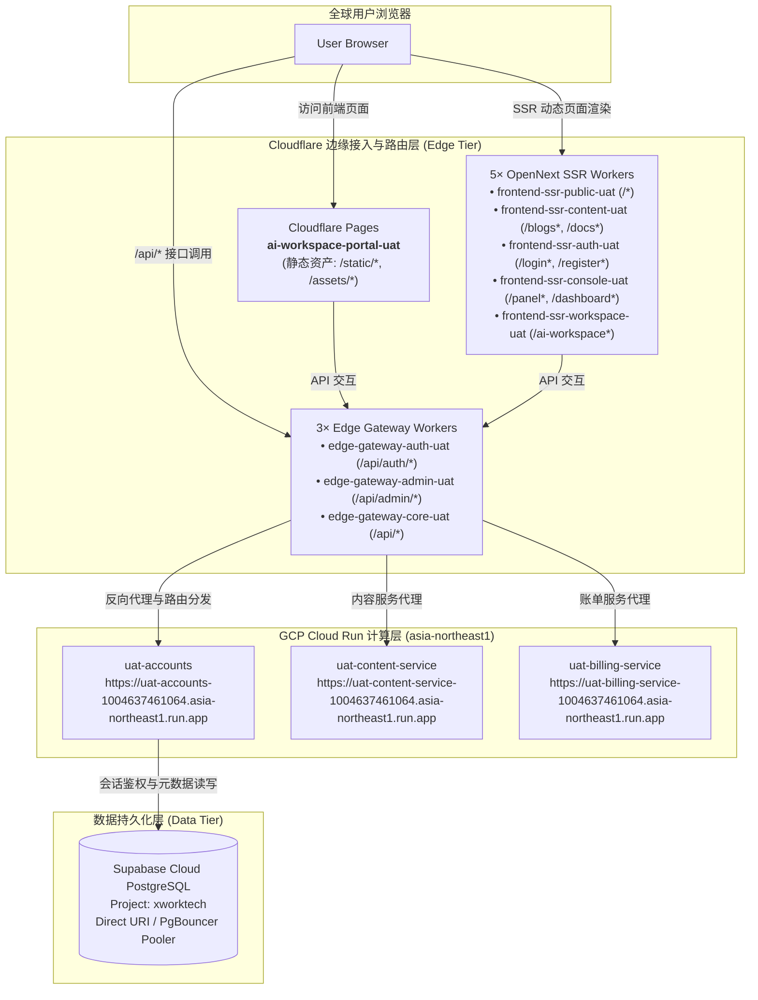
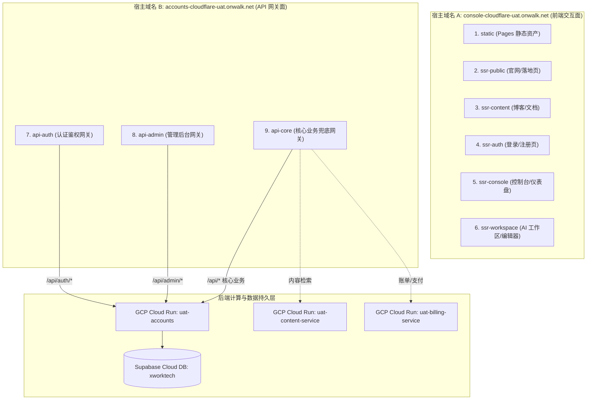
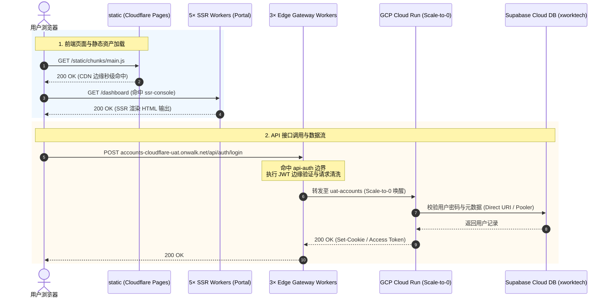

# UAT Serverless 运行时拓扑、路由契约与全链路验证指南

> **技术矩阵**：Cloudflare Pages + Cloudflare Workers (SSR ×5 + Gateway ×3) + GCP Cloud Run (Scale-to-0) + Supabase Cloud DB (`xworktech`) + HashiCorp Vault (`vault.svc.plus`)  
> **核心声明源**：`gitops/topology/uat/serverless/runtime-topology.yaml`  
> **标准编排流水线**：`platform-ops-toolkit/.github/workflows/serverless-orchestrator.yml` ([CI Run #32017012356](https://github.com/ai-workspace-infra/platform-ops-toolkit/actions/runs/32017012356))
> **目标演进**：将当前 9 个边缘边界升级为“Frontend Router ×1 + Pages ×1 + SSR ×5 + API Gateway ×3”；具体决策和编码计划见 [Console Frontend Router 与 Edge Gateway 目标架构及实施计划](frontend-edge-routing-target-architecture.md)。

---

## 📌 一、 架构全景与链路设计

UAT Serverless 模式旨在提供 **“持久化数据库 + 弹性无服务器计算 + 边缘多路由拆分”** 的现代化零闲置成本架构。



---

## 🏛️ 二、 GitOps 运行时拓扑契约 (`runtime-topology.yaml`)

拓扑文件位于 `gitops/topology/uat/serverless/runtime-topology.yaml`，属于不可变配置中心源：

### 1. 流量控制与 DNS 映射 (`spec.runtime.routing`)
* **控制面**：`cloudflare-dns`，TTL 为 60 秒。
* **流量权重**：`selfhost: 0, serverless: 100`。
* **规范记录映射**：
  * `console-uat.onwalk.net` $\rightarrow$ `console-cloudflare-uat.onwalk.net`
  * `accounts-uat.onwalk.net` $\rightarrow$ `accounts-cloudflare-uat.onwalk.net`

### 2. 后端微服务与真实端点映射 (`spec.serverless`)
实际部署在 GCP Cloud Run（区域 `asia-northeast1`，项目 `xworktech`）的微服务端点：

* **Accounts Service**: `https://uat-accounts-1004637461064.asia-northeast1.run.app`
* **Content Service**: `https://uat-content-service-1004637461064.asia-northeast1.run.app`
* **Billing Service**: `https://uat-billing-service-1004637461064.asia-northeast1.run.app`

---

## 🌐 三、 9 个边缘分片边界精确路由与链路拓扑关系

在 `gitops/topology/uat/serverless/runtime-topology.yaml` 中，为了**彻底规避 Cloudflare Workers 单包 3 MiB 限制**、**实现毫秒级边缘冷启动**与**双轨故障转移（Failover）**，整个前端与网关被严格划分为 **9 个独立分片边界**（1 个 Pages 静态资产 + 5 个 SSR Workers + 3 个 API Gateway Workers）。

### 1. 宿主域名与分片归属拓扑



### 2. 9 大分片边界路由规则与职责矩阵

| 序号 | 分片边界 ID | 承载实体类型与 Worker 名称 | 绑定宿主域名 | 精确匹配路由规则 (Routes) | 核心职责与业务范围 | 后端真实上游 (Upstream) |
| :---: | :--- | :--- | :--- | :--- | :--- | :--- |
| **1** | **`static`** | **Cloudflare Pages**<br>`ai-workspace-portal-uat` | `console-cloudflare-uat.onwalk.net` | `/static/*`<br>`/assets/*`<br>`*.ico, *.png, *.svg` | 前端打包静态资产 (Next.js HTML/JS/CSS/多媒体)，利用 Cloudflare 全球 CDN 零成本无限带宽分发 | Cloudflare 边缘存储 (Pages Storage) |
| **2** | **`ssr-public`** | **Worker (OpenNext)**<br>`frontend-ssr-public-uat` | `console-cloudflare-uat.onwalk.net` | `/*`<br>`/_edge/public/*` | 官网首页、营销推广页、通用 Landing Page 及全平台客户端下载指引的 SSR 渲染 | Cloudflare Pages 静态依赖 + 边缘 V8 执行 |
| **3** | **`ssr-content`** | **Worker (OpenNext)**<br>`frontend-ssr-content-uat` | `console-cloudflare-uat.onwalk.net` | `/blogs*`<br>`/docs*`<br>`/download*`<br>`/_edge/content/*` | 博客中心、知识库技术文档 (`docs.svc.plus`) 与产品包发布中心的动态 SSR 渲染 | Cloud Run `uat-content-service` (获取文档源) |
| **4** | **`ssr-auth`** | **Worker (OpenNext)**<br>`frontend-ssr-auth-uat` | `console-cloudflare-uat.onwalk.net` | `/login*`<br>`/register*`<br>`/email-verification*`<br>`/logout*`<br>`/_edge/auth/*` | 身份流转页面 (登录、注册、邮箱激活、重置密码及登出) 的 SSR 渲染 | 边缘前置校验 + 客户端调用 API 网关 |
| **5** | **`ssr-console`** | **Worker (OpenNext)**<br>`frontend-ssr-console-uat` | `console-cloudflare-uat.onwalk.net` | `/panel*`<br>`/dashboard*`<br>`/_edge/console/*` | 用户个人中心、多租户控制面板、订阅套餐概览及组织管理面板 SSR 渲染 | 边缘聚合 + 客户端交互 |
| **6** | **`ssr-workspace`** | **Worker (OpenNext)**<br>`frontend-ssr-workspace-uat` | `console-cloudflare-uat.onwalk.net` | `/ai-workspace*`<br>`/cloud_iac*`<br>`/editor*`<br>`/support*`<br>`/xworkmate*`<br>`/_edge/workspace/*` | 在线 Web IDE、AI 对话工作区、云端 IaC 资源编排器及工单/客服支持交互界面 | 客户端直连数据面及核心 API 网关 |
| **7** | **`api-auth`** | **Worker (Edge Gateway)**<br>`edge-gateway-auth-uat` | `accounts-cloudflare-uat.onwalk.net` | `/api/auth/*` | 拦截所有认证请求，负责边缘 JWT 签名/验签、OAuth 回调分发及登录 Token 交换 | **Cloud Run: `uat-accounts`**<br>`https://uat-accounts-1004637461064.asia-northeast1.run.app` |
| **8** | **`api-admin`** | **Worker (Edge Gateway)**<br>`edge-gateway-admin-uat` | `accounts-cloudflare-uat.onwalk.net` | `/api/admin/*` | 管理员/运维平台专属网关，负责高权限接口隔离与 RBAC 访问权限拦截 | **Cloud Run: `uat-accounts`** (Admin 模块) |
| **9** | **`api-core`** | **Worker (Edge Gateway)**<br>`edge-gateway-core-uat` | `accounts-cloudflare-uat.onwalk.net` | `/api/*`<br>*(全局通配兜底)* | 核心业务网关，处理租户元数据、计费调用、内容接口，支持 2500ms 超时自动故障转移 (Failover) | **Cloud Run: `uat-accounts`** / `uat-billing-service` / `uat-content-service` |

### 3. 请求流转与时序交互拓扑



### 4. 架构工程优势与设计考量

1. **突破 Cloudflare Workers 3 MiB 体积限制**：
   全量 Next.js 生产产物通常在 15~30 MiB，单 Worker 无法承载。通过 OpenNext 拆分为 5 个专业化 SSR Worker 后，单 Worker 体积仅 1.5~2.8 MiB，完全满足 Cloudflare 单包限制。
2. **毫秒级边缘冷启动**：
   拆分后的 Worker 内存占用小，配合 Cloudflare V8 Isolate 引擎，边缘冷启动耗时低于 50ms。
3. **高权限隔离与安全纵深**：
   `/api/auth/*`（高频轻量）与 `/api/admin/*`（低频高权）在边缘层即由专属 Worker 处理，避免通用业务漏洞穿透影响认证中枢。
4. **零闲置成本双轨容灾**：
   前端由 Pages/Workers 免费承载，后端微服务在 Cloud Run 设置 `min-instances=0`，无人访问时计算资源消耗为 $0。请求触发时在 ~200ms 内拉起并直连 Supabase 读写。

---

## ⚙️ 四、 CI/CD 自动化流水线编排链路

标准流水线定义在 `platform-ops-toolkit/.github/workflows/serverless-orchestrator.yml`：

### 执行阶段分解 ([Run #32017012356](https://github.com/ai-workspace-infra/platform-ops-toolkit/actions/runs/32017012356))

1. **Preflight & 契约校验 (`Validate / Dispatch inputs`)**：
   * 检出 GitOps 仓库并提取 `topology/uat/serverless/runtime-topology.yaml`。
   * 通过 Ruby 脚本渲染为标准 JSON 格式。
   * 运行 `scripts/serverless_uat/validate_cloudflare_boundaries.py`，严格校验 9 大边缘边界、服务定义与 Supabase 契约。
2. **数据库校验与初始化 (`Supabase / xworktech`)**：
   * 使用 GitHub OIDC 向 Vault 获取 `kv/data/uat/serverless/supabase` 凭据。
   * 验证 Supabase REST / PostgreSQL 连接，执行必要的 Accounts 初始化 SQL。
3. **后端容器部署 (`Cloud Run Matrix`)**：
   * 并行调度 `accounts`、`content-service`、`billing-service`。
   * 通过 GCP Workload Identity Federation (WIF) 免密认证，注入直连 Supabase 连接串 `SUPABASE_CONNECT_URI`。
4. **边缘 SSR Workers 部署 (`Cloudflare / SSR Matrix`)**：
   * 并行构建并发布 5 个 OpenNext SSR Worker。
5. **API 边缘网关部署 (`Cloudflare / edge-gateway Matrix`)**：
   * 并行发布 3 个 Edge Gateway Worker，将流量上游指向 Cloud Run。
6. **静态资产发布 (`Cloudflare / static-pages`)**：
   * 编译 Next.js 静态输出并发布至 Cloudflare Pages 项目 `ai-workspace-portal-uat`。
7. **聚合验证与汇总 (`Verify / Summary`)**：
   * 聚合所有上游 Matrix Job 状态，在 GitHub Actions Step Summary 生成运行报告。

---

## 🔍 五、 链路排错与域名连通性实测手册

### 1. 域名解析与 Custom Domain 绑定排错
* **现象**：浏览器直接访问 `console-cloudflare-uat.onwalk.net` 出现 `ERR_NAME_NOT_RESOLVED` (NXDOMAIN)。
* **根因**：Cloudflare DNS Zone `onwalk.net` 尚未绑定 Custom Domain 或缺少 CNAME 记录。
* **解决办法**：
  * **Console 接入**：在 Cloudflare Pages `ai-workspace-portal-uat` $\rightarrow$ **Custom domains** 添加 `console-cloudflare-uat.onwalk.net`（或在 DNS 添加 CNAME 指向 `ai-workspace-portal-uat.pages.dev` 并开启 Proxied 橙色小云朵）。
  * **Accounts 接入**：在 Worker `edge-gateway-core-uat` $\rightarrow$ **Custom domains** 添加 `accounts-cloudflare-uat.onwalk.net`。

### 2. 真实端点快速连通性验证命令
```bash
# 1. 验证 Cloudflare Pages 静态站与 SSR 入口
curl -sSL -I https://ai-workspace-portal-uat.pages.dev/

# 2. 验证 Cloud Run Accounts 容器与应用响应
curl -sSL -I https://uat-accounts-1004637461064.asia-northeast1.run.app/readyz

# 3. 验证 Cloud Run Content 与 Billing 服务响应
curl -sSL -I https://uat-content-service-1004637461064.asia-northeast1.run.app/
curl -sSL -I https://uat-billing-service-1004637461064.asia-northeast1.run.app/

# 4. 验证 Supabase 心跳保活 (通过 Vault API 提取凭据或 REST ping)
curl -sSL -H "apikey: <SUPABASE_ANON_KEY>" "https://<PROJECT_REF>.supabase.co/rest/v1/"
```
