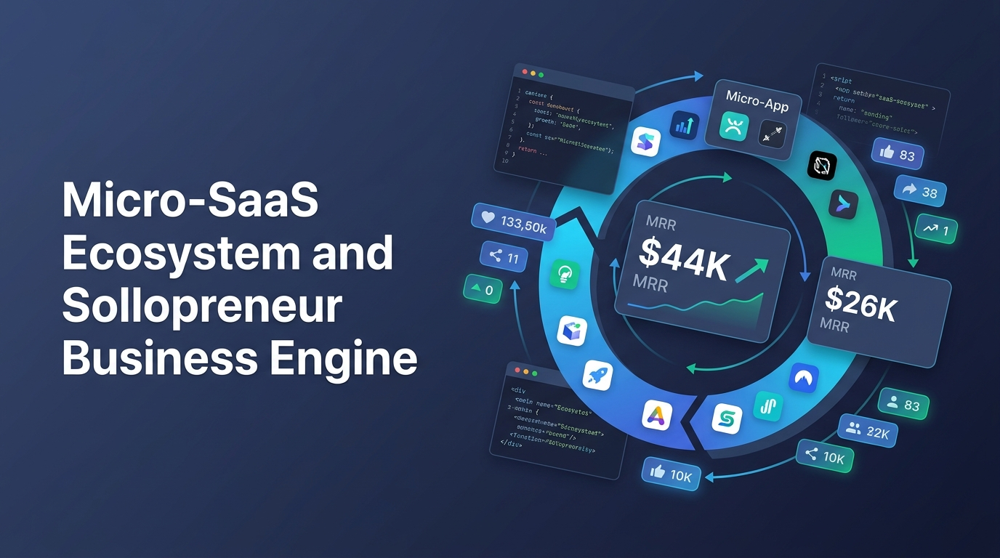

# 海外“小而美” Micro-SaaS 深度解构：商业范式、增长杠杆与生态洞察



## 1. 引言：单兵作战与微型团队的千万美元时代

在传统的企服 SaaS 叙事中，商业成功往往与“庞大的销售团队”、“数千万美元融资金额”以及“大而全的平台型架构”强绑定。然而，随着基础设施（如 Stripe/Lemon Squeezy 跨境支付、Vercel/Supabase Serverless 托管）的成熟与大模型 AI 开发工具的普及，一场由**独立开发者（Indie Hackers）与单兵创作者（Solopreneurs）**主导的 **“小而美” Micro-SaaS 浪潮**正在全球范围内重塑 SaaS 的定义。

如今，一个 1 到 3 人的团队甚至单人，无需风险投资介入，就能通过构建微型 SaaS 达到数万至数十万美元的月经常性收入（MRR），甚至实现数百万美元的高价资本并购。

从 **Marc Lou** 打造的单人收益矩阵（月入近 $10 万），到 **Tibo（Thibault Louis-Lucas）** 依靠 Tweet Hunter 和 Taplio 实现 **$800 万美元 Exit** 并持续孵化 AI 矩阵，再到海外独立开发者 Jack Friks 的 **Post Bridge** 与国内开发者打造的 **OutseekAI**，Micro-SaaS 已经形成了一套高度可复制的商业范式。

---

## 2. 海外“小而美” Micro-SaaS 的 5 大核心特点

```
                     ┌────────────────────────────────────────┐
                     │     海外“小而美” Micro-SaaS 商业闭环      │
                     └───────────────────┬────────────────────┘
                                         │
       ┌─────────────────────────────────┼─────────────────────────────────┐
       ▼                                 ▼                                 ▼
┌──────────────┐                 ┌──────────────┐                 ┌──────────────┐
│  极致微场景  │                 │  单兵矩阵化  │                 │ Build in     │
│ (Point-Sol)  │                 │ (Portfolio)  │                 │ Public (IP)  │
└──────┬───────┘                 └──────┬───────┘                 └──────┬───────┘
       │                                 │                                 │
       │  解决明确细分痛点              │  产品互相导流、复用基础设施     │  X/PH 社区透明传播
       ▼                                 ▼                                 ▼
┌────────────────────────────────────────────────────────────────────────────────┐
│                   极简技术栈 + 80%+ 高毛利率 + 零外部融资                       │
└────────────────────────────────────────────────────────────────────────────────┘
```

---

### 特点一：极致微场景与“点解决方案”（Point Solution）

不同于 Slack、Salesforce 试图覆盖复杂的企业全工作流，Micro-SaaS 拒绝功能膨胀（Enterprise Bloat）。它们的核心逻辑是：**找到一个极其具体、高频、刚需的微小痛点，提供 10 倍更好或 10 倍更快的解决方案。**

*   **痛点即产品**：
    *   `ShipFast`（Marc Lou）：发现开发者每次启动 Next.js 新项目都要重复配置鉴权、Stripe 接口和 SEO 元数据，于是将代码打包为开箱即用的脚手架，变现为 $4K/m 的收益基石。
    *   `Feather.so`（Tibo 矩阵）：放弃繁琐的传统 CMS 搭建，只专注解决“**如何把 Notion 页面一键转化为高 SEO 性能的博客**”。
    *   `Post Bridge`（Jack Friks）：因不满 Hootsuite 等企业级工具每月 $150+ 的昂贵定价，专注做一个**轻量、开发者友好的跨平台社交媒体 API 与定时发布基础设施**，并完美支持 MCP (Model Context Protocol)。

---

### 特点二：单兵 / 微团队“产品矩阵协同”（Portfolio Strategy）

单靠一款微型产品可能存在市场上限，海外顶尖开发者普遍采用 **“产品矩阵（Portfolio Engine）”** 策略：通过快速构建多个微型产品，相互导流、复用底层基础设施，降低整体 CAC（客户获取成本）。

#### 案例 A：Marc Lou 的开发者与创业者生态矩阵

| 产品名称 | 月收入 (MRR) | 产品定位与生态闭环角色 |
| :--- | :--- | :--- |
| **TrustMRR** | **$44,000 /月** | 接入 Stripe/LemonSqueezy API，验证真实 MRR 的收入透明排行榜与微型买卖市场 |
| **DataFast** | **$26,000 /月** | 针对独立创业者的收入导向型极简 Web 流量与转化分析工具 |
| **SHIPORDIE** | **$13,000 /月** | 创业打卡挑战与社区产品，提供游戏化的极速交付方案 |
| **CodeFast** | **$6,000 /月** | 快速代码与生成式开发脚手架 |
| **ShipFast** | **$4,000 /月** | Next.js 极速创业模板（引流爆款基石） |
| **IndiePage** | **$1,000 /月** | 独立开发者个人项目展示与 IP 主页搭建工具 |

> **闭环商业逻辑**：创作者用 `ShipFast` / `CodeFast` 快速开发 MVP，用 `DataFast` 分析收益流量，在 `TrustMRR` 认证真实营收建立信任，在 `IndiePage` 集中展示个人矩阵。**产品链条自然串联，互为渠道。**

#### 案例 B：Tibo 的内容营销与 AI 矩阵

*   **前期爆款**：`Tweet Hunter`（X 增长工具）与 `Taplio`（LinkedIn 个人品牌工具），成功做到 8 位数估值，并以 **$800 万美元** 卖给 Lempire 集团。
*   **后期 AI 矩阵**：
    *   `revid.ai`：AI 驱动的文本/URL 转化为短视频生成工具。
    *   `outrank.so`：AI 驱动的自动 SEO 与内容排名提升平台。
    *   `postsyncer.com`：多平台社交媒体内容同步工具。
    *   `superx.so`：新一代 X 平台数据分析与增长工具。
    *   `tmaker.io`：创作者社区（Founder Room）、Growth Newsletter 与个人品牌总枢纽。

---

### 特点三：公开建造（Build in Public）与创始人 IP 驱动的低 CAC 增长

“小而美” SaaS 最核心的竞争壁垒往往不是技术本身，而是**创始人的分配渠道（Distribution Channels）**。海外微型 SaaS 普遍采用“零付费广告（Zero-Paid-Ads）”的获客模式：

1.  **极度透明的数据分享（Proof Economy）**：
    *   创始人每天在 X (Twitter)、LinkedIn、Product Hunt 和 Reddit 上公开产品的每日访客数、MRR 增长曲线、代码提交记录甚至是失败的测试。
    *   这种“公开建造（Build in Public）”极大地降低了用户试错心理门槛，将普通的互联网用户转化为产品的“精神股东”。
2.  **创始人即增长总监**：
    *   Tibo 获得 Product Hunt“年度最佳 Maker”，其个人账号即为 `revid.ai` 和 `outrank.so` 的核心带货渠道。
    *   Marc Lou 在 X 上数十万的粉丝关注，使其每推出一个新 MVP 都能在 24 小时内获得首批付费用户。

---

### 特点四：极简技术栈与 80%+ 毛利率的资本效率

微型 SaaS 的人效比（Revenue per Employee）远远高于传统中大型科技公司：

*   **高度标准化的技术路线**：
    *   前端：Next.js / Vue.js + Tailwind CSS
    *   后端与数据库：Supabase / PostgreSQL / Firebase
    *   支付与鉴权：Stripe / Lemon Squeezy / Clerk / NextAuth
    *   部署：Vercel / Cloudflare
*   **极高的资本效率与现金流**：
    *   除必要的 API 调用费（如 OpenAI API、Postmark、Cloudflare 流量费）外，几乎零人员与固定资产开销。
    *   产品毛利率普遍高于 **80%-90%**，现金流极其强劲。创始人拥有 100% 的股权与战略控制权，无需被 VC 的“增长指标”绑架。

---

### 特点五：验证收入（Verified MRR）与微型 M&A 资产流动性

Micro-SaaS 领域的另一大创新是**微型并购（Micro-M&A）与流转市场的成熟**：

*   以 `TrustMRR` 为代表的平台，通过直接读取 Stripe 等支付系统的只读 API，实现了真实的 MRR 验证。它消除了传统自报收益中的水分，使 Micro-SaaS 成为一种标准的、可计价的流转数字资产。
*   独立开发者不仅可以通过订阅费获得日常现金流，还可以在平台（如 Acquire.com、TrustMRR）上以 **2x - 5x ARR（年经常性收入）** 的倍率卖掉产品，快速变现离场。

---

## 3. 全球视角下的对照与镜像：海外与中国开发者

```
                         ┌─────────────────────────────┐
                         │   全球 Micro-SaaS 开发者生态  │
                         └──────────────┬──────────────┘
                                        │
             ┌──────────────────────────┴──────────────────────────┐
             ▼                                                     ▼
┌──────────────────────────┐                         ┌──────────────────────────┐
│   海外开发者 (如 Jack Friks) │                         │  中国出海开发者 (如 OutseekAI)│
├──────────────────────────┤                         ├──────────────────────────┤
│ • 产品：Post Bridge       │                         │ • 产品：OutseekAI        │
│ • 优势：原生融入海外社区  │                         │ • 优势：极致工程效率与    │
│ • 策略：紧跟开发者 MCP    │                         │   AI 技术快速落地        │
│   与平台生态痛点         │                         │ • 策略：面向全球收取美元  │
└──────────────────────────┘                         └──────────────────────────┘
```

1.  **海外独立开发者（如 Jack Friks 与 Post Bridge）**：
    *   **本土社区土壤**：天然融入 X、Reddit、Product Hunt 语境，极其擅长使用冷幽默、Build in Public 文案打造开发者亲和力。
    *   **生态敏锐度**：迅速跟进 API 化与 MCP 协议，让 Post Bridge 成为 AI 工作流中的分发基础设施。
2.  **中国出海独立开发者（如 OutseekAI 团队）**：
    *   **工程与交付优势**：国内开发者在大模型应用层（如 AI 搜索、AI 研究 Agent、视频生成）具备极强的工程迭代速度与体验优化能力。
    *   **全球化套利逻辑**：利用国内高效的技术研发成本，直接挂载 Stripe/Lemon Squeezy 面对全球市场收取美元订阅（如 $19-$49/月），拥有极优异的单位经济模型（Unit Economics）。

---

## 4. 给独立创业者的落地行动指引

如果你计划打造自己的“小而美” SaaS 服务，可遵循以下 4 步法则：

1.  **Step 1: 验证微小痛点（Micro Validation）**
    *   不要试图解决庞大的课题。从自己或具体圈子（如“Notion 用户”、“Next.js 开发者”、“小红书/X 内容创作者”）日常遇到的微小痛点切入。
2.  **Step 2: 建立极速原型（Ship Fast）**
    *   使用最成熟的代码脚手架（如 ShipFast 类的 Starter Kits），在 1-2 周内上线带有 Stripe 支付功能的 MVP。
3.  **Step 3: 公开建造并积累流量（Build in Public）**
    *   从第一天起在社交媒体晒出你的想法、代码提交记录、甚至第一个用户带来的收入，持续积累 Founder IP。
4.  **Step 4: 拓展产品矩阵（Portfolio Scaling）**
    *   当一款产品稳定产生现金流后，利用现有用户群体和基础设施延伸开发相关联的产品，构建具有抵御风险能力的 Micro-SaaS 矩阵。

---

## 5. 结语

“小而美” Micro-SaaS 并不是传统 SaaS 的退而求次，而是**AI 时代下技术民主化带来的全新商业解法**。它证明了：创业不一定需要庞大的团队与数百万融资，一个人、一个极致明确的痛点、一套极简的技术栈，就能搭建起持续产生高现金流的商业帝国。
